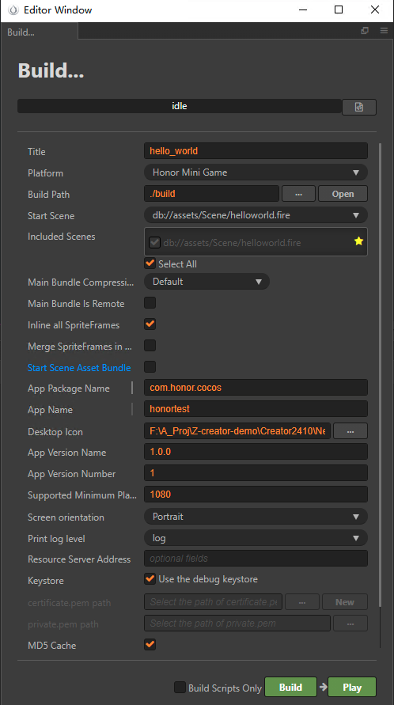
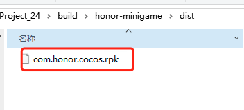
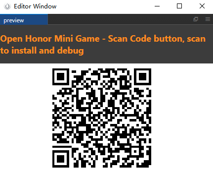
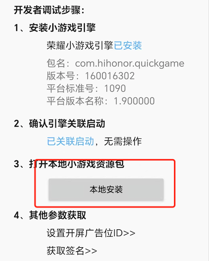

# Publish to Honor Mini Games

Starting from Cocos Creator v2.4.15, games can be published to **Honor Mini Games**.

## Preparation Work

- Refer [Honor Mini Games Integration Guide](https://developer.honor.com/cn/docs/game_center/guides/miniGame/miniGameGuidelines), complete the developer registration process and app creation on the Honor Open Platform.

- Download [Honor Quick Game APP](https://developer.honor.com/cn/docs/game_center/guides/miniGame/miniGameGuidelines#开发+调试指引) and install it on your honor mobile device.

## Release Process

Use Cocos Creator to open the project that needs to be released. Open the **Build** panel from the **Menu bar -> Project**, select **Honor Mini Game** in the **Platform** dropdown.



### Configuration Options

The specific filling rules for the relevant parameter configuration are as follows:

- **Main Bundle Compression Type**

  Set the compression type of the main package, please refer to the [built-in Asset Bundle — `main`](../asset-manager/bundle.md#the-built-in-asset-bundle) documentation for details.

- **Main Bundle Is Remote**

  This option is optional and needs to be used with the **Resource Server Address** option.<br>
  If set, the main package is configured as a remote package, and along with its related dependent resources are built into a built-in Asset Bundle — [main](../asset-manager/bundle.md#the-built-in-asset-bundle) under the **remote** folder of the release package directory. You need to upload the entire **remote** folder to the remote server.

- **Start Scene Asset Bundle**

  This option is optional.<br>
  If set, the start scene and its related dependent resources are built into the built-in Asset Bundle — [start-scene](../asset-manager/bundle.md#the-built-in-asset-bundle) to speed up the resource loading of the start scene. Please refer to the [Start Scene Loading](publish-wechatgame.md#speed-up-the-loading-of-the-start-scene) for details.

- **App Package Name**

  **App Package Name** is filled in according to the user's needs. It's require.

- **App Name**

  **App Name**, the name of the Honor Mini Game, is required. And the **Title** at the top of the **Build** panel does not participate in the Honor mini game packaging process.

- **Desktop Icon**

  **Desktop Icon** is required. Click the **...** button at the back of the input box to select the icon you want. When building, the Desktop Icon will be built into the __MIGU Mini Game__ project. Desktop Icon suggest using PNG pictures.

- **App Version Name**

  This item is required. **App Version Name** is the real version, such as: 1.0.0.

- **App Version Number**

  This item is required. **App Version Number** is different from the **App Version Name**, and the **App Version Number** is mainly used to distinguish the version update. Each time when you submit audit, the app version number is at least 1 higher than the value of the last submitted audit. It must not be equal to or less than the value of the last submitted audit, and it is recommended that the **App Version Number** be recursively incremented by 1 each time when the audit is submitted.
  
  > **Note**: the **App Version Number** must be a positive integer.

- **Supported Minimum Platform Version Number**

  For compatibility checks to prevent incompatibilities from arising when running on lower version platforms after going live.

- **Resource Server Address**

  This option is optional and used to fill in the address of the remote server where the resources are stored.

  - If this option is left blank, the `build/honor-minigame/remote` folder in the release package directory will be packaged into the **rpk** package.

  - If this option is filled in, the `remote` folder will not be packaged into the built **rpk** package. You need to manually upload the `remote` folder to the filled in Resource Server Address after build.

  Refer to the Resource Management section at the bottom of the document for more details.

- **Keystore**

  When you check the **Keystore**, the default is to build the rpk package with a certificate that comes with Creator, which is used only for **debugging**.

  If you don't check the **Keystore**, you need to configure the signature files **certificate.pem path** and **private.pem path**, where you build a rpk package that you can **publish directly**. The user can configure two signature files by using the **...** button to the right of the input box.

  > **Note**: these two signature files are not recommended to be placed in the **build/qgame** directory of the publish package, otherwise the build directory will be emptied each time when it is built, resulting in file loss.

  There are two ways to generate a signature files:

    - Generated by the **New** button after the **certificate.pem path** in the **Build** panel.

    - Generated by the command line.

      The user needs to generate the signature file **private.pem**, **certificate.pem** through tools such as openssl. The certificate in the **build/qgame/sign/debug** directory is for debugging purposes only.

      ```bash
      # Generate a signature file with the openssl command tool
      openssl req -newkey rsa:2048 -nodes -keyout private.pem -x509 -days 3650 -out certificate.pem
      ```

      > **Note**: the `openssl` tool can be opened directly in the terminal in linux or Mac environment, and in the Windows environment you need to install `openssl` and configure system environment variables.

### Build

After the relevant options of the **Build** panel are set, click **Build**. After the build is complete, click the **Open** button behind the **Build Path** to open the build release package. You can see that the **honor-minigame** directory is generated under the default release path build directory, which is the exported Honor Mini Game project directory, and the **rpk** package will be generated in the `honor-minigame/dist` directory.



### Run the built rpk to the phone

There are two ways to run rpk on your phone:

- **Method One**

    Click the **Run** button in the **Build** panel to wait for the QR Code interface to be generated:

    

    Then open the **Quick App** that was installed before on your Android device. Click the **Scan code install** button to scan the QR Code to open the **rpk**.

    

- **Method Two**

    Copy the generated mini game **rpk** file (located in the **dist** directory of the game project) to the internal storage directory of the mobile phone.
   
    Open the **Quick App** that has been installed before on your Android device, click **Local Install**, then find the **rpk** file from the internal storage directory of your mobile phone and select Open.
   
    

## Resource Management for Honor Mini Game Environment

**Honor Mini Game** is similar to the **WeChat Mini Game**. The main package size limit for Honor Mini Game is **5MB**, more than that must be downloaded via a network request.

Cocos Creator already helps developers with downloading, caching and version management of remote resources. The specific implementation logic and operation steps are similar to the WeChat Mini Game. Please refer to the [Resource Management for WeChat Mini Game](./publish-wechatgame.md#resource-management-for-the-wechat-mini-games) documentation for details.

## Reference link

- [Honor Mini Games Integration Guide](https://developer.honor.com/cn/docs/game_center/guides/miniGame/miniGameGuidelines)
- [Honor Quick Game APP](https://developer.honor.com/cn/docs/game_center/guides/miniGame/miniGameGuidelines#开发+调试指引)