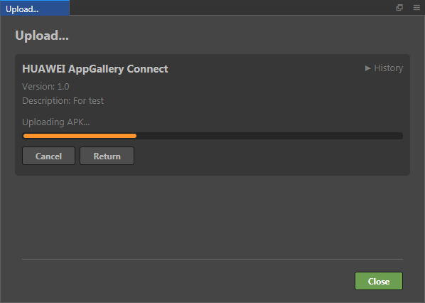
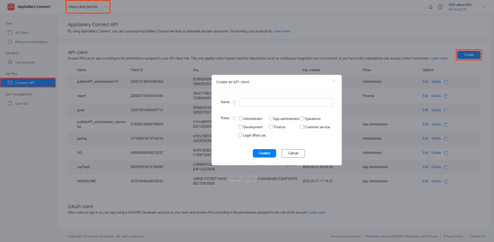

# Publish to HUAWEI AppGallery Connect

Starting with Cocos Creator v2.4.1, creating games for HUAWEI AppGallery Connect is officially supported, which helps developers access the HUAWEI AppGallery.

## Preparation Work

- Login to the [AppGallery Connect](https://developer.huawei.com/consumer/en/service/josp/agc/index.html), you need to complete the [Developer Registration](https://developer.huawei.com/consumer/en/doc/start/10104) before you can [create an app](https://developer.huawei.com/consumer/en/doc/distribution/app/agc-create_app). When creating an app, select **APK** for the **Package type**.

  

- You can access the required HUAWEI AppGallery Connect related services via the Cocos Service panel. Currently the SDK only supports the Android platform, please refer to the document [HUAWEI HMS Core](../cocos-service/sdkhub-plugins/sdkhub-hms.md) for the detailed operation steps.

## Release Process

Use Cocos Creator to open the project that needs to be released. Open the **Build** panel from the **Menu bar -> Project**, select **HUAWEI AppGallery Connect** in the **Platform** dropdown of the **Build** panel.

For the settings of the general options, please refer to the [Build Options](publish-native.md#build-options) document.

**SDKHub Configuration**: This option is used to help the game quickly intergrate the channel SDK. Please select the SDKHub service that you have previously enabled in the Cocos Services panel.

### Build and Compile

After the relevant options of the **Build** panel are set, click **Build**. 
After the build is complete, click the **Open** button behind the **Build Path** to open the release package directory. You can see that the `jsb-default` or `jsb-link` folder (Depending on the **Template** selected in the Build panel) is generated under the default release path `build` directory, which has been automatically integrated with HUAWEI AppGallery Connect related services.

Then click **Compile**, or use [Android Studio](publish-native.md#use-an-native-project) to open the project to compile. After compiling, HUAWEI AppGallery Connect APK will be generated in the release package directory.

### Upload the APK to AppGallery Connect

There are two ways to upload the APK to AppGallery Connect.

#### 1. Upload by the Build panel

Click the **Upload** button in the bottom right of the **Build** panel to open the Upload panel, then fill in the relevant information.

- APP ID: Fill in the APP ID for your app. Login to the AppGallery Connect and click **My apps -> App information** to get the APP ID.

- Version: Fill in as required.

- APK Path: Select the APK generated after compilation.

- Login Type: Includes both **OAuth** and **API Client**.

  - **OAuth**

    The OAuth login type only requires you follow the prompts to login to your HUAWEI account (Need to have sufficient [permissions](https://developer.huawei.com/consumer/en/doc/distribution/app/agc-team_account_mgt#appendix)) when you click **Confirm**, then check the box of the required permissions, the window will automatically close and the APK will be uploaded automatically.

    

  - **API Client**

    - If the API Client login type is used for the first time, you need to login to AppGallery Connect to get the relevant configuration information.

      

    - Select **Users and permission -> Connect API -> Create** to create an API client, and select role permissions as needed, then click **Confirm**.

      

    - Fill the **Client ID** and **Key** of the API client into the corresponding input boxs in the **Upload** panel of the Creator.

    - Click **Confirm** when you are done configuring.

  Detailed descriptions of the two login types can be found in document [AppGallery Connect API Getting Started](https://developer.huawei.com/consumer/en/doc/development/AppGallery-connect-Guides/agcapi-getstarted).

#### 2. Upload by AppGallery Connect

Sign in to AppGallery Connect, click **My apps** and select the app. Then switch to the **Distribute** column at the top left, click on **Version information -> Draft** in the left column, find the **Upload APK package**, click on **Software packages**, and then click on **Upload**.

### Submit Your App for Review

1. Sign in to AppGallery Connect, click **My apps** and select the app. Then switch to the **Distribute** column at the top left, click on **Version information -> Draft** in the left column, find the **Upload APK package**, click on **Software packages**, and then click on **Select**.

    

2. For other configuration information, please refer to the document [Releasing an App](https://developer.huawei.com/consumer/en/doc/distribution/app/agc-release_app). After you have completed and confirmed all the information is in order, you can directly click the **Submit** button at the top right of the page. HUAWEI AppGallery will complete the review in 3~5 working days.

## Related Reference Links

- [AppGallery Connect](https://developer.huawei.com/consumer/en/service/josp/agc/index.html)
- [AppGallery Connect Operation Guide](https://developer.huawei.com/consumer/en/doc/distribution/app/agc-create_app)
