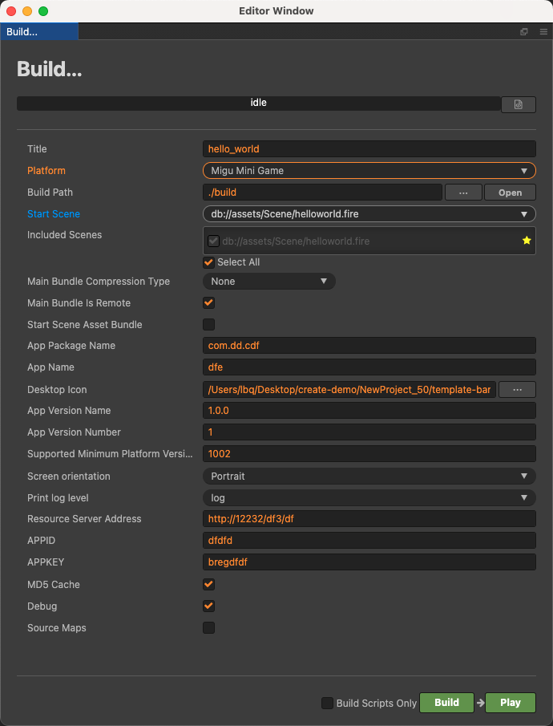
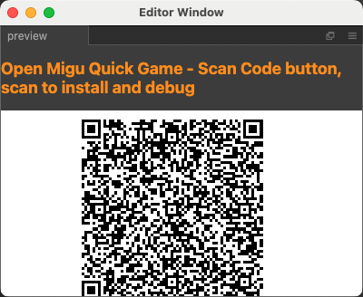

# Publish to Migu Mini Games

Starting from Cocos Creator v2.4.14, games can be published to **Migu Mini Games**.

## Preparation Work

- Refer [Migu Mini Games Integration Guide](https://open.migufun.com/document/detail?id=640), complete the developer registration process and app creation on the Migu Open Platform.

- Download [Migu Quick Game](https://g.migufun.com/cocosdebugtool) and install it on your mobile device.

- The minimum version required for Migu Quick Game is Android 5.0.

## Release Process

Use Cocos Creator to open the project that needs to be released. Open the **Build** panel from the **Menu bar -> Project**, select **MIGU Mini Game** in the **Platform** dropdown.

### Configuration Options

The specific filling rules for the relevant parameter configuration are as follows:

- **Main Bundle Compression Type**

  Set the compression type of the main package, please refer to the [built-in Asset Bundle — `main`](../asset-manager/bundle.md#the-built-in-asset-bundle) documentation for details.

- **Main Bundle Is Remote**

  This option is optional and needs to be used with the **Resource Server Address** option. 
  If set, the main package is configured as a remote package, and along with its related dependent resources are built into a built-in Asset Bundle — [main](../asset-manager/bundle.md#the-built-in-asset-bundle) under the **remote** folder of the release package directory. You need to upload the entire **remote** folder to the remote server.

- **Start Scene Asset Bundle**

  This option is optional. 
  If set, the start scene and its related dependent resources are built into the built-in Asset Bundle — [start-scene](../asset-manager/bundle.md#the-built-in-asset-bundle) to speed up the resource loading of the start scene. Please refer to the [Start Scene Loading](publish-wechatgame.md#speed-up-the-loading-of-the-start-scene) for details.

- **App Package Name**

  **App Package Name** is filled in according to the user's needs. It's require.

- **App Name**

  **App Name**, the name of the Migu Mini Game, is required. And the **Title** at the top of the **Build** panel does not participate in the Migu mini game packaging process.

- **Desktop Icon**

  **Desktop Icon** is required. Click the **...** button at the back of the input box to select the icon you want. When building, the Desktop Icon will be built into the __MIGU Mini Game__ project. Desktop Icon suggest using PNG pictures.

- **App Version Name**

  This item is required. **App Version Name** is the real version, such as: 1.0.0.

- **APPID**

  This item is required. **APPID** is the ID assigned by Migu Open Cooperation Platform for content.

- **APPKEY**

  This item is required. **APPKEY** is the KEY assigned by Migu Open Cooperation Platform for content.

- **App Version Number**

  This item is required. **App Version Number** is different from the **App Version Name**, and the **App Version Number** is mainly used to distinguish the version update. Each time when you submit audit, the app version number is at least 1 higher than the value of the last submitted audit. It must not be equal to or less than the value of the last submitted audit, and it is recommended that the **App Version Number** be recursively incremented by 1 each time when the audit is submitted.
  
  > **Note**: the **App Version Number** must be a positive integer.

- **Supported Minimum Platform Version Number**

  This item is required. Please refer to [Official Documentation](https://open.migufun.com/document/detail?id=640) to check the latest version number of migu engine.

- **Resource Server Address**

  This option is optional and used to fill in the address of the remote server where the resources are stored.

  - If this option is left blank, the `build/migu-runtime/remote` folder in the release package directory will be packaged into the **rpk** package.

  - If this option is filled in, the `remote` folder will not be packaged into the built **rpk** package. You need to manually upload the `remote` folder to the filled in Resource Server Address after build.

  Refer to the Resource Management section at the bottom of the document for more details.

### Build

After the relevant options of the **Build** panel are set, click **Build**. After the build is complete, click the **Open** button behind the **Build Path** to open the build release package. You can see that the **migu-runtime** directory is generated under the default release path build directory, which is the exported Migu Mini Game project directory, and the **rpk** package will be generated in the `migu-runtime/dist` directory.

### Run the built rpk to the phone

Click the **Ru**n button in the **Build and Publish** panel and wait for the QR code interface to generate.

Then, on the Android device, open the previously installed **Migu Quick Game**, click the **Scan button** in the upper right corner of the My page, and scan the QR code directly to open the rpk.

## Resource Management for Migu Mini Game Environment

**Migu Mini Game** is similar to the **WeChat Mini Game**. The main package size limit for Migu Mini Game is **5MB**, more than that must be downloaded via a network request.

Cocos Creator already helps developers with downloading, caching and version management of remote resources. The specific implementation logic and operation steps are similar to the WeChat Mini Game. Please refer to the [Resource Management for WeChat Mini Game](./publish-wechatgame.md#resource-management-for-the-wechat-mini-games) documentation for details.

## Reference link

- [Migu Mini Games Integration Guide](https://open.migufun.com/document/detail?id=640)
- [Migu Quick Game](https://g.migufun.com/cocosdebugtool)