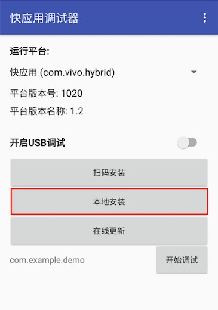

# Publish to vivo Mini Games

## Environment Configuration

- Download [Quick App & vivo Mini Game Debugger](https://minigame.vivo.com.cn/documents/#/lesson/base/environment?id=%E5%AE%89%E8%A3%85vivo%E5%B0%8F%E6%B8%B8%E6%88%8F%E8%B0%83%E8%AF%95%E5%99%A8) and [vivo Mini Game Engine](https://minigame.vivo.com.cn/documents/#/lesson/base/environment?id=%E5%AE%89%E8%A3%85vivo%E5%B0%8F%E6%B8%B8%E6%88%8F%E5%BC%95%E6%93%8E) and install it on your Android device (recommended Android Phone 6.0 or above)

- Install [nodejs-8.9.0](https://nodejs.org/en/download/) or above, globally:

    > **Note**: after installing nodejs, you need to pay attention to whether the npm source address is <https://registry.npmjs.org/>

    ```bash
    # View current npm source address
    npm config get registry

    # If not, reset the npm source address
    npm config set registry https://registry.npmjs.org/
    ```

- Install `qgame-toolkit` globally:

    ```bash
    npm install -g qgame-toolkit
    ```

    > **Note**: starting with **v2.1.3**, there is no need to install `qgame-toolkit`, but you need to install `vivo-minigame/cli`:

    ```
    npm install -g @vivo-minigame/cli
    ```

    If `vivo-minigame/cli` installation fails, it may be caused by too low version of nodejs. Please check the version of node and upgrade.

## Release Process

Use Cocos Creator to open the project that needs to be released. Open the **Build** panel from the **Menu bar -> Project**, select **vivo Mini Game** in the **Platform** dropdown.


### Configuration Options

The specific filling rules for the relevant parameter configuration are as follows:

- **Main Bundle Compression Type**

  Set the compression type of the main package, please refer to the [built-in Asset Bundle — `main`](../asset-manager/bundle.md#the-built-in-asset-bundle) documentation for details.

- **Main Bundle Is Remote**

  This option is optional and needs to be used with the **Resource Server Address** option.<br>
  If set, the main package is configured as a remote package, and along with its related dependent resources are built into a built-in Asset Bundle — [main](../asset-manager/bundle.md#the-built-in-asset-bundle) under the **remote** folder of the release package directory. You need to upload the entire **remote** folder to the remote server.

- **Start Scene Asset Bundle**

  This option is optional.<br>
  If set, the start scene and its related dependent resources are built into the built-in Asset Bundle — [start-scene](../asset-manager/bundle.md#the-built-in-asset-bundle) to speed up the resource loading of the start scene. Please refer to the [Start Scene Loading](publish-wechatgame.md#speed-up-the-loading-of-the-start-scene) for details.

- **App Package Name**

  **App Package Name** is filled in according to the user's needs. It's require.

- **App Name**

  **App Name**, the name of the vivo Mini Game, is required. And the **Title** at the top of the **Build** panel does not participate in the vivo mini game packaging process.

- **Desktop Icon**

  **Desktop Icon** is required. Click the **...** button at the back of the input box to select the icon you want. When building, the Desktop Icon will be built into the __OPPO Mini Game__ project. Desktop Icon suggest using PNG pictures.

- **App Version Name**

  This item is required. **App Version Name** is the real version, such as: 1.0.0.

- **App Version Number**

  This item is required. **App Version Number** is different from the **App Version Name**, and the **App Version Number** is mainly used to distinguish the version update. Each time when you submit audit, the app version number is at least 1 higher than the value of the last submitted audit. It must not be equal to or less than the value of the last submitted audit, and it is recommended that the **App Version Number** be recursively incremented by 1 each time when the audit is submitted.
  
  > **Note**: the **App Version Number** must be a positive integer.

- **Supported Minimum Platform Version Number**

  This item is required. Please refer to [Official Documentation](https://minigame.vivo.com.cn/documents/#/download/engine?id=%E6%9B%B4%E6%96%B0%E8%AE%B0%E5%BD%95%EF%BC%9A) to check the latest version number of vivo engine.

- **Resource Server Address**

  This option is optional and used to fill in the address of the remote server where the resources are stored.

  - If this option is left blank, the `build/qgame/remote` folder in the release package directory will be packaged into the **rpk** package.

  - If this option is filled in, the `remote` folder will not be packaged into the built **rpk** package. You need to manually upload the `remote` folder to the filled in Resource Server Address after build.

  Refer to the Resource Management section at the bottom of the document for more details.

- **Keystore**

  When you check the **Keystore**, the default is to build the rpk package with a certificate that comes with Creator, which is used only for **debugging**.

  If you don't check the **Keystore**, you need to configure the signature files **certificate.pem path** and **private.pem path**, where you build a rpk package that you can **publish directly**. The user can configure two signature files by using the **...** button to the right of the input box.

  > **Note**: these two signature files are not recommended to be placed in the **build/qgame** directory of the publish package, otherwise the build directory will be emptied each time when it is built, resulting in file loss.

  There are two ways to generate a signature files:

    - Generated by the **New** button after the **certificate.pem path** in the **Build** panel.

    - Generated by the command line.

      The user needs to generate the signature file **private.pem**, **certificate.pem** through tools such as openssl. The certificate in the **build/qgame/sign/debug** directory is for debugging purposes only.

      ```bash
      # Generate a signature file with the openssl command tool
      openssl req -newkey rsa:2048 -nodes -keyout private.pem -x509 -days 3650 -out certificate.pem
      ```

      > **Note**: the `openssl` tool can be opened directly in the terminal in linux or Mac environment, and in the Windows environment you need to install `openssl` and configure system environment variables.

- **Separate Engine** (New in v2.3.4)

  This item is optional. Vivo has added **game engine plugin** feature since platform version number **1063**. This plugin has the official version of the Cocos Creator engine built-in. If the plugin is enabled in the first game the player experiences, all games that also have the plugin enabled do not need to download the Cocos Creator engine again, just use the same version of the engine directly from the public plugin library, or incremental update the engine.

  Check **Separate Engine** when using, and then build and release normally in the **Build** panel, without additional manual operation. You can refer to the [WeChat Engine Plugin Instructions](./wechat-engine-plugin.md) for details.

- **Custom npm folder path**

  This item is optional. Starting with **v2.0.10**, the global npm of the operating system can be automatically obtained without manual setting. The way to obtain npm is:

  - **Windows**: Gets the path in the environment variable from the system.
  - **Mac**: Gets the path in the environment variable from the configuration file of Shell.

  If not, make sure the npm is properly installed and can be started directly in the command line environment. The obtained npm is used to provide an environment for building rpk. If the npm folder path cannot be found at building, Cocos Creator will only export the game project directory and will not generate the rpk package.

  The npm filling rules below **v2.0.10** are as follows:

  - If you do not fill out this item, the Creator will read the npm path in the environment variable by default on the Windows system, and the npm in the **/usr/bin/local** directory is read by default on the Mac system to build the exported mini game rpk package that can be run.
  - If your PC environment does not have npm installed or cannot read the npm path in the system, you will need to fill out the **Custom npm folder path** to build and exported rpk package. Fill in the rules as follows:

    - Windows system

      ```bash
      # Get local npm folder path
      where npm
      # If the output is
      C:\Program Files\nodejs\npm
      # Then the local npm folder path is filled in as:
      C:\Program Files\nodejs
      ```

    - Mac system

      ```bash
      # Get local npm folder path
      which npm
      # If the output is
      /Users/yourname/.nvm/versions/node/v8.1.4/bin/npm
      # Then the local npm folder path is filled in as:
      /Users/yourname/.nvm/versions/node/v8.1.4/bin
      ```

### Build

After the relevant options of the **Build** panel are set, click **Build**. After the build is complete, click the **Open** button behind the **Build Path** to open the build release package. You can see that the **qgame** directory is generated under the default release path build directory, which is the exported vivo Mini Game project directory, and the **rpk** package will be generated in the `build/qgame/dist` directory.


### Run the built rpk to the phone

There are three ways to run rpk on your phone:

- **Method One**

    Click the **Run** button in the **Build** panel to wait for the QR Code interface to be generated:

    

    Then open the **Quick App & vivo Mini Game Debugger** that was installed before on your Android device. Click the **Scan code install** button to scan the QR Code to open the **rpk**.

    

- **Method Two**

    Generate URLs and QR codes using the __vivo Mini Game Packer Commands__.

    ```bash
    # First assign the command line to the qgame directory
    cd E:\workspace\YourProject\build\qgame

    # Generate URL and QR code
    npm run server
    ```

    Then open the **Quick App & vivo Mini Game Debugger** that was installed before on your Android device.

    

    Finally, click the **Scan code install** button to copy the URL generated in the first step to the browser, and then directly scan the QR code on the web page to open the **rpk**.

- **Method Three**

    Copy the generated mini game **rpk** file (located in the dist directory of the game project qgame directory) to the internal storage directory of the mobile phone.

    Open the **Quick App & vivo Mini Game Debugger** that has been installed before on your Android device, click **Local Install**, then find the **rpk** file from the internal storage directory of your mobile phone and select Open.

    

## Subpackage Loading

Starting with **v2.1.3**, vivo Mini Games supports subpackage loading, and usage is similar to WeChat Mini Games. Please refer to the [Mini Game Subpackage](subpackage.md#vivo-mini-games) for details.

## Resource Management for vivo Mini Game Environment

**vivo Mini Game** is similar to the **WeChat Mini Game**. The main package size limit for vivo Mini Game is **4MB**, more than that must be downloaded via a network request.

Cocos Creator already helps developers with downloading, caching and version management of remote resources. The specific implementation logic and operation steps are similar to the WeChat Mini Game. Please refer to the [Resource Management for WeChat Mini Game](./publish-wechatgame.md#resource-management-for-the-wechat-mini-games) documentation for details.

## Reference link

- [vivo Mini Games Development Documentation](https://minigame.vivo.com.cn/documents/#/lesson/base/start)
- [vivo Mini Games API Documentation](https://minigame.vivo.com.cn/documents/#/api/system/life-cycle)
- [Quick App & vivo Mini Game Debugger Download](https://minigame.vivo.com.cn/documents/#/download/debugger)
