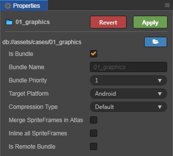
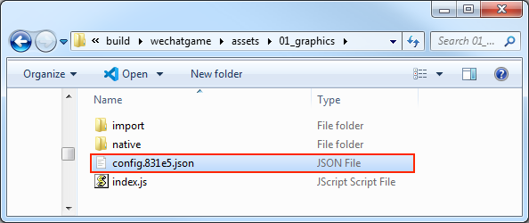

# Asset Bundle Configuration and Loading

> Author: Santy-Wang, Xunyi

As the gameplay gets richer and the number of resources in the game grows, the need for developers to split the package is increasing. So starting with v2.4, Cocos Creator introduced the **Asset Bundle**, which supports subpackage loading for **code**, **resources** and **scene**.

Developers can divide the scenes, resources, and code in the project into different Asset Bundles, which will not be loaded at game launch, but will be loaded by developers manually calling `loadBundle` during the game, thus effectively reducing the startup time of the game and make loading on demand as easy as possible.

For more information about the Asset Bundle, please refer to the [Asset Bundle](../asset-manager/bundle.md) documentation.

## Configuration

The Asset Bundle is configured in **folders**. When we select a folder in the **Assets** panel, the **Properties** panel will show a **Is Bundle** option, if set, the folder-related configuration options will appear:



| Configuration Options | Function Explanation |
| :---  | :---- |
| Bundle Name      | The name of the Asset Bundle after it is built, which will use the name of this folder by default, can be modified as needed.  |
| Bundle Priority  | Creator opens up 10 configurable priorities, and the Asset Bundle will be built in descending order of priority. For more detail, see [Asset Bundle -- Priority](../asset-manager/bundle.md#priority) documentation. |
| Target Platform  | An Asset Bundle can have different settings on different platforms and the editor will choose the corresponding setting at build time. |
| Compression Type | Determines the final output form of the Asset Bundle, including the five compression types **Default**, **None**, **Merge All JSON**, **Mini Game Subpackage**、**Zip**. For more detail, see [Asset Bundle -- Compression Type](../asset-manager/bundle.md#compression-type) documentation. |
| Is Remote Bundle | Whether to configure the Asset Bundle as a remote package and not support the Web platform.<br>If checked, the Asset Bundle will be placed in the **remote** folder after the build, and you will need to place the entire **remote** folder on the remote server.<br>When building mini game platforms such as OPPO, vivo, Huawei, etc., the Asset Bundle will not be packaged into rpk if this option is checked. |

After the configuration, click on the **Apply** button at the top right and the folder will be configured as an Asset Bundle, then select the corresponding platform in the **Build** panel to build.

> **Notes**:
>
> 1. There are four [built-in Asset Bundles](../asset-manager/bundle.md#the-built-in-asset-bundle) in the Creator, including **resources**, **internal**, **main** and **start-scene**. When setting the **Bundle Name**, **do not** use these four names.
> 2. The [mini game subpackage](../publish/subpackage.md) can only be placed locally and cannot be configured as remote packages. So the **Is Remote Bundle** option cannot be checked when the compression type is set to **Mini Game Subpackage**.
> 3. The Zip compression type is primarily used to reduce the number of network requests and is used by default with the **Is Remote Bundle** option. Since the package doesn't need network requests if it's local, there's no need to use Zip compression.

## Build

At build time, resources (including scenes, code, and other resources) in the folder configured as an Asset Bundle, as well as relevant dependent resources outside the folder, are merged into the same Asset Bundle folder. For example, if "scene A" is placed in "folder a", when "folder a" is configured as an Asset Bundle, "scene A" and its dependent resources will be merged into the "Asset Bundle a" folder.

After building, the Asset Bundle folder will be packaged into the **assets** folder in the release package directory of the corresponding platform. However, there are two special cases.
- If the **Is Remote Bundle** option is checked when configuring the Asset Bundle, this Asset Bundle folder will be packaged into the **remote** folder in the release package directory of the corresponding platform.
- If the **Compression Type** is set to **Mini Game Subpackage** when configuring the Asset Bundle, this Asset Bundle folder will be packaged into the **subpackages** folder in the release package directory of the corresponding platform.

Each folder contained within these three folders **assets**, **remote** and **subpackages** is an Asset Bundle.

**For example**, if the **cases/01_graphics** folder in the [example-case](https://github.com/cocos/example-projects) is configured as an Asset Bundle on the Web Mobile platform, then after the project is built, a **01_graphics** folder is generated in the **assets** folder in the release package directory, and the **01_graphics** folder is an Asset Bundle.


<!--
> **Note**: if you set the **Compression Type** to **Mini Game Subpackage** when configuring the Asset Bundle, do not remove the Asset Bundle folder that was generated in the **subpackages** folder after build. The corresponding platform (such as WeChat Mini Game) will do the relevant processing by itself.
-->

## Load the Asset Bundle

The engine provides a unified API `cc.assetManager.loadBundle` to load the Asset Bundle, which you need to pass in either the Asset Bundle's **URL** or the **Bundle Name** set in the Asset Bundle configuration panel, but if you want to reuse Asset Bundles from other projects, you can only do so through the **URL**. The usage is as follows:

```js
cc.assetManager.loadBundle('01_graphics', (err, bundle) => {
    bundle.load('xxx');
});

// Reuse Asset Bundles from other projects
cc.assetManager.loadBundle('https://othergame.com/remote/01_graphics', (err, bundle) => {
    bundle.load('xxx');
});
```

In addition, starting with v2.4.3, `cc.assetManager.loadBundle` also supports loading an Asset Bundle from user space with the path in user space. You can use the download interface provided by the corresponding platform to pre-download the Asset Bundle into your user space and then use `loadBundle` to load it, so that you can manage the download and cache process of the Asset Bundle by yourself.

```js
// Download an Asset Bundle in advance to the "pathToBundle" directory in your user space, and it's necessary to ensure 
// that the structure and content of the Asset Bundle in your user space is identical to that of the original Asset Bundle.
// ...

// Load with the path of the Asset Bundle in user space
// On native platform
cc.assetManager.loadBundle(jsb.fileUtils.getWritablePath() + '/pathToBundle/bundleName', (err, bundle) => {
    // ...
});

// On WeChat Mini Game
cc.assetManager.loadBundle(wx.env.USER_DATA_PATH + '/pathToBundle/bundleName', (err, bundle) => {
    // ...
});
```

> **Note**: if you check the **Is Remote Bundle** option when configuring the Asset Bundle, then please fill in the **Resource Server Address** in the **Build** panel when building.

When you load the Asset Bundle via the API, instead of loading all the resources in the Asset Bundle, the engine loads the Asset Bundle's **resource manifest** and **all the scripts** it contains.<br>
When the Asset Bundle is loaded, the engine triggers a callback and returns an error message and an instance of `cc.AssetManager.Bundle` class, which is the main entrance of the Asset Bundle API that you can use to load the various resources in the Asset Bundle.

### Versions of the Asset Bundle

The Asset Bundle continues the MD5 scheme of the Creator for updates. When you need to update the Asset Bundle on the remote server, check the **MD5 Cache** option in the **Build** panel. Then the filename of the `config.json` in the built Asset Bundle will come with a Hash value. As shown in the following figure:



It is not necessary to provide an additional Hash value when loading the Asset Bundle, Creator will search for the corresponding Hash value in the `settings.js` and make adjustments automatically.<br>
However, if you want to store the relevant version configuration information on the server and dynamically fetch the version information at startup for hot updates, you can manually specify a version Hash value and pass in the `loadBundle`, and the Asset Bundle will be built based on the incoming Hash value:

```js
cc.assetManager.loadBundle('01_graphics', {version: 'fbc07'}, function (err, bundle) {
    if (err) {
        return console.error(err);
    }
    console.log('load bundle successfully.');
});
```

Then you can bypass the old version files in the cache and redownload the latest version of the Asset Bundle.

## Load the resources in the Asset Bundle

After the Asset Bundle is loaded, the engine returns an instance of `cc.AssetManager.Bundle` class. You can load the resources in the Asset Bundle by using `load` method of the instance, which has the same arguments as the `cc.resources.load`, you just need to pass in the path of the resource relative to the Asset Bundle, and the end of the path **must not** contain the file extension.

```js
// Load Prefab
bundle.load(`prefab`, cc.Prefab, function (err, prefab) {
    let newNode = cc.instantiate(prefab);
    cc.director.getScene().addChild(newNode);
});

// Load Texture
bundle.load(`image`, cc.Texture2D, function (err, texture) {
    console.log(texture)
});
```

Like the `cc.resources.load`, the `load` method also provides a type parameter, which is useful for loading resources with the same name or loading a SpriteFrame.

```js
// Load SpriteFrame
bundle.load(`image`, cc.SpriteFrame, function (err, spriteFrame) {
    console.log(spriteFrame);
});
```

### Bulk load resources

The Asset Bundle provides `loadDir` method to bulk load multiple resources in the same directory. The arguments of this method are similar to the `cc.resources.loadDir`, you just need to pass in the path of the directory relative to the Asset Bundle.

```js
// Load all resources in the "textures" directory
bundle.loadDir("textures", function (err, assets) {
    // ...
});

// Load all Texture resources in the "textures" directory
bundle.loadDir("textures", cc.Texture2D, function (err, assets) {
    // ...
});
```

### Load scenes

The Asset Bundle provides `loadScene` methods for loading scenes from the specified bundle, you just need to pass in the **scene name**.<br>
The difference between `loadScene` and `cc.director.loadScene` is that `loadScene` will only load the scene from the specified bundle and will not run the scene, you also need to use `cc.director.runScene` to run the scene.

```js
bundle.loadScene('test', function (err, scene) {
    cc.director.runScene(scene);
});
```

## Get the Asset Bundle

After the Asset Bundle has been loaded, it will be cached, and you can use the name to get the Asset Bundle. For example:

```js
let bundle = cc.assetManager.getBundle('01_graphics');
```

## Preload resources

In addition to scenes, other resources can also be preloaded. The loading arguments for preloading are the same as for normal loading, but because preloading only downloads the necessary resources, and does not perform the resources' deserialization and initialization, so it consumes less performance and is suitable for use during gameplay.

The Asset Bundle provides `preload` and `preloadDir` interfaces to preload the resources in the Asset Bundle, which are used in the same way as the `cc.assetManager`, see [Loading and Preloading](../asset-manager/preload-load.md) documentation for details.

## Release resources in the Asset Bundle

After loading the resources, all the resources are temporarily cached in `cc.assetManager` to avoid reloading. Of course, the resources in the cache also occupy memory, and some resources you can release in the following three ways if they are no longer needed:

1. Use the regular `cc.assetManager.releaseAsset` method for release.

    ```js
    bundle.load(`image`, cc.SpriteFrame, function (err, spriteFrame) {
        cc.assetManager.releaseAsset(spriteFrame);
    });
    ```

2. Use `release` method provided by the Asset Bundle, then pass in the path and type to release resources, but can only release the single resource in the Asset Bundle. The arguments can be the same as those used in the `load` method of the Asset Bundle.

    
    ```js
    bundle.load(`image`, cc.SpriteFrame, function (err, spriteFrame) {
        bundle.release(`image`, cc.SpriteFrame);
    });
    ```

3. Use `releaseAll` method provided by the Asset Bundle, which is similar to the `cc.assetManager.releaseAll`, but the `releaseAll` will release all resources that belong to the Asset Bundle (including resources in the Asset Bundle and the related dependent resources outside the Asset Bundle), so please use caution.

    ```js
    bundle.load(`image`, cc.SpriteFrame, function (err, spriteFrame) {
        bundle.releaseAll();
    });
    ```

> **Note**: when releasing a resource, Creator will automatically handle the resource's dependent resources, and you don't need to manage their dependency resources.

For more information about releasing resources, see [Release of Resources](../asset-manager/release-manager.md) documentation.

## Remove the Asset Bundle

After the Asset Bundle is loaded, it will remain in the entire gameplay, unless you manually remove it from the game. When an unneeded Asset Bundle is manually removed, the cache for the bundle is also removed. If you need to use it again, you must reload it again.

```js
let bundle = cc.assetManager.getBundle('bundle1');
cc.assetManager.removeBundle(bundle);
```

> **Note**: when you destroy an Asset Bundle, the resources already loaded in the bundle are not released. If you need to release it, use the Asset Bundle's `release`/`releaseAll` method first.

```js
let bundle = cc.assetManager.getBundle('bundle1');
// Releases a single resource in the Asset Bundle.
bundle.release(`image`, cc.SpriteFrame);
cc.assetManager.removeBundle(bundle);

let bundle = cc.assetManager.getBundle('bundle1');
// Releases all resources belonging to the Asset Bundle.
bundle.releaseAll();
cc.assetManager.removeBundle(bundle);
```
