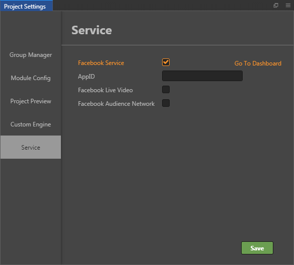

# Facebook Live Video and Audience Network

Starting with **v2.0.6**, Cocos Creator officially supports one-click integration of Facebook services, including **Facebook Live Video** and **Facebook Audience Network**. These two SDKs currently support Android and iOS.

**Cocos Creator includes**:

- Provides one-click integration of Facebook Live Video and Facebook Audience Network in the Cocos Creator **Project Settings** panel, and is automatically initialized so that users can call the relevant APIs directly

**What the user needs to do**:

- Call the APIs of Facebook Live Video and Facebook Audience Network to access related features

## Facebook Service Integration Operation Steps

**First**, open the project with Cocos Creator, click on the **Menu bar -> Project -> Project Settings -> Service** and there is a **Facebook Service** in the **Service** tab.



Select the **Facebook Service** and you can see that there are three options below:

  - **AppID**: Create a new app (or an old app you've created before) in the [Facebook Developer Center](https://developers.facebook.com/) **My AppS -> Add New App**. The **APP ID** above when the creation is complete is AppID.
  - **Facebook Live Video**: Integrate Facebook Live Video into Project.
  - **Facebook Audience Network**: Integrate Facebook Audience Network into Project.

**Second**, after you set up the SDK that needs to be integrated in the **Project Settings -> Service**, open the **Build** panel, select **Platform** and then select **Android/iOS**. Next, select the **API Level** of the Android platform as **android-26** and above. There are other parameters that the developer can configure themselves, as needed. When the configuration is complete, click **Build**.

> **Note**: **before you build for iOS**, you need to download the dependencies associated with the Facebook service and execute the following command on the command line. Please refer to [CocoaPods official website](https://cocoapods.org/) for details.
>
> ```bash
> # Xcode 8 + 9
> $ sudo gem install cocoapods
> ```
>
> If you run the command, and the following error occurs:
>
> ```bash
> ERROR:  Could not find a valid gem 'cocoapods' (>= 0), here is why:
> Unable to download data from https://rubygems.org/ - SSL_connect returned=1 errno=0 state=SSLv2/v3 read server hello A: tlsv1 alert protocol version (https://rubygems.org/latest_specs.4.8.gz)
> ```
>
> You can run the following command to resolve:
>
> ```bash
> $ gem source -r https://rubygems.org/
> $ gem source -a http://rubygems.org/
> $ sudo gem install cocoapods
> ```

**Third**, after the build is complete, you can see that two files, **fb-live-stream.js** and **CCAds.js**, have been generated under the `src` directory in the `build` directory. These correspond to the encapsulation of **Facebook Live Video** and **Facebook Audience Network** by Cocos Creator.


>**Notes**:
>
> 1. The first time you compile on Android requires using Android Studio to open the built-after project to download the support packages that Facebook needs (If the download fails, it is recommended to switch the network or set up the HTTP proxy for Android Studio). And Android Phone needs to be in version 6.0 or above.
> 2. When you use Xcode to compile for iOS, you need to open `.xcworkspace` file instead of `.xcodeproj` file. And iOS devices need to be in version 11 or above.
>
>     

## Invoking related APIs

### Facebook Live Video

You can access **Facebook Live Video** through the `fb.liveStream` module:

- `fb.liveStream.startLive();`: Start playing
- `fb.liveStream.stopLive();`: Stop playing
- `fb.liveStream.pauseLive();`: Pause playing
- `fb.liveStream.resumeLive();`: Resume playing

For details, please refer to the [/assets/script/live_scene.js](https://github.com/cocos-creator/facebook_demo/blob/master/assets/script/live_scene.js) file in [Sample Project](https://github.com/cocos-creator/facebook_demo).

### Facebook Audience Network

There are three types of **Facebook Audience Network**:

- `cc.Ads.Banner`: Pop up banner ad
- `cc.Ads.RewardedVideo`: Pop up reward video window ad
- `cc.Ads.Interstitial`: Pop up placard ad

Taking the pop up banner ad `cc.Ads.Banner` as an example, the user can create an instance of a new `cc.Ads.Banner` object and then call it according to their needs.

The sample code is as follows:

```js
banner_click(event){
    let banner = new cc.Ads.Banner(this.placementId.BANNER, cc.Ads.BANNER_POSITION.ALIGN_PARENT_BOTTOM);
    this.banner = banner;
    banner.on("onAdLoaded", () => {
        cc.log("banner onAdLoaded");
        this.status_tips.string = "banner loaded";
    }, this.node);

    banner.on("onError", (eCode) => {
        cc.log("banner onError");
        this.status_tips.string = "banner onError";
    }, this.node);

    banner.on("onAdClicked", () => {
        cc.log("banner onAdClicked");
        this.status_tips.string = "banner onAdClicked";
    }, this.node);

    banner.show().then(() => {
        cc.log("banner show-------");
    }).catch((e) => {
        cc.log("banner reject ", e);
    });
},
```

`cc.Ads.RewardedVideo` and `cc.Ads.Interstitial` are called in a similar way to `cc.Ads.Banner` and you can refer the [/assets/script/an_scene.js](https://github.com/cocos-creator/facebook_demo/blob/master/assets/script/an_scene.js) file in [Sample Project](https://github.com/cocos-creator/facebook_demo). Or refer to Facebook's official documentation [Audience Network](https://developers.facebook.com/docs/audience-network).

## Related reference links

- The Facebook Service Integration [Sample Project](https://github.com/cocos-creator/facebook_demo) provided by Cocos Creator contains **Facebook Live Video** and **Facebook Audience Network** usage example.
- [Facebook Developer Center](https://developers.facebook.com/)
- [Facebook Live Video](https://developers.facebook.com/docs/videos/live-video)
- [Facebook Audience Network](https://developers.facebook.com/docs/audience-network)
