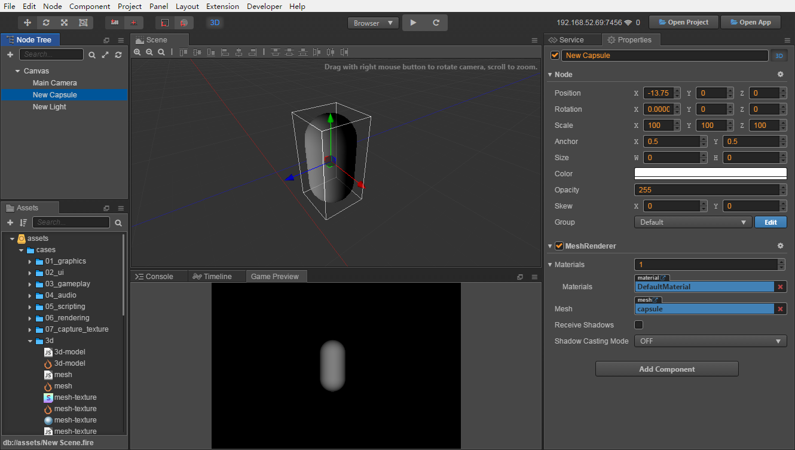
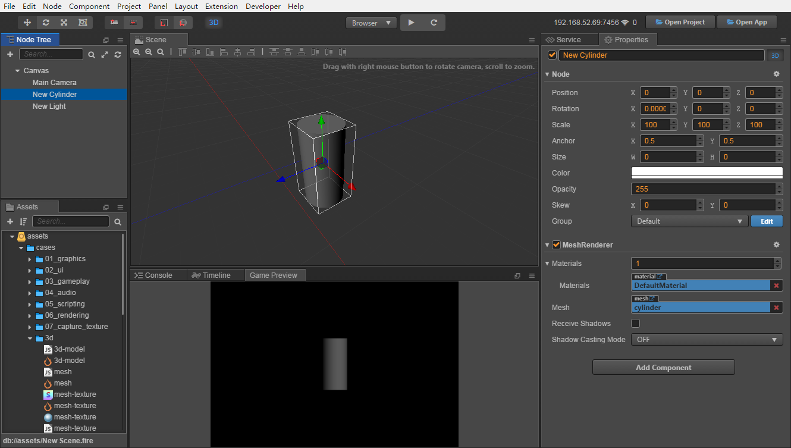

# 基础 3D 物体

Cocos Creator 可以导入由大部分 3D 模型制作软件生成的模型文件，也可以直接在 Creator 中创建一些常见的基础 3D 物体，比如长方体、胶囊体、球体、圆柱体等。

## 创建基础 3D 物体

Creator 提供了以下两种方式来创建基础 3D 物体。

### 通过脚本创建

Cocos Creator 提供了 `cc.primitive` 脚本接口来创建基础 3D 模型的顶点数据，然后根据这些顶点数据创建出对应的 mesh 给 [Mesh Renderer 组件](mesh-renderer.md) 使用。

```js
function createMesh (data, color) {
    let gfx = cc.gfx;
    let vfmt = new gfx.VertexFormat([
        { name: gfx.ATTR_POSITION, type: gfx.ATTR_TYPE_FLOAT32, num: 3 },
        { name: gfx.ATTR_NORMAL, type: gfx.ATTR_TYPE_FLOAT32, num: 3 },
        { name: gfx.ATTR_COLOR, type: gfx.ATTR_TYPE_UINT8, num: 4, normalize: true },
    ]);

    let colors = [];
    for (let i = 0; i < data.positions.length; i++) {
        colors.push(color);
    }

    let mesh = new cc.Mesh();
    mesh.init(vfmt, data.positions.length);
    mesh.setVertices(gfx.ATTR_POSITION, data.positions);
    mesh.setVertices(gfx.ATTR_NORMAL, data.normals);
    mesh.setVertices(gfx.ATTR_COLOR, colors);
    mesh.setIndices(data.indices);
    mesh.setBoundingBox(data.minPos, data.maxPos);

    return mesh;
}

// 创建长方体顶点数据
let data = cc.primitive.box(100, 100, 100);
// 根据顶点数据创建网格
let mesh = createMesh(data, cc.color(100, 100, 100));
// 将创建的网格设置到 Mesh Renderer 上
let renderer = this.getComponent(cc.MeshRenderer);
renderer.mesh = mesh;
```

更多关于 `cc.primitive` 的使用请查看 [Primitive API](%__APIDOC__%/zh/modules/primitive.html)。用户也可以下载 **TheAviator Demo**（[GitHub](https://github.com/cocos/cocos-example-the-aviator) | [Gitee](https://gitee.com/mirrors_cocos-creator/demo-the-aviator)）来学习如何使用 `cc.primitive`。

### 通过编辑器创建

在 **层级管理器** 中点击左上角的 **+** 按钮，然后选择 **创建 3D 节点**，即可在编辑器内创建长方体、胶囊体、球体圆柱体等基础 3D 物体：


#### 创建长方体


#### 创建胶囊体



#### 创建圆锥体


#### 创建圆柱体



#### 创建平面


#### 创建球体


#### 创建圆环


#### 创建面片


