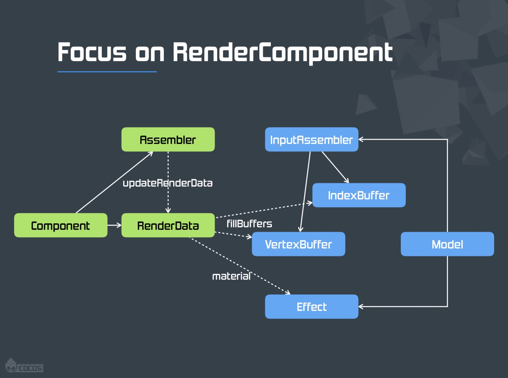
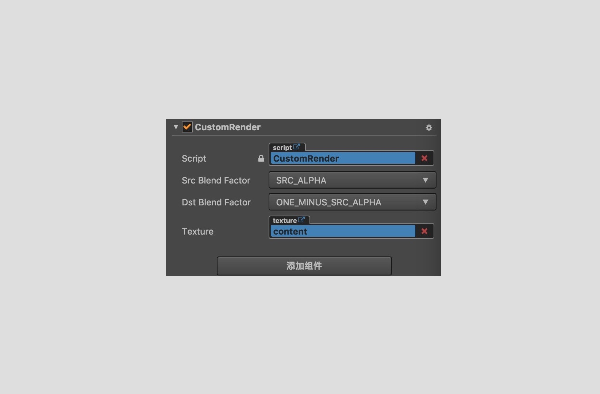

# 自定义渲染

在 v2.0 版本中，我们对引擎框架进行了重构，移除底层 cocos2d-html5 渲染引擎，改为和 3D 引擎共享底层渲染器，同时摒弃渲染树，直接使用节点和渲染组件数据来组装渲染数据。在新的渲染器中，所有的直接渲染组件都继承自 `cc.RenderComponent` 这个组件，比如：`cc.Sprite`、`cc.Label`、`cc.Graphics` 等，渲染组件定义组件的颜色混合模式，同时控制组件的渲染状态更新。而每个直接渲染组件都有其对应的 Assembler 来对其进行渲染数据的组装与填充，具体的流程如下图所示：



新的渲染流程不仅大大提升了底层的渲染效率，同时渲染组件及 Assembler 的模块化也使得自定义渲染变得更加方便，有特殊需求的开发者只需要自定义 RenderComponent 及对应的 Assembler，然后添加渲染组件到场景中的节点上，引擎的渲染流程将按照自定义的渲染组件自动完成节点的渲染，下面将介绍如何自定义 RenderComponent 及 Assembler 完成自定义渲染。

## 自定义 RenderComponent

我们以渲染一张 Texture 为例，首先创建自定义渲染组件的脚本，命名为 CustomRender.js，并添加类型为 cc.Texture2D 的属性。

```js
// 自定义渲染组件
let CustomRender = cc.Class({
    // 所有渲染组件需要继承自 cc.RenderComponent
    extends: cc.RenderComponent,

    ctor () {
        // 顶点数据装配器
        this._assembler = null;
        // 材质
        this._spriteMaterial = null;
        // 纹理 UV 数据
        this.uv = [];
    },

    properties: {
        // 渲染组件使用的 Texture
        _texture: {
            default: null,
            type: cc.Texture2D,
        },

        texture: {
            get: function () {
                return this._texture;
            },
            set: function (value) {
                this._texture = value;
            },
            type: cc.Texture2D,
        },
    },
// ...

```

添加组件到自定义节点之后，如下图所示：



继承自 RenderComponent 的组件会默认添加 Src Blend Factor 和 Dst Blend Factor 属性，用于指定颜色混合因子。接着我们来补充自定义组件的功能，自定义的 RenderComponent 需要关联对应的 Assembler 进行渲染数据的填充，还有材质的创建以及纹理 UV 的计算。

```js
    // 设置组件的 Assembler
    _updateAssembler () {
        let assembler = CustomAssembler;

        if (this._assembler !== assembler) {
            this._assembler = assembler;
            this._renderData = null;
        }

        if (!this._renderData) {
            this._renderData = this._assembler.createData(this);
            this._renderData.material = this._material;
            this.markForUpdateRenderData(true);
        }
    },
    // 创建用于渲染图片的材质
    _activateMaterial () {
        let material = this._material;
        if (!material) {
            material = this._material = new SpriteMaterial();
        }
        // 是否使用 Uniform 变量传递节点颜色
        material.useColor = true;
        if (this._texture) {
            material.texture = this._texture;
            // 标记渲染组件的渲染状态
            this.markForUpdateRenderData(true);
            this.markForRender(true);
        } else {
            this.disableRender();
        }

        this._updateMaterial(material);
    },
    // 设置纹理的 UV 数据
    _calculateUV () {
        let uv = this.uv;
        // 设置纹理 UV 起始值
        let l = 0, r = 1, b = 1,t = 0;

        uv[0] = l;
        uv[1] = b;
        uv[2] = r;
        uv[3] = b;
        uv[4] = l;
        uv[5] = t;
        uv[6] = r;
        uv[7] = t;
    }
```

最后，在节点激活时依次调用上述回调，完成整个 RenderComponent 的功能，完整的代码如下：

```js
const renderEngine = cc.renderer.renderEngine;
const SpriteMaterial = renderEngine.SpriteMaterial;
const CustomAssembler = require('./CustomAssembler');
// 自定义渲染组件
let CustomRender = cc.Class({
    // 所有渲染组件需要继承自 cc.RenderComponent
    extends: cc.RenderComponent,

    ctor () {
        // 顶点数据装配器
        this._assembler = null;
        // 材质
        this._spriteMaterial = null;
        // 纹理 UV
        this.uv = [];
    },

    properties: {
        // 渲染组件使用的 Texture
        _texture: {
            default: null,
            type: cc.Texture2D,
        },

        texture: {
            get: function () {
                return this._texture;
            },
            set: function (value) {
                this._texture = value;
                this._activateMaterial();
            },
            type: cc.Texture2D,
        },
    },
    // 组件激活时链接组件的 Assembler，处理UV数据及事件监听。
    onEnable () {
        this._super();
        this._updateAssembler();
        this._activateMaterial();
        this._calculateUV();

        this.node.on(cc.Node.EventType.SIZE_CHANGED, this._onNodeSizeDirty, this);
        this.node.on(cc.Node.EventType.ANCHOR_CHANGED, this._onNodeSizeDirty, this);
    },
    // 组件禁用时，取消事件监听
    onDisable () {
        this._super();

        this.node.off(cc.Node.EventType.SIZE_CHANGED, this._onNodeSizeDirty, this);
        this.node.off(cc.Node.EventType.ANCHOR_CHANGED, this._onNodeSizeDirty, this);
    },
    // 节点数据变化时需要标记更新组件的渲染状态
    _onNodeSizeDirty () {
        if (!this._renderData) return;
        this.markForUpdateRenderData(true);
    },
    // 设置组件的 Assembler
    _updateAssembler () {
        let assembler = CustomAssembler;

        if (this._assembler !== assembler) {
            this._assembler = assembler;
            this._renderData = null;
        }

        if (!this._renderData) {
            this._renderData = this._assembler.createData(this);
            this._renderData.material = this._material;
            this.markForUpdateRenderData(true);
        }
    },
    // 创建用于渲染图片的材质
    _activateMaterial () {
        let material = this._material;
        if (!material) {
            material = this._material = new SpriteMaterial();
        }
        // 是否使用 Uniform 变量传递节点颜色
        material.useColor = true;
        if (this._texture) {
            material.texture = this._texture;
            // 标记渲染组件的渲染状态
            this.markForUpdateRenderData(true);
            this.markForRender(true);
        } else {
            this.disableRender();
        }

        this._updateMaterial(material);
    },
    // 设置纹理的 UV 数据
    _calculateUV () {
        let uv = this.uv;
        // 设置纹理 UV 起始值
        let l = 0, r = 1, b = 1,t = 0;

        uv[0] = l;
        uv[1] = b;
        uv[2] = r;
        uv[3] = b;
        uv[4] = l;
        uv[5] = t;
        uv[6] = r;
        uv[7] = t;
    }
});
```

## 自定义 Assembler

在新版本的渲染流中，Assembler 是指处理渲染组件顶点数据的一系列方法。因为不同的渲染组件会有不同的顶点数据数量以及不同的填充规则，因此在设计整个渲染框架时，为了便于扩展及复用，将这部分功能独立出来并可以指定给任意的 RenderComponent 使用。

下面，我们将为自定义的 RenderComponent 添加对应的 Assembler 文件，Assembler 中必须要定义 updateRenderData 及 fillBuffers 方法，前者需要更新准备顶点数据，后者则是将准备好的顶点数据填充进 VetexBuffer 和 IndiceBuffer 中，创建名为 `CustomAssembler.js` 的文件，并添加如下代码：

```js
const renderEngine = cc.renderer.renderEngine;
const gfx = renderEngine.gfx;

// 引擎定义的顶点数据的 buffer 格式, 参考引擎中的 vertex-format.js
// 传递位置及 UV
let vfmtPosUv = new gfx.VertexFormat([
    { name: gfx.ATTR_POSITION, type: gfx.ATTR_TYPE_FLOAT32, num: 2 },
    { name: gfx.ATTR_UV0, type: gfx.ATTR_TYPE_FLOAT32, num: 2 }
]);
// 传递位置，UV 及颜色数据
let vfmtPosUvColor = new gfx.VertexFormat([
    { name: gfx.ATTR_POSITION, type: gfx.ATTR_TYPE_FLOAT32, num: 2 },
    { name: gfx.ATTR_UV0, type: gfx.ATTR_TYPE_FLOAT32, num: 2 },
    { name: gfx.ATTR_COLOR, type: gfx.ATTR_TYPE_UINT8, num: 4, normalize: true },
]);

// 自定义 Assembler
let CustomAssembler = {
    // 创建渲染数据
    createData (comp) {
        let renderData = comp.requestRenderData();
        renderData.dataLength = 4;
        renderData.vertexCount = 4;
        renderData.indiceCount = 6;
        return renderData;
    },
    // 更新渲染数据
    updateRenderData (comp) {
        let renderData = comp._renderData;
        if (renderData) {
            this.updateVerts(comp);
        }
    },
    // 填充数据 buffer
    fillBuffers (comp, renderer) {
        let renderData = comp._renderData;
        let data = renderData._data;
        // 指定 buffer 的数据格式，并获取 buffer
        let buffer = renderer.getBuffer('mesh', vfmtPosUv),
            vertexOffset = buffer.byteOffset >> 2,
            vertexCount = renderData.vertexCount,
            indiceCount = renderData.indiceCount;

        let indiceOffset = buffer.indiceOffset,
            vertexId = buffer.vertexOffset;
        // 通过设定的顶点数量及顶点索引数量获取 buffer 的数据空间
        buffer.request(vertexCount, indiceCount);

        let vbuf = buffer._vData,
            ibuf = buffer._iData;
        // 填充顶点缓冲
        for (let i = 0, l = vertexCount; i < l; i++) {
            let vert = data[i];
            vbuf[vertexOffset++] = vert.x;
            vbuf[vertexOffset++] = vert.y;
            vbuf[vertexOffset++] = vert.u;
            vbuf[vertexOffset++] = vert.v;
        }
        // 填充索引缓冲
        for (let i = 0, l = indiceCount / 6; i < l; i++) {
            ibuf[indiceOffset++] = vertexId;
            ibuf[indiceOffset++] = vertexId + 1;
            ibuf[indiceOffset++] = vertexId + 2;
            ibuf[indiceOffset++] = vertexId + 1;
            ibuf[indiceOffset++] = vertexId + 3;
            ibuf[indiceOffset++] = vertexId + 2;
            vertexId += 4;
        }
    },
    // 准备顶点数据
    updateVerts (comp) {
        let renderData = comp._renderData,
            node = comp.node,
            data = renderData._data,
            cw = node.width, ch = node.height,
            appx = node.anchorX * cw, appy = node.anchorY * ch,
            vl, vb, vr, vt;

        let uv = comp.uv;

        let matrix = node._worldMatrix,
            a = matrix.m00, b = matrix.m01, c = matrix.m04, d = matrix.m05,
            tx = matrix.m12, ty = matrix.m13;
        // 依据锚点计算四个顶点的起始值
        vl = -appx;
        vb = -appy;
        vr = cw - appx;
        vt = ch - appy;

        let al = a * vl,
            ar = a * vr,
            bl = b * vl,
            br = b * vr,
            cb = c * vb,
            ct = c * vt,
            db = d * vb,
            dt = d * vt;

        let offset = 0;

        // 左下
        data[offset].x = al + cb + tx;
        data[offset].y = bl + db + ty;
        data[offset].u = uv[0];
        data[offset].v = uv[1];
        offset++;

        // 右下
        data[offset].x = ar + cb + tx;
        data[offset].y = br + db + ty;
        data[offset].u = uv[2];
        data[offset].v = uv[3];
        offset++;

        // 左上
        data[offset].x = al + ct + tx;
        data[offset].y = bl + dt + ty;
        data[offset].u = uv[4];
        data[offset].v = uv[5];
        offset++;

        // 右上
        data[offset].x = ar + ct + tx;
        data[offset].y = br + dt + ty;
        data[offset].u = uv[6];
        data[offset].v = uv[7];
        offset++;
    }
};

module.exports = CustomAssembler;
```

> **注意**：在引擎中定义了几种顶点数据的格式，常用的两种数据格式为 **vfmtPosUv** 和 **vfmtPosUvColor**，具体的定义可以查看引擎中的 `vertex-format.js` 文件。这两者的区别主要在于顶点颜色数据的传递，现在有两种方式传递节点的颜色数据：
>
> - 一种是将颜色数据作为 Uniform 变量直接设置给 Shader，这种情况下 buffer 的数据格式设定为 vfmtPosUv，同时纹理材质 material.useColor 需要设置为 true，引擎将自动完成节点颜色的设置。
> - 另外一种方式是将节点的颜色数据作为 attribute 变量，通过 buffer 将数据传递给 Shader，这种情况需要设置 buffer 的数据格式为 vfmtPosUvColor，同时将 `material.useColor` 设置为 false，这样顶点数据的填充就需要修改为：
>
>   ```js
>   let vbuf = buffer._vData,
>       ibuf = buffer._iData,
>       uintbuf = buffer._uintVData;
>   // 填充顶点缓冲
>   for (let i = 0, l = vertexCount; i < l; i++) {
>       let vert = data[i];
>       vbuf[vertexOffset++] = vert.x;
>       vbuf[vertexOffset++] = vert.y;
>       vbuf[vertexOffset++] = vert.u;
>       vbuf[vertexOffset++] = vert.v;
>       // 将颜色数据添加到顶点缓冲，color 为节点颜色
>       uintbuf[vertexOffset++] = color;
>   }
>   ```

这样我们就实现了一张纹理在场景中的自定义渲染，最终的效果如下图所示：


以上就是自定义渲染的简单实现，开发者可以依据自己的需求进行个性化的渲染定制，未来的版本中我们也将开放更多的自定义渲染功能，为不同的场景和开发需求提供便利。
