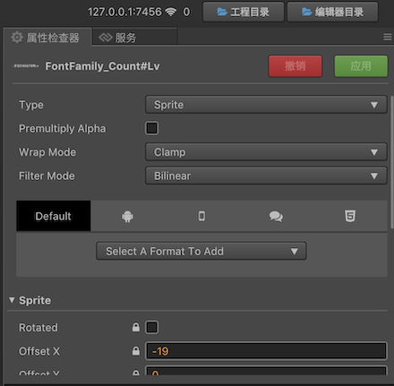

# UI 渲染批次合并指南

## 前言

在游戏开发中，Draw call 作为一个非常重要的性能指标，直接影响游戏的整体性能表现。Draw call 就是 CPU 调用图形 API，比如 OpenGL，命令 GPU 进行图形绘制。一次 Draw call 就代表一次图形绘制命令，由于 Draw call 带来的 CPU 及 GPU 的渲染状态切换消耗，往往需要通过批次合并来降低 Draw call 的调用次数。批次合并的本质就是在一帧的渲染过程中，保证连续节点的渲染状态一致，将尽可能多的节点数据合并一次性提交，从而减少绘图指令的调用次数，降低图形 API 调用带来的性能消耗，同时也可以避免 GPU 进行频繁的渲染状态切换。渲染状态就包括：纹理状态，Blend 模式，Stencil 状态，Depth Test 状态等等。

## 纹理状态

在 Creator 中可编辑的纹理状态包括：纹理的图片资源、纹理的 Filter 模式、纹理的 Premultiply 状态、纹理的 Wrap 模式。如下图所示：



为了保证节点使用的纹理图片资源一致，引擎提供两种合图方式：静态合图和动态合图。

### 静态合图

静态合图即为编辑器提供的自动图集功能，以及其他第三方图集打包工具如：TexturePacker 等。在资源层面进行散图合并，保证UI节点使用的都是同一张贴图，因为同一张图集的纹理状态都是一致的，所以能够达到渲染批次合并对纹理状态的要求。

对于 Label 组件，为了保证所有的 Label 节点使用相同的纹理，通常会使用 BMFont 将要使用的 UI 文字提前进行打包，并使用引擎的自动图集与散图一起合并进一张大的纹理，即可与其他相邻的 Sprite 节点进行批次合并。自动图集的创建与设置可以参考 [自动图集资源](../asset-workflow/auto-atlas.md)，然后新建一个自动图集资源配置，把所有你希望进行合图的 UI 图片，BMFont 和艺术数字都拖到自动图集资源所在的目录即可。BMFont 的文本制作可以通过 BMFont 字体制作工具，将常用的美术字或者文本制作生成一张字体图片及其字体映射文件。然后直接拖入编辑器中即可使用。

#### 静态合图的最佳实践

由于不同平台对纹理尺寸有限制，最大尺寸最好控制在 `2048 * 2048` 以内。这样以来单个图集的空间有限，同时为了避免 UI 界面打开时图集资源过大导致加载缓慢的问题。通常将单个 UI 界面所使用的图片资源放入一个文件夹为该文件夹创建自动图集，即可保证同一界面使用的纹理图片资源一致。<br>
如果静态合图很大，但当前场景实际用到的只是其中很小一部分散图，则也可能造成 **浪费**，导致游戏加载时间延长和内存占用增多。这种情况下不使用静态合图，由引擎进行动态合图可能是更好的选择。自动图集的预览功能如下图所示：


当同一界面的所有节点使用同一图集时，Draw call 最佳时就会为 **1**。在关闭界面时，可以销毁该界面使用的图集资源，即可保证界面占用的内存空间能够及时释放，达到最优的内存控制，避免出现内存空间过高导致的程序退出。

### 动态合图

除了前面提到的静态合图空间浪费问题，静态合图的局限性还常常体现在动态文本的渲染过程，如 Label 组件在使用系统文本时，文本贴图是依据文本内容通过 Canvas 绘制动态生成，不能提前进行图集打包。所以，除了静态合图，引擎也提供了动态合图的功能。

在运行时，引擎通过将散图添加到动态图集中，来保证节点使用的纹理一致。由于动态图集使用的是默认纹理状态，所以只有当散图的纹理状态与动态图集的状态一致，才可参与到引擎的动态合图中。

Label 组件目前提供三种 Cache Mode：**NONE**、**BITMAP**、**CHAR**。

- NONE 模式即 Label 的整个文本内容会进行一次绘制，并进行提交，但是并不参与动态合图。
- BITMAP 模式即 Label 的整个文本内容会进行一次绘制，并加入到动态图集中，以便进行批次合并。
- CHAR 模式即 Label 会将文本内容进行拆分，然后对单个字符进行绘制，并将字符缓存到一张单独的字符图集中。下次遇到相同字符不再重新绘制。

动态合图的说明具体可以参考 [动态合图说明](./dynamic-atlas.md)。

#### 动态合图的最佳实践

目前引擎的动态图集主要有两种：

- 一种是为散图及使用 BITMAP 模式的文本提供的动态图集，最大数量为 **5** 张，尺寸为 `2048 * 2048`。
- 另外一种是为使用 CHAR 模式的文本提供的字符图集，单个场景只有 **1** 张，尺寸为 `2048 * 2048`。

这两种动态图集在切换场景时会进行清理释放。由于动态图集空间有限，因此需要最佳化的利用：

- 对于一些 **不常变化的静态文本**，例如 UI 界面的标题，属性栏的固定文本，如果使用系统文本，可以设置为 **BITMAP** 模式，缓存到动态图集中，这样连续的 UI 节点即可进行动态合批。由于图片一般会打包为静态图集，而为了最大限度的把界面中的 Label 进行合批，可以将界面中的这些静态文本节点层级放在最上层，并保证这些 Label 节点连续即可避免 Label 节点打断批次，同时合并连续的 Label 节点降低 Draw call。
- 对于一些 **频繁变化的文本**，例如游戏中常用的倒计时，如果使用 BITMAP 模式，会导致大量的数值文本占用动态图集空间，但是其使用的字符数量有限，只有数字 **0 - 9** 这 10 个字符。为了避免频繁绘制，可设置为 **CHAR** 模式，进行字符缓存，将单个字符文本添加到字符图集中。这样缓存一次之后，后续所有的数字组合都可以从已缓存的字符中获取，提高性能。如果连续的 Label 节点使用的都是 CHAR 模式，因为它们使用的是同一张字符图集，所以也可以保证这些节点能够进行批次合并。

| Cache Mode | 文本图片 | 最佳实践 |
| ---------|--------|-------------|
| NONE | 单个 Label 使用一张节点大小的图片 | 适用频繁更新的不定文本，如：聊天功能 |
| BITMAP  | 文本修改需要重绘，绘制后添加到大小为 **2048 * 2048** 的通用动态图集中 | 适用内容不会改变的静态文本，如：界面标题 |
| CHAR | 每个字符绘制一次并添加到大小为 **2048 * 2048** 的字符图集中 | 适用频繁更新且文本字符内容有限的文本，如：分数、倒计时 |

## Blend 模式

Creator 编辑器中对部分渲染组件可以进行 Blend Func 的编辑，Src Blend Factor 以及 Dst Blend Factor，分别表示颜色混合时的源颜色和目标颜色的取值模式。颜色混合公式为：

```js
FinalRed = (RS * RFactor) + (RD * RFactor)
FinalGreen = (GS * GFactor) + (GD * GFactor)
FinalBlue = (BS * BFactor) + (BD * BFactor)
FinalAlpha = (AS * AFactor) + (AD * AFactor)
```

| Constant | RFactor | GFactor | BFactor | AFactor | Description |
| ---------|--------|--------|--------|--------|-------------|
| ZERO | 0 | 0 | 0 | 0 | 将所有颜色乘以 0 |
| ONE  | 1 | 1 | 1 | 1 | 将所有颜色乘以 1 |
| SRC_COLOR | RS | GS | BS | AS | 将所有颜色乘以源颜色 |
| ONE_MINUS_SRC_COLOR | 1 - RS | 1 - GS | 1 - BS | 1 - AS | 将所有颜色乘以 1 减去源颜色 |
| DST_COLOR | RD | GD | BD | AD | 将所有颜色乘以目标颜色 |
| ONE_MINUS_DST_COLOR | 1 - RD | 1 - GD | 1 - BD | 1 - AD | 将所有颜色乘以 1 减去目标颜色 |
| SRC_ALPHA | AS | AS | AS | AS | 将所有颜色乘以源透明度 |
| ONE_MINUS_SRC_ALPHA | 1 - AS | 1 - AS | 1 - AS | 1 - AS | 将所有颜色乘以 1 减去源透明度 |
| DST_ALPHA | AD | AD | AD | AD | 将所有颜色乘以目标透明度 |
| ONE_MINUS_DST_ALPHA | 1 - AD | 1 - AD | 1 - AD | 1 - AD | 将所有颜色乘以 1 减去目标透明度 |

某些情况下，透明图片的边缘部分因为采样到透明区域的背景颜色，会出现黑色边缘的现象，通常为了解决该问题，会设置图片的预乘状态，并设置 Src Blend Factor 为 **ONE**，但是 Blend 模式不一致也会打断批次合并。

### Blend 使用的最佳实践

由于 Blend 模式不一致会打断批次合并，所以也应该尽量减少 Blend 模式的改变。比如 PNG 图片的黑边问题，可以在图集打包时进行扩边，而不是用切换 Blend Func 的方式。如果某些表现效果需要特殊的设置，也应该在设定 UI 布局层级时，尽量保证 Blend 模式一致的节点是在同一层级且连续，避免不同 Blend 模式的节点交叉布局，这样即可有效减少 Blend 模式切换导致的 Draw call 增加。

## Stencil 状态

Stencil 状态即模板测试，通过模板缓冲来实现特定的效果，在 Creator 中，Mask 组件就是通过该功能实现，一个 Mask 组件及其控制的渲染节点，需要至少三次 Draw call。第一次开启模板测试并调用一次 Draw call，刷新模板缓冲。第二次绘制对需要通过模板测试的区域进行设置。第三次再进行实际的子节点内容绘制，绘制结束再关闭模板测试。因此使用 Mask 组件就无法与其他相邻节点进行批次处理，但是 Mask 组件内部的连续节点在满足合并规则的情况下还是会进行合批。

### Stencil 使用的最佳实践

如果界面内使用大量 Mask 组件会带来 Draw call 的剧增，因此应该尽量减少 Mask 组件的使用。如有使用 Mask 组件的节点，应该尽量不要穿插在连续并且可以进行批次合并的节点层级内，这样也可以尽量规避 Mask 打断本可以合并批次的一系列连续节点。

## 渲染帧调试

在遇到 Draw call 比较高时，如果不能直接判断是哪些因素导致的批次合并失败，可以通过渲染帧调试的方式，把当前帧所有的渲染指令打印出来，然后再依据具体指令进行问题分享及定位，进一步地优化可以合并的 Draw call。在 Web 端常用的工具例如 Web Inspector、SpectorJs 等，这里以 SpectorJs 为例。[SpectorJS 官方下载地址](https://spector.babylonjs.com)，下载安装 Chrome 插件。

搭建 UI 测试例如下：


运行预览，我们可以在界面左下角的 Profile 信息中看到具体的 Draw call 数值，该测试例的 Draw call 为 4。


然后我们开启 SpectorJS 打印当前界面的渲染帧，就可以看到每一次 Draw call 调用具体的绘制信息，如下图所示：


通过每一次 drawElements 中间的状态切换，我们即可知道是什么原因导致的批次合并失败。

## 注意事项

1. 由于 Creator 的自动图集功能是在项目导出的时候进行的，所以应该在发布后的项目中进行合批测试。
2. 在导入 BMFont 的资源的时候，需要把 `.fnt` 和相应的 `png` 图片放在同一个目录下面。
3. LabelAtlas 底层渲染采用的跟 BMFont 一样的机制，所以也可以和 BMFont 及其它 UI 元素一起合图来实现批次渲染。
4. 微信小游戏平台由于 Image 的内存占用原因，默认禁用了动态图集功能，如果对内存占用要求不高的游戏，可以自行通过 `cc.dynamicAtlasManager.enabled = true` 打开该功能，并且设置 `cc.macro.CLEANUP_IMAGE_CACHE = false` 禁止清理 Image 缓存。具体可参考 [启用、禁用动态合图](./dynamic-atlas.md#%E5%90%AF%E7%94%A8%E3%80%81%E7%A6%81%E7%94%A8%E5%8A%A8%E6%80%81%E5%90%88%E5%9B%BE)。
5. 默认 Spine 的合批是关闭的，需要勾选 **enableBatch** 选项开启，Spine 必须是同个 Spine 资源创建的对象，且每个 Spine 只有一种混合模式、一张贴图，才能进行批次合并，Dragonbones 同理。
6. 单次 Draw call 的 Buffer 数据有限，当数据超过 Buffer 长度限制时，会重新申请新的 Buffer，不同的 Buffer 也会是不同的批次。

## 参考链接

[Cocos Creator 性能优化：DrawCall](https://mp.weixin.qq.com/s/2fKhBciXoxZ85XuUL01iyg)
