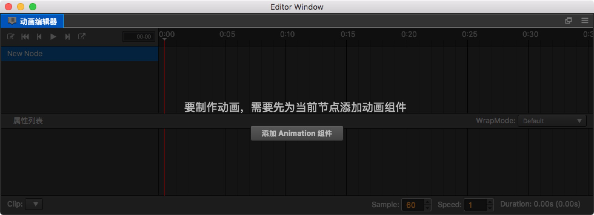

# 创建Animation组件和动画剪辑

## 创建 Animation 组件

在每个节点上，我们都可以添加不同的组件。如果我们想在这个节点上创建动画，也必须为它新建一个 Animation 组件。创建的方法有两种：

- 选中相应的节点，在属性检查器中点击右上方的 **+**，或者下方的 **添加组件**，在其他组件中选择 Animation。
- 打开动画编辑器，然后在层级管理器中选中需要添加动画的节点，在动画编辑器中点击 **添加 Animation 组件** 按钮。

  

## 创建与挂载动画剪辑

现在我们的节点上已经有了 Animation 组件了，但是还没有相应的动画剪辑数据，动画剪辑也有两种创建方式：

- 在资源管理器中点击左上方的 **+**，或者右键空白区域，选择 Animation Clip，这时候会在管理器中创建一个名为 `New AnimationClip` 的剪辑文件。单单创建还是不够的，我们再次在层级管理器中点选刚刚的节点，在属性检查器中找到 Animation，这时候的 Clips 显示的是 0，我们将它改成 1。然后将刚刚在资源管理器中创建的 `New AnimationClip`，拖入刚刚出现的 **animation-clip 选择框** 内。

- 如果 Animation 组件中还没有添加动画剪辑文件，则可以在动画编辑器中直接点击 **新建 AnimationClip** 按钮，根据弹出的窗口创建一个新的动画剪辑文件。需要注意的是，如果选择覆盖已有的剪辑文件，被覆盖的文件内容会被清空。

  

至此我们已经完成了动画制作之前的准备工作，下一步就是要创建动画曲线了。

## 剪辑内的数据

一个动画剪辑内可能包含了多个节点，每个节点上挂载多个动画属性，每个属性内的数据才是实际的关键帧。

### 节点数据

动画剪辑通过节点的名字定义数据的位置，本身忽略了根节点，其余的子节点通过与根节点的 **相对路径** 索引找到对应的数据。有时候我们会在制作完成动画后，将节点重命名，这样会造成动画数据出现问题，如下图：

这时候我们要手动指定数据对应的节点，可以将鼠标移入节点，点击节点右侧出现的更多按钮，并选择 “移动数据”。要注意的是，根节点名字是被忽略的，所以根节点名字是固定的，并不能修改，并且一直显示在页面左侧。

如上图，`/New Node/test` 节点没有数据，我想将 `/New Node/efx_flare` 上的数据移到这里：

1. 鼠标移到丢失的节点 `/New Node/efx_flare` 上
2. 点击右侧出现的按钮
3. 选择移动数据
4. 将路径改为 `/New Node/test`，并回车
