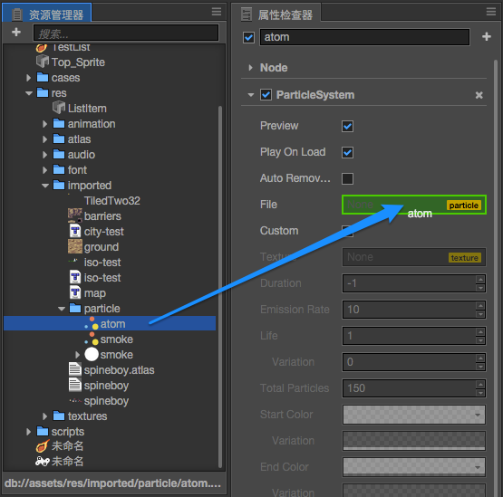

# 粒子资源（ParticleSystem）

## 导入粒子资源

将 Cocos2d 支持的粒子 `.plist` 文件直接放到工程资源目录下。


## 在场景中添加粒子系统

- 方法一，从 **资源管理器** 里将粒子资源直接拖到 **层级管理器**：

  

- 方法二，从 **资源管理器** 里将粒子资源直接拖到 **场景编辑器**：

  

- 方法三，在已有节点上添加一个 **粒子系统（ParticleSystem）** 组件，从 **资源管理器** 里将粒子资源直接赋给组件的 `File` 属性：

  

  **注意**：不支持 `.plist` 文件中的 sourcePosition 属性的导入。

## 在项目中的存放

为了提高资源管理效率，建议将导入的 `plist` 和 `png`（如果有使用贴图）文件存放在单独的目录下，不要和其他资源混在一起。

## 渲染错误解决方法

粒子使用的 png 贴图文件或 base64 格式的内置图片文件可能会有不正确的预乘信息，导致渲染出的粒子不能正确显示透明区域。如果出现这种情况，请手动修改粒子 plist 文件中的 blendFuncSource 属性到下面的值：

```xml
<key>blendFuncSource</key>
<integer>770</integer>
```