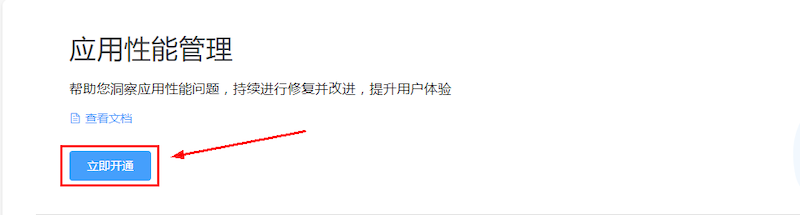

> **注意**：此版本文档已归档不再维护，请移步至 [最新版本](https://service.cocos.com/document/zh/agc-apm.html)。

# 性能管理（AppGallery Connect）快速入门

华为 AppGallery Connect（简称 AGC）[性能管理](https://developer.huawei.com/consumer/cn/doc/development/AppGallery-connect-Guides/agc-apms-introduction)（APM，App Performance Management）服务，提供分钟级应用性能监控能力，开发者可以在 AGC 后台查看和分析性能管理服务收集到的应用性能数据，从而全面了解所开发应用的性能特点，快速精准修复应用存在的性能问题，持续提升应用的用户体验。

### 主要功能

| 功能 | 说明 |
| :--- | :--- |
| 自动采集应用启动、应用屏幕、HTTP/HTTPS 网络请求等方面的性能数据 | 性能管理 APM SDK 能够自动采集应用启动、应用屏幕、HTTP/HTTPS 网络请求等关键性能数据。<br>1. 应用启动性能数据：记录应用启动（冷启动和热启动）时间。<br>2. 应用屏幕性能数据：记录应用屏幕渲染缓慢帧和冻结帧数量。<br>3. HTTP/HTTPS 网络性能数据：SDK 记录响应时长，成功率，响应大小等指标数据。 |
| 支持查看和分析应用性能数据，精准发现应用性能在哪些方面有改进空间 | 性能管理 APM 通过多个维度（版本号、国家/地区、手机类型、一级区域、系统版本、运营商、网络）向开发者展示应用的性能指标，帮助开发者快速了解应用在哪些方面可优化改进。 |
| 支持创建自定义跟踪记录，监控应用在特定场景下的性能 |  借助性能管理 APM SDK，开发者可以：<br>1. 创建自定义跟踪记录来监控应用在特定场景，如用户登录或者屏幕加载场景下的性能。<br>2. 为自定义跟踪记录添加指标（如登录次数）和属性（如登录是否成功）。|

### 版本更新说明

- 当前版本：0.5.2_1.3.1.300

    - 修复部分 bug。

- v0.5.1_1.3.1

    - 集成华为 AGC APM 服务。

## 一键接入性能管理服务

### 开通服务

- 使用 Cocos Creator 打开需要接入性能管理服务的项目工程。

- 点击菜单栏的 **面板 -> 服务**，打开 **服务** 面板，选择 **性能管理**，进入服务详情页。然后点击右上方的 **启用** 按钮即可开通服务。详情可参考 [服务面板操作指南](./user-guide.md)。

  

- 如果华为后台的 **性能管理** 服务尚未开通，需登录 [AppGallery Connect](https://developer.huawei.com/consumer/cn/service/josp/agc/index.html) 后台，选择 **我的项目**，进入 **质量 -> 性能管理** 页面，点击 **立即开通** 按钮开通服务。

  

### 配置华为参数文件

大部分的华为相关项目都需要用到 `agconnect-services.json` 配置文件。若有新开通服务等操作，请及时更新该文件。

- 登录 [AppGallery Connect](https://developer.huawei.com/consumer/cn/service/josp/agc/index.html) 后台，在 **项目列表 -> 应用列表** 中找到对应的应用。

- 在 **项目设置** 页面的 **应用** 区域，点击 `agconnect-services.json` 下载配置文件。`agconnect-services.json` 文件在下载或者更新完成后，**必须手动拷贝** 到工程目录的 `settings` 目录下。

  

- Cocos Creator v2.4.3 及以上版本，若 [发布到 HUAWEI AppGallery Connect](../publish/publish-huawei-agc.md)，开发者可直接在 **构建发布** 面板中选取下载或更新后的配置文件，不需要手动拷贝。

  

### 验证服务是否接入成功

- 完成 **性能管理** 服务接入步骤后，无需改动代码，即可 [发布到 Android 平台](../publish/publish-native.md)。请确保 **构建发布** 面板中的包名与华为后台设置的包名一致。

- 工程运行到手机后，登录 [AppGallery Connect](https://developer.huawei.com/consumer/cn/service/josp/agc/index.html) 后台，打开对应项目，进入 **质量 -> 性能管理**，若能看到应用性能数据正常显示（通常会在 15 分钟内显示），即为接入成功。

  

## Sample 工程

开发者可以通过 Sample 工程快速体验性能管理服务。

- 点击性能管理服务面板中的 **Sample 工程** 按钮，Clone 或下载 HUAWEI Sample 工程，并在 Cocos Creator 中打开。

- 参照上文开通性能管理并配置华为参数文件后，可通过 Creator 编辑器菜单栏的 **项目 -> 构建发布** 打开 **构建发布** 面板来构建编译工程。Creator v2.4.1 及以上版本，可 [发布到 HUAWEI AppGallery Connect](../publish/publish-huawei-agc.md)。Creator v2.4.1 以下的版本可 [发布到 Android 平台](../publish/publish-native.md)。

- Sample 工程运行到手机后，点击首页的 **APMS** 按钮，即可进入功能界面进行测试。

  

## 开发指南

### 设置性能管理服务开关

`enableCollection(enable: boolean): void`

可参考 [在应用客户端停用](https://developer.huawei.com/consumer/cn/doc/development/AppGallery-connect-Guides/agc-apms-stopapms#h1-1584589061111) 文档。开关的默认值为打开（true），如果需要停用应用性能数据采集，可将开关设为关闭（false）。

应用客户端停用的级别 **高于** AGC 远程配置停用。如用户在应用客户端停用性能监控，即使通过 AGC 远程配置打开性能监控开关，性能管理服务也不会进行性能数据采集。

**参数说明**：

| 参数 | 说明 |  
| :---------- | :------------- |  
|  enable | APM 服务开关。<br>`true`：打开，性能管理服务会采集性能监控数据。<br>`false`：关闭，性能管理服务不会采集性能监控数据。| 

**示例**：

```js
huawei.agc.apms.apmsService.enableCollection(true);
```

### 添加自定义跟踪记录（可选）

可参考 [添加自定义跟踪记录](https://developer.huawei.com/consumer/cn/doc/development/AppGallery-connect-Guides/agc-apms-addtrace) 文档。自定义跟踪记录可用于监控开发者的应用在特定场景下的性能，如应用登录场景、应用页面长时间无响应场景等。性能管理插件封装后的方法，比起 SDK 原型方法，需要加入 `name` 参数，用于获取对象调用。若当前名称的对象不存在，则会再新建一个对象。

#### 启动自定义跟踪记录

`startCustomTrace(name: string): void`

可参考 [启动自定义跟踪记录](https://developer.huawei.com/consumer/cn/doc/development/AppGallery-connect-References/customtrace#start) 文档。

**参数说明**：

| 参数 | 说明 |  
| :---------- | :------------- |  
| name | 自定义跟踪记录名称，只能包含中文、字母（不区分大小写）、数字和下划线，且长度不能超过 100 字符，所有方法需要根据该名称获取对象调用。若当前名称的对象不存在，则会再新建一个对象。| 

**示例**：

```js
huawei.agc.apms.apmsService.startCustomTrace("traceID");
```

#### 停止自定义跟踪记录

`stopCustomTrace(name: string): void`

可参考 [停止自定义跟踪记录](https://developer.huawei.com/consumer/cn/doc/development/AppGallery-connect-References/customtrace#stop) 文档。

**参数说明**：

|  参数  |  说明  |  
| :---------- | :------------- |  
| name | 自定义跟踪记录名称，只能包含中文、字母（不区分大小写）、数字和下划线，且长度不能超过 100 字符，所有方法需要根据该名称获取对象调用。若当前名称的对象不存在，则会再新建一个对象。 | 

**示例**：

```js
huawei.agc.apms.apmsService.stopCustomTrace("traceID");
```

#### 添加自定义属性

`putCustomTraceProperty(name: string, propertyName: string, propertyValue: string): void`

设置自定义跟踪记录属性名称和属性值。每个 CustomTrace 实例最多只能设置 5 个自定义属性。

**参数说明**：

|  参数  |  说明  |  
| :---------- | :------------- |  
| name | 自定义跟踪记录名称，只能包含中文、字母（不区分大小写）、数字和下划线，且长度不能超过 100 字符，所有方法需要根据该名称获取对象调用。若当前名称的对象不存在，则会再新建一个对象。 | 
| propertyName | 自定义属性名称，只能由中文、字母（不区分大小写）、数字和下划线组成，且长度不超过 40 字符。| 
| propertyValue | 自定义属性值，只能由中文、字母（不区分大小写）、数字和下划线组成，且长度不超过 100 字符。| 

**示例**：

```js
let traceID = "testTrace";
let pName = "product";
let pValue = "food";

huawei.agc.apms.apmsService.putCustomTraceProperty(traceID, pName, pValue);
```

#### 移除自定义属性

`removeCustomTraceProperty(name: string, propertyName: string): void`

从 CustomTrace 实例中移除自定义属性。

**参数说明**：

|  参数  |  说明  |  
| :---------- | :------------- |  
| name | 自定义跟踪记录名称，只能包含中文、字母（不区分大小写）、数字和下划线，且长度不能超过 100 字符，所有方法需要根据该名称获取对象调用。若当前名称的对象不存在，则会再新建一个对象。 | 
| propertyName | 自定义属性名称，只能由中文、字母（不区分大小写）、数字和下划线组成，且长度不超过 40 字符。| 

**示例**：

```js
let traceID = "testTrace";
let pName = "product";

huawei.agc.apms.apmsService.removeCustomTraceProperty(traceID, pName);
```

#### 获取自定义属性值

`getCustomTraceProperty(name: string, propertyName: string): string`

可参考 [获取自定义属性值](https://developer.huawei.com/consumer/cn/doc/development/AppGallery-connect-References/customtrace#getProperty) 文档。

**参数说明**：

|  参数  |  说明  |  
| :---------- | :------------- |  
| name | 自定义跟踪记录名称，只能包含中文、字母（不区分大小写）、数字和下划线，且长度不能超过 100 字符，所有方法需要根据该名称获取对象调用。若当前名称的对象不存在，则会再新建一个对象。 | 
| propertyName | 自定义属性名称，只能由中文、字母（不区分大小写）、数字和下划线组成，且长度不超过 40 字符。| 

**示例**：

```js
let traceID = "testTrace";
let pName = "product";
let propertValue = huawei.agc.apms.apmsService.getCustomTraceProperty(traceID, pName);
console.log("pValue = ", propertValue);
```

#### 增加自定义跟踪记录指标

`incrementCustomTraceMeasure(name: string, measureName: string, measureValue: number): void`

增加自定义跟踪记录指标的指标值。如果指标不存在，将创建一个新指标。如果自定义跟踪记录未启动或已停止，接口不生效。

**参数说明**：

|  参数  |  说明  |  
| :---------- | :------------- |  
| name | 自定义跟踪记录名称，只能包含中文、字母（不区分大小写）、数字和下划线，且长度不能超过 100 字符，所有方法需要根据该名称获取对象调用。若当前名称的对象不存在，则会再新建一个对象。 |
| measureName | 自定义跟踪记录指标名称。| 
| measureValue | 自定义跟踪记录指标值，对应 Java 侧 long 型数值。| 

**示例**：

```js
let traceID = "testTrace";
let mName = "MeasureName";
let mValue = 12000;

huawei.agc.apms.apmsService.incrementCustomTraceMeasure(traceID, mName, mValue);
```

#### 获取自定义跟踪记录指标值

`getCustomTraceMeasure(name: string, measureName: string): string`

可参考 [获取自定义跟踪记录指标值](https://developer.huawei.com/consumer/cn/doc/development/AppGallery-connect-References/customtrace#getMeasure) 文档。

**参数说明**：

|  参数  |  说明  |  
| :---------- | :------------- |  
| name | 自定义跟踪记录名称，只能包含中文、字母（不区分大小写）、数字和下划线，且长度不能超过 100 字符，所有方法需要根据该名称获取对象调用。若当前名称的对象不存在，则会再新建一个对象。 |
| measureName | 自定义跟踪记录指标名称。| 

**示例**：

```js
let traceID = "testTrace";
let mName = "MeasureName";

let measureValue = huawei.agc.apms.apmsService.getCustomTraceMeasure(traceID, mName);
console.log("mValue = ", measureValue);
```

#### 添加自定义跟踪记录指标

`putCustomTraceMeasure(name: String, measureName: String, measureValue: number): void`

添加自定义跟踪记录指标。如果指标已经存在，则更新指标的值。

**参数说明**：

|  参数  |  说明  |  
| :---------- | :------------- |  
| name | 自定义跟踪记录名称，只能包含中文、字母（不区分大小写）、数字和下划线，且长度不能超过 100 字符，所有方法需要根据该名称获取对象调用。若当前名称的对象不存在，则会再新建一个对象。 |
| measureName | 自定义跟踪记录指标名称。| 
| measureValue | 自定义跟踪记录指标值，对应 Java 侧 long 型数值。| 

**示例**：

```js
let traceID = "testTrace";
let mName = "MeasureName";
let mValue = 12000;

huawei.agc.apms.apmsService.putCustomTraceMeasure(traceID, mName, mValue);
```

#### 获取自定义跟踪记录的所有属性

`getCustomTraceProperties(name: string): string`

获取自定义跟踪记录的所有属性。返回值为 JSON 对象，存放所有属性的键值对。

**参数说明**：

|  参数  |  说明  |  
| :---------- | :------------- |  
| name | 自定义跟踪记录名称，只能包含中文、字母（不区分大小写）、数字和下划线，且长度不能超过 100 字符，所有方法需要根据该名称获取对象调用。若当前名称的对象不存在，则会再新建一个对象。 |

**示例**：

```js
let traceID = "testTrace";
let tProp = huawei.agc.apms.apmsService.getCustomTraceProperties(traceID);
console.log("tProp = ", JSON.stringify(tProp));
```

### 添加针对特定网络请求的监控指标（可选）

可参考 [添加针对特定网络请求的监控指标](https://developer.huawei.com/consumer/cn/doc/development/AppGallery-connect-Guides/agc-apms-addnetworkmeasure) 文档。虽然 APM 会自动采集应用中大多数网络请求性能数据，但如果采用的是非 URLConnection 或非 Okhttp 框架，还是有少量网络请求 APM 无法自动采集。此时，可以按照下列方式采集网络请求性能数据。另外，您还可以对特定网络请求添加自定义属性。

#### 创建网络请求指标实例

`initNetworkMeasure(url: string, httpMethod: string): string`

针对每个网络请求，[创建网络请求指标实例](https://developer.huawei.com/consumer/cn/doc/development/AppGallery-connect-References/apms#createNetworkMeasure)，用于采集网络性能数据。**返回值即为下方各方法所需的 id 参数**。

**参数说明**：

| 参数 | 说明 |  
| :---------- | :------------- |  
| url | 网络请求 URL 地址 | 
| httpMethod | 请求方法，仅支持 GET、PUT、POST、DELETE、HEAD、PATCH、OPTIONS、TRACE 和 CONNECT 方法。 | 

**示例**：

```js
let id = huawei.agc.apms.apmsService.initNetworkMeasure(url, "POST");
console.log("createNetworkMeasure, id = ", id);
```

#### 设置请求开始时间

`startNetworkMeasure(id: string): void`

可参考 [设置请求开始时间](https://developer.huawei.com/consumer/cn/doc/development/AppGallery-connect-References/networkmeasure#start) 文档。

**参数说明**：

| 参数 | 说明 |  
| :---------- | :------------- |  
| id | `initNetworkMeasure` 方法返回的对象 id，同时可能有多个 id 对象存在。其他方法均需要传入此 id。 | 

**示例**：

```js
huawei.agc.apms.apmsService.startNetworkMeasure(id);
```

#### 设置请求结束时间

`stopNetworkMeasure(id: string): void`

可参考 [设置请求结束时间](https://developer.huawei.com/consumer/cn/doc/development/AppGallery-connect-References/networkmeasure#stop) 文档，并上报网络请求指标及自定义属性数据。

**参数说明**：

| 参数 | 说明 |  
| :---------- | :------------- |  
| id | `initNetworkMeasure` 方法返回的对象 id，同时可能有多个 id 对象存在。其他方法均需要传入此 id。 | 

**示例**：

```js
huawei.agc.apms.apmsService.stopNetworkMeasure(id);
```

#### 设置请求的响应码

`setNetworkMeasureStatusCode(id: string, statusCode: number): void`

可参考 [设置请求的响应码](https://developer.huawei.com/consumer/cn/doc/development/AppGallery-connect-References/networkmeasure#setStatusCode) 文档。

**参数说明**：

| 参数 | 说明 |  
| :---------- | :------------- |  
| id | `initNetworkMeasure` 方法返回的对象 id，同时可能有多个 id 对象存在。其他方法均需要传入此 id。 | 
| statusCode | 请求的响应码 | 

**示例**：

```js
huawei.agc.apms.apmsService.setNetworkMeasureStatusCode(id, 500);
```

#### 设置请求体大小

`setNetworkMeasureBytesSent(id: string, length: number): void`

可参考 [设置请求体大小](https://developer.huawei.com/consumer/cn/doc/development/AppGallery-connect-References/networkmeasure#setBytesSent) 文档。

**参数说明**：

| 参数 | 说明 |  
| :---------- | :------------- |  
| id | `initNetworkMeasure` 方法返回的对象 id，同时可能有多个 id 对象存在。其他方法均需要传入此 id。 | 
| length | 请求体大小，对应 Java 侧 long 型数值。 | 

**示例**：

```js
huawei.agc.apms.apmsService.setNetworkMeasureBytesSent(id, 10000);
```

#### 设置响应体大小

`setNetworkMeasureBytesReceived(id: string, length: number): void`

可参考 [设置响应体大小](https://developer.huawei.com/consumer/cn/doc/development/AppGallery-connect-References/networkmeasure#setBytesReceived) 文档。

**参数说明**：

| 参数 | 说明 |  
| :---------- | :------------- |  
| id | `initNetworkMeasure` 方法返回的对象 id，同时可能有多个 id 对象存在。其他方法均需要传入此 id。 | 
| length | 响应体大小，对应 Java 侧 long 型数值。 | 

**示例**：

```js
huawei.agc.apms.apmsService.setNetworkMeasureBytesReceived(id, 10000);
```

#### 设置响应体 contentType 类型

`setNetworkMeasureContentType(id: string, contentType: string): void`

可参考 [设置响应体 contentType 类型](https://developer.huawei.com/consumer/cn/doc/development/AppGallery-connect-References/networkmeasure#setContentType) 文档。

**参数说明**：

| 参数 | 说明 |  
| :---------- | :------------- |  
| id | `initNetworkMeasure` 方法返回的对象 id，同时可能有多个 id 对象存在。其他方法均需要传入此 id。 | 
| contentType | 响应体 contentType 类型 | 

**示例**：

```js
huawei.agc.apms.apmsService.setNetworkMeasureContentType(id, "contentType1");
```

#### 设置网络请求的自定义属性名称和属性值

`putNetworkMeasureProperty(id: string, propertyName: string, propertyValue: string): void`

可参考 [设置网络请求的自定义属性名称和属性值](https://developer.huawei.com/consumer/cn/doc/development/AppGallery-connect-References/networkmeasure#putProperty) 文档。每个 NetworkMeasure 实例最多只能设置 5 个自定义属性。

**参数说明**：

| 参数 | 说明 |  
| :---------- | :------------- |  
| id | `initNetworkMeasure` 方法返回的对象 id，同时可能有多个 id 对象存在。其他方法均需要传入此 id。 | 
| propertyName | 自定义属性名称，只能由中文、字母（不区分大小写）、数字和下划线组成，且长度不能超过 40 字符。 | 
| propertyValue | 自定义属性值，只能由中文、字母（不区分大小写）、数字和下划线组成，且长度不能超过 100 字符。 | 

**示例**：

```js
let pName = "propName";
let pValue = "12000";
huawei.agc.apms.apmsService.putNetworkMeasureProperty(id, pName, pValue);
```

#### 从 NetworkMeasure 实例中移除已存在属性

`removeNetworkMeasureProperty(id: string, propertyName: string): void`

可参考 [从 NetworkMeasure 实例中移除已存在属性](https://developer.huawei.com/consumer/cn/doc/development/AppGallery-connect-References/networkmeasure#removeProperty) 文档。

**参数说明**：

| 参数 | 说明 |  
| :---------- | :------------- |  
| id | `initNetworkMeasure` 方法返回的对象 id，同时可能有多个 id 对象存在。其他方法均需要传入此 id。 | 
| propertyName | 自定义属性名称，只能由中文、字母（不区分大小写）、数字和下划线组成，且长度不能超过 40 字符。 | 

**示例**：

```js
let pName = "propName";
huawei.agc.apms.apmsService.removeNetworkMeasureProperty(id, pName);
```

#### 从 NetworkMeasure 实例中获取所有属性

`getNetworkMeasureProperties(id: string): string`

可参考 [从 NetworkMeasure 实例中获取所有属性](https://developer.huawei.com/consumer/cn/doc/development/AppGallery-connect-References/networkmeasure#getProperties) 文档，返回 JSON 对象。

**参数说明**：

| 参数 | 说明 |  
| :---------- | :------------- |  
| id | `initNetworkMeasure` 方法返回的对象 id，同时可能有多个 id 对象存在。其他方法均需要传入此 id。 | 

**示例**：

```js
let mProp = huawei.agc.apms.apmsService.getNetworkMeasureProperties(id);
console.log("mProp = ", JSON.stringify(mProp));
```

#### 获取自定义属性值

`getNetworkMeasureProperty(id: string, propertyName: string): string`

可参考 [获取自定义属性值](https://developer.huawei.com/consumer/cn/doc/development/AppGallery-connect-References/networkmeasure#getProperty) 文档。

**参数说明**：

| 参数 | 说明 |  
| :---------- | :------------- |  
| id | `initNetworkMeasure` 方法返回的对象 id，同时可能有多个 id 对象存在。其他方法均需要传入此 id。 | 
| propertyName | 自定义属性名称，只能由中文、字母（不区分大小写）、数字和下划线组成，且长度不能超过 40 字符。 | 

**示例**：

```js
let pName = "propName";
let nMeasure = huawei.agc.apms.apmsService.getNetworkMeasureProperty(id, pName);
console.log("nMeasure = ", nMeasure);
```

## API 文档

详细的功能接口和 API 说明，请参考 [性能管理 - API 文档](https://service.cocos.com/document/api/modules/huawei.agc.apms.html)。
