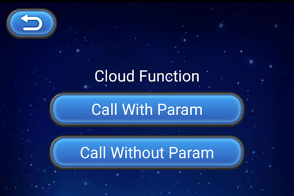

> **注意**：此版本文档已归档不再维护，请移步至 [最新版本](https://service.cocos.com/document/zh/agc-cloudfunc.html)。

# 云函数（AppGallery Connect）快速入门

华为 AppGallery Connect（简称 AGC）[云函数](https://developer.huawei.com/consumer/cn/doc/development/AppGallery-connect-Guides/agc-cloudfunctiontion-introduction) 是一项 Serverless 计算服务，提供 FaaS（Function as a Service）能力，可以帮助开发者大幅简化应用开发与运维相关的事务，降低应用功能的实现门槛，快速构建业务能力。

### 主要功能

- 云函数提供了高效可靠的函数开发与运行框架，替开发者完全解决传统应用开发与运维中的诸多复杂事务（如服务器配置与管理、代码部署、负载均衡、弹性伸缩、高可用保证等等），开发者只需聚焦业务逻辑、开发并上传函数代码，即可构建高可用性、可伸缩的 Serverless 应用。

- 云函数作为 Serverless 的核心与枢纽，方便连接和扩展周边云服务，开发者可以像拼搭积木一样自由便捷地组织各项服务来实现业务逻辑。

### 相关概念

通过云函数，开发者可以使用 AGC 当前支持的编程语言开发函数，然后提交到 Serverless 环境中运行函数。函数的每个实例都会在一个隔离的环境中运行、接收并处理事件，然后返回响应。云函数会保证函数实例的高可用性，并且按需自动扩展实例数量。

- 函数：在云函数中运行的脚本或程序，处理事件并返回响应。
- 事件源：AGC 中的其他服务（如云数据库），或者开发者自定义服务。事件源可以发布多种类型事件，以触发函数的执行。
- 触发器：按照配置（事件源 、事件类型、函数的映射关系），监听事件源上的指定类型事件，当事件发生时自动调用函数，将事件数据提交给函数处理。
- 别名：开发者可以为函数创建一个或多个别名，其作用类似于指向特定函数版本的指针。函数调用方（含触发器）通过使用别名，可以访问别名指向的函数。

### 典型应用场景

通过云函数，开发者能够运行函数代码以响应关注的事件，典型的应用场景大致可分为以下几类：

- 向用户发送某些事件通知 
- 执行数据库清理和维护任务
- 在云端执行密集型任务
- 集成第三方服务和 API

### 申请测试资格

云函数服务当前仍处于 Beta 测试状态，若要使用该服务，开发者需要发送申请开通服务的邮件到邮箱 `agconnect@huawei.com`。

邮件标题请使用 **[云函数]-[公司名称]-[开发者帐号 ID]-[项目 ID]** 格式，**开发者帐号 ID** 及 **项目 ID** 的获取可参考文档 [查询开发者帐号 ID 及项目 ID](https://developer.huawei.com/consumer/cn/doc/development/AppGallery-connect-Guides/agc-query-ID)。在收到开发者的申请后，华为运营人员会在 **1-3** 个工作日内答复。

### 如何收费

目前云函数服务处于 Beta 测试阶段，开发者可以 **免费** 使用。华为会在正式收费前一个月邮件通知并公告相关策略及费率。

### 版本更新说明

- 当前版本：0.5.0_1.4.1.300

    - 集成华为 AGC 云函数服务。

## 一键接入云函数服务

### 开通服务

- 确保云函数服务测试资格申请已通过。

- 使用 Cocos Creator 打开需要接入云函数服务的项目工程。

- 点击菜单栏的 **面板 -> 服务**，打开 **服务** 面板，选择 **云函数**，进入服务详情页。然后点击右上方的 **启用** 按钮即可开通服务。详情可参考 [服务面板操作指南](./user-guide.md)。

  

### 配置华为参数文件

大部分的华为相关项目都需要用到 `agconnect-services.json` 配置文件。若有新开通服务等操作，请及时更新该文件。

- 登录 [AppGallery Connect](https://developer.huawei.com/consumer/cn/service/josp/agc/index.html) 后台，在 **项目列表 -> 应用列表** 中找到对应的应用。

- 在 **项目设置** 页面的 **应用** 区域，点击 `agconnect-services.json` 下载配置文件。`agconnect-services.json` 文件在下载或者更新完成后，**必须手动拷贝** 到工程目录的 `settings` 目录下。

  

- Cocos Creator v2.4.3 及以上版本，若 [发布到 HUAWEI AppGallery Connect](../publish/publish-huawei-agc.md)，开发者可直接在 **构建发布** 面板中选取下载或更新后的配置文件，不需要手动拷贝。

  

### 验证服务是否接入成功

- 参考 [创建函数](https://developer.huawei.com/consumer/cn/doc/development/AppGallery-connect-Guides/agc-cloudfunction-getstarted#h1-1577934210281) 文档，在 AppGallery Connect 后台创建函数并完成函数定义，可直接使用 AGC 默认提供的 **myHandler** 函数代码。然后参考 [应用客户端调用](https://developer.huawei.com/consumer/cn/doc/development/AppGallery-connect-Guides/agc-cloudfunction-appcall#h1-1577936935853) 查询并获取触发器标识。

- 参考上文开通云函数服务后，我们便可以通过在脚本中添加简单的代码，来验证接入是否成功。以获取到的触发器标识为 `test-$latest` 为例：

  ```js
    huawei.agc.func.AGCFunctionService.wrap("test-$latest").call((err, data) => {
        if (err !== null) {
            console.log("Cloud Function", `error: ${JSON.stringify(err)}`);
        }
        console.log("Cloud Function", `result: ${JSON.stringify(data)}`);
    });
  ```
  
- [发布到 Android 平台](../publish/publish-native.md)。请确保 **构建发布** 面板中的包名与华为后台设置的包名一致。

- 工程运行到手机后，若能在 Logcat 中看到数据输出，即为接入成功。

  

## Sample 工程

开发者可以通过 Sample 工程快速体验云函数服务。

- 点击云函数服务面板中的 **Sample 工程** 按钮，Clone 或下载 HUAWEI Sample 工程，并在 Cocos Creator 中打开。

- 参考 [创建函数](https://developer.huawei.com/consumer/cn/doc/development/AppGallery-connect-Guides/agc-cloudfunction-getstarted#h1-1577934210281) 文档，在后台创建函数。若有自定义的触发器标识名称，请替换 `assets/function/function.js` 中的 "func-$latest" 触发器标识名。

- 参照上文开通云函数服务并配置华为参数文件后，可通过 Creator 编辑器菜单栏的 **项目 -> 构建发布** 打开 **构建发布** 面板来构建编译工程。Creator v2.4.1 及以上版本，可 [发布到 HUAWEI AppGallery Connect](../publish/publish-huawei-agc.md)。Creator v2.4.1 以下的版本可 [发布到 Android 平台](../publish/publish-native.md)。

- Sample 工程运行到手机后，点击首页的 **Function** 按钮，即可进入功能界面进行测试。

  

## 开发指南

本文档对应 [华为云函数服务 — 调用函数](https://developer.huawei.com/consumer/cn/doc/development/AppGallery-connect-Guides/agc-cloudfunction-appcall#h1-1577936984338)。

通过 `wrap` 方法设置函数，在方法中传入触发器标识。

`wrap(trigger: string): AGCFunctionCallable`

**示例**：

```js
var function = huawei.agc.func.AGCFunctionService.wrap("test-$latest");
```

再通过 `call` 方法调用函数。

`call(cb: FunctionCallback, param = {}): void`

**示例**：

```js
// without params
function.call((err, data) => {
    if (err !== null) {
        console.log("Cloud Function", `error: ${JSON.stringify(err)}`);
    }
    console.log("Cloud Function", `result: ${JSON.stringify(data)}`);
});

// with params
function.call((err, data) => {
    if (err !== null) {
        console.log("Cloud Function", `error: ${JSON.stringify(err)}`);
    }
    console.log("Cloud Function", `result: ${JSON.stringify(data)}`);
}, {
    param1: "value1",
    param2: {
        param3: "value3",
        param4: 123
    }
});
```

## API 文档

详细的功能接口和 API 说明，请参考 [云函数 - API 文档](https://service.cocos.com/document/api/modules/huawei.agc.func.html)。


