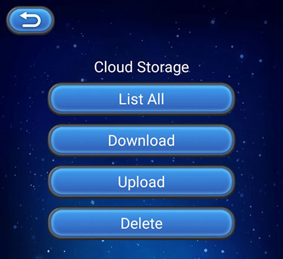

> **注意**：此版本文档已归档不再维护，请移步至 [最新版本](https://service.cocos.com/document/zh/agc-cloudstorage.html)。

# 云存储（AppGallery Connect）快速入门

华为 AppGallery Connect（简称 AGC）[云存储](https://developer.huawei.com/consumer/cn/agconnect/cloud-storage/) 是专为开发者打造的可伸缩、免维护的云端存储服务，用于存储图片、音频、视频或其他由用户生成的内容。

云存储具备稳定、安全、高效、易用的特点，开发者无需关心存储服务器的开发、部署、运维、扩容等事务。具备可用性、可靠性、持久性等指标，降低应用使用存储的门槛，让开发者专注于业务能力的构建、运营和提升用户口碑。

### 云存储的优势

云存储提供了客户端 SDK，SDK 提供简单、安全、高效、健壮的 API 接口，开发者可以使用云存储 SDK，存储图片、视频、音频或用户生成的其他类型文件。

- 全流程使用 HTTPS 协议，对用户的传输数据进行加密保护，并采用安全的加密协议将文件加密存储在云端。
- 因网络原因或用户原因导致的操作中止，应用客户端只需要简单的传入操作中止的位置，即可尝试继续操作。
- 提供 EB 级的数据存储，解决开发者海量数据存储的难题。
- 开发者简单的判断返回异常就可以定位出错误原因，定位快捷方便。

### 工作原理

应用客户端使用云存储服务提供的客户端 SDK 上传文件到云存储空间，云存储服务再将上传的文件存储在默认的存储实例中，开发者即可通过 AGC 访问这些文件。当然，开发者还可以使用云存储 SDK 在应用客户端下载、删除、管理文件。

### 申请测试资格

云存储服务当前仍处于 Beta 测试状态，若要使用该服务，开发者需要发送申请开通服务的邮件到邮箱 `agconnect@huawei.com`。

邮件标题请使用 **[云存储]-[公司名称]-[开发者帐号 ID]-[项目 ID]** 格式，**开发者帐号 ID** 及 **项目 ID** 的获取可参考文档 [查询开发者帐号 ID 及项目 ID](https://developer.huawei.com/consumer/cn/doc/development/AppGallery-connect-Guides/agc-query-ID)。在收到开发者的申请后，华为运营人员会在 **1-3** 个工作日内答复。

### 如何收费

目前云存储服务处于 Beta 测试阶段，采取 **限量免费** 的策略，开发者可以在一定配额内免费使用。

### 版本更新说明

- 当前版本：0.5.2_1.3.1.100

    - 修复 `updateFileMetadata` 方法崩溃问题。
    - 新增部分 AGCStorageReference 接口。
    - 新增部分获取 Android 应用存储目录接口。

- v0.5.0_1.3.0.300

    - 集成华为 AGC 云存储服务。

## 一键接入云存储服务

### 开通服务

- 确保云存储服务测试资格申请已通过。

- 使用 Cocos Creator 打开需要接入云存储服务的项目工程。

- 云存储依赖于认证服务，所以在集成云存储服务前，请先开通 [认证服务（AGC）](./agc-auth.md#%E5%BC%80%E9%80%9A%E6%9C%8D%E5%8A%A1)。

- 点击菜单栏的 **面板 -> 服务**，打开 **服务** 面板，选择 **云存储**，进入服务详情页。然后点击右上方的 **启用** 按钮即可开通服务。详情可参考 [服务面板操作指南](./user-guide.md)。

  

- 请参考 [开通云存储服务](https://developer.huawei.com/consumer/cn/doc/development/AppGallery-connect-Guides/agc-cloudstorage-getstarted#h1-1585569414384) 文档，设置存储实例名称，开通服务，并将默认使用的存储实例名称填写到云存储服务面板下方 **默认实例** 选项中。

  

### 配置华为参数文件

大部分的华为相关项目都需要用到 `agconnect-services.json` 配置文件。若有新开通服务等操作，请及时更新该文件。

- 登录 [AppGallery Connect](https://developer.huawei.com/consumer/cn/service/josp/agc/index.html) 后台，在 **项目列表 -> 应用列表** 中找到对应的应用。

- 在 **项目设置** 页面的 **应用** 区域，点击 `agconnect-services.json` 下载配置文件。`agconnect-services.json` 文件在下载或者更新完成后，**必须手动拷贝** 到工程目录的 `settings` 目录下。

  

- Cocos Creator v2.4.3 及以上版本，若 [发布到 HUAWEI AppGallery Connect](../publish/publish-huawei-agc.md)，开发者可直接在 **构建发布** 面板中选取下载或更新后的配置文件，不需要手动拷贝。

  

### 验证服务是否接入成功

- 完成 **云存储** 服务接入步骤后，我们便可以通过在脚本中添加简单的代码，来验证接入是否成功。

  ```js
  huawei.agc.storage.storageService.on("list-file", data => this.console.log("Cloud Storage, list-file", JSON.stringify(data)), this);
  var rootReference = storageManagement.getStorageReference();
  rootReference.listAll();
  ```

- 参考 [上传文件](https://developer.huawei.com/consumer/cn/doc/development/AppGallery-connect-Guides/agc-cloudstorage-manage#h1-1591179694719) 文档，任意上传一个 [合法文件](#%E6%96%87%E4%BB%B6%E5%90%88%E6%B3%95%E6%80%A7)。

- [发布到 Android 平台](../publish/publish-native.md)。请确保 **构建发布** 面板中的包名与华为后台设置的包名一致。

- 工程运行到手机后，若能在 Logcat 中看到上传文件的文件名，即为接入成功。

## Sample 工程

开发者可以通过 Sample 工程快速体验云存储服务。

- [上传](https://developer.huawei.com/consumer/cn/doc/development/AppGallery-connect-Guides/agc-cloudstorage-manage#h1-1591179694719) 一个名为 `output.json` 的 [合法文件](#%E6%96%87%E4%BB%B6%E5%90%88%E6%B3%95%E6%80%A7)。

- 点击云存储服务面板中的 **Sample 工程** 按钮，Clone 或下载 HUAWEI Sample 工程，并在 Cocos Creator 中打开。

- 参照上文开通云存储服务并配置华为参数文件后，可通过 Creator 编辑器菜单栏的 **项目 -> 构建发布** 打开 **构建发布** 面板来构建编译工程。Creator v2.4.1 及以上版本，可 [发布到 HUAWEI AppGallery Connect](../publish/publish-huawei-agc.md)。Creator v2.4.1 以下的版本可 [发布到 Android 平台](../publish/publish-native.md)。

- Sample 工程运行到手机后，需要先点击 **Auth** 按钮，完成用户认证后，再返回首页点击 **Storage** 按钮，进入云存储功能界面进行测试。

  

## 开发指南

### 文件合法性

上传文件或目录时，会对云端文件或目录的名称进行严格的检查，限制如下：

- 采用 UTF-8 编码时，云端文件的完整地址总长度不超过 1024 字符。
- 不能包含回车符、换行符。
- 对象名称中禁止使用特殊字符，如 `# * : ? ' " < > | [ ]`。
- 最大上传文件大小不能超过 50GB，单次上传不超过 5GB，云存储 SDK 内部将文件按最大 5GB 的大小分割上传到服务器直到 50GB 上传完毕。若上传失败，SDK 会根据设置的最大重试次数重新上传文件。
- 单个文件名称或目录名称避免超过 255 个字符，超过后会导致在某些操作系统下出现兼容问题。

### 初始化

在使用云存储功能前，需要使用 `getInstance` 初始化云存储实例。

```js
var storageManagement = huawei.agc.storage.storageService.getInstance();
```

如果需要使用 [非默认](#%E5%BC%80%E9%80%9A%E6%9C%8D%E5%8A%A1) 存储实例，需要传入 **存储实例名称**。

```js
var customManagement = huawei.agc.storage.storageService.getInstance("custom-bucket-name");
```

### 设置监听

设置各事件监听，如有需要，在回调中进行对应处理。

**回调事件类型说明**：

| event 参数 | 说明 |  
| :--- | :--- |
| "error" | [错误](#error-事件回调) |
| "get-file-metadata" | [获取元数据](#get-file-metadata-%E4%BA%8B%E4%BB%B6%E5%9B%9E%E8%B0%83) |
| "update-file-metadata" | [覆盖元数据](#update-file-metadata-%E4%BA%8B%E4%BB%B6%E5%9B%9E%E8%B0%83) |
| "delete-file" | [删除文件](#delete-file-%E4%BA%8B%E4%BB%B6%E5%9B%9E%E8%B0%83) |
| "list-file" | [列举文件](#list-file-%E4%BA%8B%E4%BB%B6%E5%9B%9E%E8%B0%83) |
| "get-download-url" | [获取下载地址](#get-download-url-%E4%BA%8B%E4%BB%B6%E5%9B%9E%E8%B0%83) |
| "task" | [上传或者下载文件任务](#task-事件回调) |

**示例**：

```js
huawei.agc.storage.storageService.on("error", data => this.console.log("Cloud Storage, error:", `${data.errCode}:${data.errMsg}`), this);
huawei.agc.storage.storageService.on("get-file-metadata", data => this.console.log("Cloud Storage, get-file-metadata", JSON.stringify(data)), this);
huawei.agc.storage.storageService.on("update-file-metadata", data => this.console.log("Cloud Storage, update-file-metadata", JSON.stringify(data)), this);
huawei.agc.storage.storageService.on("delete-file", data => this.console.log("Cloud Storage, delete-file", JSON.stringify(data)), this);
huawei.agc.storage.storageService.on("list-file", data => this.console.log("Cloud Storage, list-file", JSON.stringify(data)), this);
huawei.agc.storage.storageService.on("get-download-url", data => this.console.log("Cloud Storage, get-download-url", JSON.stringify(data)), this);
huawei.agc.storage.storageService.on("task", data => this.console.log("Cloud Storage, task", JSON.stringify(data)), this);
```

#### error 事件回调

所有错误信息将会返回到 `error` 事件回调中。

| 参数名 | 类型 | 说明 |
| :--- | :--- | :--- |
| errCode | Number | 错误 Code，可参考 [异常处理](https://developer.huawei.com/consumer/cn/doc/development/AppGallery-connect-Guides/agc-cloudstorage-troubleshooting) 文档 |
| errMsg | String | 错误信息描述 |

### 创建引用

如果开发者需要上传、下载、删除文件，或者更新文件的元数据，可通过 `getStorageReference` 创建根目录、云端指定目录或文件的引用。

**示例**：

```js
var rootReference = storageManagement.getStorageReference();
var dirReference = storageManagement.getStorageReference("images/");
var fileReference = storageManagement.getStorageReference("images/demo.jpg");
```

也可以通过 `child`、`getParent`、`getRoot` 等方法创建引用。

**示例**：

```js
var fileReference = rootReference.child("images/demo.jpg");
var dirReference = fileReference.getParent();
var nRootReference = fileReference.getRoot();
```

### 上传文件

开发者可以通过 `putFile` 将文件上传到 AGC 云端的存储实例中。

`putFile(filePath: string, metadata = {}, offset = -1): AGCUploadTask`

| 参数名 | 说明 |
| :--- | :--- |
| filePath | 待上传文件的路径，支持的最大文件大小为 50GB。 |
| metadata | 文件或目录的元数据 |
| offset | 文件的断点续传位置。在 `task` 回调中的 `bytesTransferred` 中获取文件已经传输的字节数，再调用本方法继续断点续传。 |

**示例**：

```js
var fileReference = storageManagement.getStorageReference("images/demo.jpg");
var uploadTask = fileReference.putFile(jsb.fileUtils.getWritablePath() + "/images/demo.jpg");
```

可通过 `pause`、`resume`、`cancel` 切换上传任务的状态。

- `pause(): boolean`：暂停一个处于上传过程中的上传任务。
- `resume(): boolean`：唤醒一个处于暂停状态的上传任务。
- `cancel(): boolean`：取消上传会导致上传失败。

**示例**：

```js
uploadTask.pause();
uploadTask.resume();
uploadTask.cancel();
```

#### task 事件回调

可在 `task` 事件回调中获取信息。

| 参数名 | 类型 | 说明 |
| :--- | :--- | :--- |
| bytesTransferred | Number | 已传输的字节 |
| totalByteCount | Number | 上传文件的总字节 |
| metadata | Map | 文件元数据，仅在上传时返回 |

### 列举文件

通过 `listAll` 可获取当前目录下所有文件与目录。

`listAll(): void`

**示例**：

```js
var dirReference = storageManagement.getStorageReference("images/");
dirReference.listAll();
```

也可以通过 `list` 方法，分页获取当前目录下的文件列表，包括文件和子目录。

`list(max: number, marker = ""): void`

**参数说明**：

| 参数名 | 说明 |
| :--- | :--- |
| max | 分页获取时，指定获取的文件和子目录的总数量。max 的范围在 1-1000 之间。 |
| marker | 分页标识。通过 `list-file` 回调中的 `pageMarker` 获取下一页的分页标识，再调用本方法获取下一页数据。 |

**示例**：

```js
var dirReference = storageManagement.getStorageReference("images/");
dirReference.list(100, "file100.json");
```

#### list-file 事件回调

可在 `list-file` 事件回调中获取信息。

| 参数名 | 类型 | 说明 |
| :--- | :--- | :--- |
| pageMarker | String | 分页起始符，使用 `list(max: number, marker = "")` 方法时会返回该参数 |
| fileList | JSONArray | 列表中所有文件的引用 |
| dirList | JSONArray | 列表中所有目录的引用 |

### 下载文件

文件上传到云端后，可以通过 `getFile` 将云端文件下载到本地设备中。

`getFile` 支持断点续传，当下载过程中因出现异常导致下载失败时，再次调用 `getFile` 可以继续下载文件，提升用户下载体验。

`getFile(filePath: string): AGCDownloadTask`

| 参数名 | 说明 |
| :--- | :--- |
| filePath | 待写入文件的路径，文件需提前创建 |

**示例**：

```js
var fileReference = storageManagement.getStorageReference("images/demo.jpg");
var downloadTask = fileReference.getFile(jsb.fileUtils.getWritablePath() + "/images/demo.jpg");
```

可在 [task](#task-%E4%BA%8B%E4%BB%B6%E5%9B%9E%E8%B0%83) 事件回调中获取信息。

### 删除文件

开发者可以通过 `delete` 方法删除云端的文件。删除操作 **不可逆**，一旦执行，文件会被物理删除，不可找回。

`delete(): void`

**示例**：

```js
var fileReference = defaultInstance.getStorageReference("images/demo.jpg");
fileReference.delete();
```

#### delete-file 事件回调

若文件删除成功，`delete-file` 事件回调中会收到信息，无需处理参数。若文件删除失败，则通过 `error` 事件回调。

### 获取元数据

文件保存到云端后，开发者可以在下载文件之前先获取文件的元数据，再决定是否要下载文件。

`getFileMetadata(): void`

**示例**：

```js
var fileReference = storageManagement.getStorageReference("images/demo.jpg");
fileReference.getFileMetadata();
```

#### get-file-metadata 事件回调

可在 `get-file-metadata` 事件回调中获取信息。

| 参数名 | 类型 | 说明 |
| :--- | :--- | :--- |
| bucket | String | 存储实例名 |
| cTime | String | 创建时间，日期时间格式："Thu, 12 Mar 2020 12:10:03 GMT" |
| dirList | String | 最近一次的更新时间，日期时间格式："Thu, 12 Mar 2020 12:10:03 GMT" |
| name | String | 云端文件名 |
| path | String | 云端文件路径，例如：`images/demo.jpg` |
| size | String | 云端文件大小，单位为字节 |
| sha256 | String | 上传文件时设置的 SHA256 |
| contentType | String | 云端文件类型 |
| cacheControl | String | 用户的 CacheControl 设置 |
| contentDisposition | String | 用户的 ContentDisposition 设置 |
| contentEncoding | String | 用户的 ContentEncoding 设置 |
| contentLanguage | String | 用户的 ContentLanguage 设置 |
| customMetadata | Map | 自定义的文件属性 |

### 设置元数据

在上传文件前或者文件已经上传到云端，开发者都可以设置文件元数据，包括文件的自定义属性。

`updateFileMetadata(metedata: any): void`

可修改的参数：`sha256`、`contentType`、`cacheControl`、`contentDisposition`、`contentEncoding`、`contentLanguage`、`customMetadata`。

**示例**：

```js
var metadata = {"contentType": "jpg", "customMetadata": {"key1": "values1", "key2": "value2"}};
fileReference.updateFileMetadata(metadata);
```

#### update-file-metadata 事件回调

可在 `update-file-metadata` 事件回调中获取信息。

| 参数名 | 类型 | 说明 |
| :--- | :--- | :--- |
| bucket | String | 存储实例名 |
| cTime | String | 创建时间，日期时间格式："Thu, 12 Mar 2020 12:10:03 GMT" |
| dirList | String | 最近一次的更新时间，日期时间格式："Thu, 12 Mar 2020 12:10:03 GMT" |
| name | String | 云端文件名 |
| path | String | 云端文件路径，例如：`images/demo.jpg` |
| size | String | 云端文件大小，单位为字节 |
| sha256 | String | 上传文件时设置的 SHA256 |
| contentType | String | 云端文件类型 |
| cacheControl | String | 用户的 CacheControl 设置 |
| contentDisposition | String | 用户的 ContentDisposition 设置 |
| contentEncoding | String | 用户的 ContentEncoding 设置 |
| contentLanguage | String | 用户的 ContentLanguage 设置 |
| customMetadata | Map | 自定义的文件属性 |

### 获取下载地址

获取云端文件的下载地址。

`getDownloadUrl(): void`

**示例**：

```js
var fileReference = storageManagement.getStorageReference("images/demo.jpg");
fileReference.getDownloadUrl();
```

#### get-download-url 事件回调

可在 `get-download-url` 事件回调中获取信息。

| 参数名 | 类型 | 说明 |
| :--- | :--- | :--- |
| url | String | 下载地址 |

## API 文档

详细的功能接口和 API 说明，请参考 [云存储 - API 文档](https://service.cocos.com/document/api/modules/huawei.agc.storage.html)。
