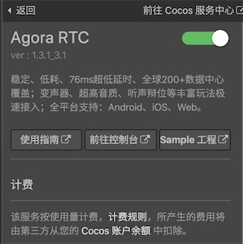

> **注意**：此版本文档已归档不再维护，请移步至 [最新版本](https://service.cocos.com/document/zh/agora.html)。

# 声网（Agora RTC）快速入门

成立于 2013 年的 [声网 Agora](https://www.agora.io/cn/) 是实时互动 API 平台行业开创者，是全球领先的专业服务商。开发者只需简单调用 API，即可在应用内构建多种实时音视频互动场景。

[Agora 互动直播](https://docs.agora.io/cn/Audio%20Broadcast/product_live_audio?platform=All%20Platforms)（Interactive Live Streaming Premium）可以实现一对多，多对多的音视频互动直播。

### 应用场景

Agora 互动直播提供丰富的功能，你可以根据自己的场景需求灵活组合。

| 主要功能 | 功能描述 | 典型适用场景  |
| :------ | :----- | :---------- |
| 观众连麦           | 观众与主播连麦聊天，观众围观。                               | <li>大型直播时，主播邀请观众互动 </li><li>狼人杀、剧本杀</li>          |
| 跨直播间连麦         | 多个主播跨直播间，连麦互动，观众围观。                       | PK 连麦                                                      |
| 伴奏混音             | 将本地或在线的音频和用户声音，同时发送并播放给频道内其他用户 | <li>在线合唱</li> <li>针对幼儿的音乐互动课堂</li>                      |
| 基础美颜          | 支持基础的美颜功能，包括设置美白、磨皮、祛痘、红润效果。 | 娱乐直播美颜      |
| 屏幕共享      | 把屏幕内容同步展示给频道内的其他用户，支持指定共享某个屏幕或窗口，同时支持指定共享区域。      | <li>互动课堂</li><li>游戏主播展示游戏实战</li>                         |
| 修改音视频原始数据   | 可支持变声，支持获取媒体引擎的原始语音或视频数据，对原始数据进行处理 | <li>语音聊天室变声</li><li>娱乐直播美颜</li>                           |
| 在线媒体流输入       | 可以将媒体流作为一个发送端接入正在进行的直播房间。通过将正在播放的音视频添加到直播中，主播和观众可以在一起收听/观看媒体流的同时，实时互动。 可以对输入源的视频属性进行设置。 | <li>主播和观众一起看电影</li> <li>主播和观众一起看比赛</li>            |
| 自定义视频源和渲染器 | 支持自定义的视频源和渲染器，可以不使用系统摄像头，使用自己构建的摄像头视频源，屏幕共享视频源，或者文件视频源等，可以更灵活地处理视频，比如添加美颜效果、滤镜等。 | <li>需要使用自定义的美颜库或者前处理库</li><li>开发者 App 中已经有自己的图像视频模块</li><li>开发者希望使用非摄像头的视频源，比如录屏数据</li><li>有些系统独占的视频采集设备，为了避免与其他业务冲突，需要灵活的设备管理策略。</li> |
| 推流到 CDN           | 将频道内的音视频内容通过 CDN 推送到其他 RTMP 服务器： <li>能够随时启动或停止推流</li> <li>能够在不间断推流的同时增减推流地址</li> <li>能够调整合图布局</li> | <li>在朋友圈、微博等推广直播内容</li><li>频道人数超限时，让更多人观看直播</li> |

### 版本更新说明

- 当前版本：1.3.1_3.1

    - 修改服务名称，从 Agora Voice 改为 Agora RTC。
    - 新增视频模块，优化性能。

- v1.2.1_3.1.2

    - 适配 Cocos Creator 2.4.x。

- v1.1.0_2.2.3.20_2.5.2

    - 适配 Cocos Creator 2.3.x。

- v1.0.2_2.2.3.20_2.5.2

    - Bug 修复。

- v1.0.1_2.2.3.20_2.5.2

    - 新增 Agora service 插件。

## 一键接入 Agora RTC 服务

### 开通服务

- 使用 Cocos Creator 打开需要接入 Agora RTC 服务的项目工程。

- 点击菜单栏的 **面板 -> 服务**，打开 **服务** 面板，选择 **Agora RTC**，进入服务详情页。然后点击右上方的 **启用** 按钮即可开通服务。详情可参考 [服务面板操作指南](./user-guide.md)。

    

    **计费**：Agora RTC 服务使用 **预付费** 模式，当你的服务使用超过服务商的免费部分，且账户余额不足时，会停止服务。这时候你需要在 Cocos 开发者账户中心进行 **预充值**。具体内容可参考 [计费与充值](./billing-and-charge.md)。

开通服务后，Cocos Service 将自动开通 Agora RTC 服务、联通 Agora 账号，并集成 Agora SDK 和所需预览插件到游戏工程中。

### 验证服务是否接入成功

Agora RTC 服务接入完成后，我们可以通过在脚本中添加简单的代码，来验证接入是否成功。

- 点击 Agora RTC 服务面板中的 **前往控制台** 按钮跳转到 [Agora 管理后台](https://console.agora.io/)，点击左侧导航栏的  图标进入项目管理页面，获取对应游戏的 **App ID**。

    

- 在脚本中调用初始化方法，填入从 Agora 后台获取的 App ID：

    ```js
    var appid = '从 Agora 后台获取的 App ID';
    agora && agora.init(appid);
    ```

- 脚本修改完成并保存后，回到编辑器。在编辑器上方选择 **浏览器**，然后点击  [预览](../getting-started/basics/preview-build.md) 按钮，若能在浏览器控制台中看到初始化日志，即为接入成功。

    

## Sample 工程

- 音频直播示例项目请参考 [Hello-Agora-CocosCreator-Voice](https://github.com/AgoraIO/Voice-Call-for-Mobile-Gaming/blob/master/Basic-Voice-Call-for-Gaming/Hello-CocosCreator-Voice-Agora/README.zh.md)。

- 视频通话示例项目请参考 [Agora-Cocos-Quickstart](https://docs.agora.io/cn/Interactive%20Broadcast/start_live_cocos_creator?platform=Cocos%20Creator#%E7%9B%B8%E5%85%B3%E9%93%BE%E6%8E%A5)。

## 开发指南

请参考 [实现音频直播](https://docs.agora.io/cn/Interactive%20Broadcast/start_live_audio_cocos_creator?platform=Cocos%20Creator) 、[实现视频直播](https://docs.agora.io/cn/Interactive%20Broadcast/start_live_cocos_creator?platform=Cocos%20Creator) 和 [实现视频通话](https://docs.agora.io/cn/Video/start_call_cocos_creator?platform=Cocos%20Creator)。

## 相关参考链接

- [Agora 平台概述](https://docs.agora.io/cn/Agora%20Platform/agora_platform?platform=Cocos%20Creator)
- [Agora 互动直播](https://docs.agora.io/cn/Interactive%20Broadcast/product_live?platform=Cocos%20Creator)
- [校验用户权限 — 获取 App ID](https://docs.agora.io/cn/Agora%20Platform/token?platform=All%20Platforms) 

## API 文档

详细的功能接口和 API 说明，请参考 [Cocos Creator SDK API Reference](https://docs.agora.io/cn/Video/API%20Reference/cocos_creator/index.html)。
