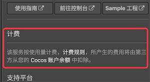
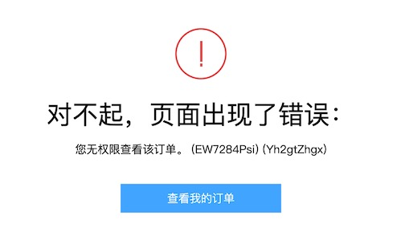

> **注意**：此版本文档已归档不再维护，请移步至 [最新版本](https://service.cocos.com/document/zh/billing-and-charge.html)。

# 计费与充值

Cocos Service 提供的服务有免费的，也有部分是付费的，具体在对应的服务详情页会有明确标明。

* 在使用付费的服务时，所产生的费用都是从对应游戏所属的账户中代扣。当开发者的游戏同时使用了多个付费服务，就不需要非常麻烦地去多个后台充值和管理费用。另外 Cocos 平台还会为开发者在使用第三方服务时多一份资金保障。
* 通常按量计费的服务都是采用 **预付费** 的方式，当开发者的服务使用超过服务商的免费部分，且账户余额不足时，会导致 **服务停止**。所以在使用该类服务时，请务必确保账户余额充足。可以前往 [Cocos 开发者账户中心](https://account.cocos.com/) 进行 **预充值**，且未使用完的资金可以随时取出。

## 充值方式

- 在服务的设置面板中点击右上方的 **前往 Cocos 服务中心** 按钮，跳转到管理后台。
- 切换到 **账户** 页面，点击侧边栏中的 **账户余额** 标签。
- 选择 **个人 / 公司** 类别，点击 **账户余额** 中的 **充值** 按钮。
- 确认开通服务的游戏在 **个人** 类别还是在 **公司** 类别下，以免错误充值。

    

- 填入 **充值金额**，然后选择通过 **支付宝** 或 **微信** 平台充值。

## 查看账单

- 用户的每一笔扣费，在 [Cocos 开发者账户中心](https://account.cocos.com/) 的 **财务 -> 账户余额 -> 收支明细** 中可以查看到：

    

## 腾讯云套餐购买方式

由于用户在 Service 面板中开通的腾讯云账号类型为子账号，所以无法直接在腾讯云后台购买腾讯云相关的资源包套餐，因此我们提供了一套简易流程方便用户自助购买套餐。

1. 在腾讯云后台登录账号，选择要购买的套餐。

    
    
    待页面弹出报错信息：“您无权限查看该订单”：

    

2. 然后登录 **Cocos 开发者账户中心**，在 **财务 -> 订单管理 -> 待付款** 中查看待支付订单，确认并支付后即可开通套餐。

    

    若未找到待支付订单，请等待一分钟或者多刷新一下页面。

## 服务商计费说明

服务商具体的计费说明请参考：