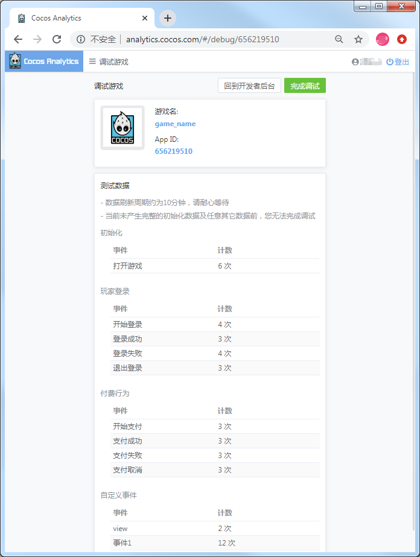

> **注意**：此版本文档已归档不再维护，请移步至 [最新版本](https://service.cocos.com/document/zh/cocos-analytics.html)。

# Cocos Analytics 快速入门

[Cocos Analytics](https://www.cocos.com/analytics) 用于数据统计和行为分析，并且在后台提供了数据分析支持。只需要在 Cocos Creator 的 **服务** 面板中进行简单的设置就能开启 Cocos Analytics 统计服务，方便在游戏开发过程中快速接入。及时便捷地监测游戏生命周期中的运营情况，为开发者提供符合行业标准的运营分析指标，简单而实用，并在不断的完善中，让开发者可以更专注于游戏开发。目前支持 Android／iOS／Web／微信小游戏平台。

## 一键接入 Cocos Analytics 服务

### 开通服务

- 使用 Cocos Creator 打开需要接入 Cocos Analytics 的项目工程。

- 点击菜单栏的 **面板 -> 服务**，打开 **服务** 面板，选择 **Cocos Analytics**，进入服务详情页。然后点击右上方的 **启用** 按钮即可开通服务。详情可参考 [服务面板操作指南](./user-guide.md)。

    

- 开通服务后，在 Cocos Analytics 服务面板可以看到新增了 **参数配置** 项，包括 **AppID** 和 **store** 两个参数，以及 **重新加载预览插件** 按钮：

    - AppID 会自动填入当前绑定的游戏 AppID。
    - store 为游戏分发渠道 ID，长度为 200。该项可以任意设置，只要确保在 [Cocos Analytics 数据中心](http://analytics.cocos.com/) 获取统计结果时能够区分即可。
    - 重新加载预览插件：Cocos Analytics 预览插件，开发者可以在浏览器预览中使用该 SDK。**暂时不支持模拟器**。

    参数配置完成后点击 **重新加载预览插件** 按钮，导入预览插件，即可完成接入工作。

### 验证服务是否接入成功

Cocos Analytics 服务接入完成后，我们可以通过在脚本中添加简单的代码，来验证接入是否成功。

- 在脚本中调用 Cocos Analytics 的开始登录方法 `loginStart`：

    ```js
    // 开启（关闭）本地日志的输出
    cocosAnalytics.enableDebug(true); 
    // 开始登录方法
    cocosAnalytics.CAAccount.loginStart({
        // 获客渠道，指获取该客户的广告渠道信息 
        channel: '99888',
    });
    ```

- 脚本修改完成并保存后，回到编辑器。在编辑器上方选择 **浏览器**，然后点击  [预览](../getting-started/basics/preview-build.md) 按钮，若能在控制台中看到初始化和登录日志，即为接入成功。

    


## Sample 工程

开发者可以通过 Sample 工程快速体验 Cocos Analytics。

- 点击 Cocos Analytics 服务面板中的 **Sample 工程** 按钮，Clone 或下载，并在 Cocos Creator 中打开。

- 在 **服务** 面板中开通 Cocos Analytics 服务。

- 接入完成后，点击编辑器窗口正上方的  [预览](../getting-started/basics/preview-build.md) 按钮，即可在浏览器中调试该工程。

  

- 可将 Sample 工程中的所有按钮点击一遍，然后在 Cocos Analytics 服务面板点击 **前往控制台** 按钮前往 **调试游戏** 页面，刷新页面直至更新数据，数据刷新周期约为 **10** 分钟。请注意检查 **调试游戏** 页面中的 AppID 是否与 **服务** 面板中的一致。

  若在调试状态下，所有数据接口调试完成，可点击右上方的 **完成调试** 按钮，转为正式模式。**注意**：转为正式模式后无法再回到 **调试游戏** 页面。

  

  游戏加载后，Cocos Analytics SDK 会在项目构建后的 `main.js` 文件中初始化，并且传入上面设置的参数。如果有批量发布的需要，也可以手动在 `main.js` 中修改这些参数。初始化后便可以直接调用 Cocos Analytics SDK，发送各种数据给服务器。

## API 文档

Cocos Analytics 插件加载时会调用 Cocos Analytics 初始化，无需再做初始化操作。具体的功能接口和说明，请参考 [Cocos Analytics SDK 文档](https://n-analytics.cocos.com/docs/zh/h5/interface_h5.html)。

## 跨平台发布

开发者可以通过 **构建发布** 面板根据需求选择 **Android／iOS／Web／微信小游戏** 平台进行 [构建编译](../publish/publish-native.md)。构建出来的发布包已经自动集成了 Cocos Analytics 服务。

## 相关参考链接

- [Cocos 开发者账户中心](https://account.cocos.com/)
- [Cocos Analytics 数据中心](http://analytics.cocos.com/)
- [Cocos Analytics 产品文档](https://n-analytics.cocos.com/docs/zh/)
- [Cocos Analytics 事件列表](https://n-analytics.cocos.com/docs/zh/analytics_event.html)
