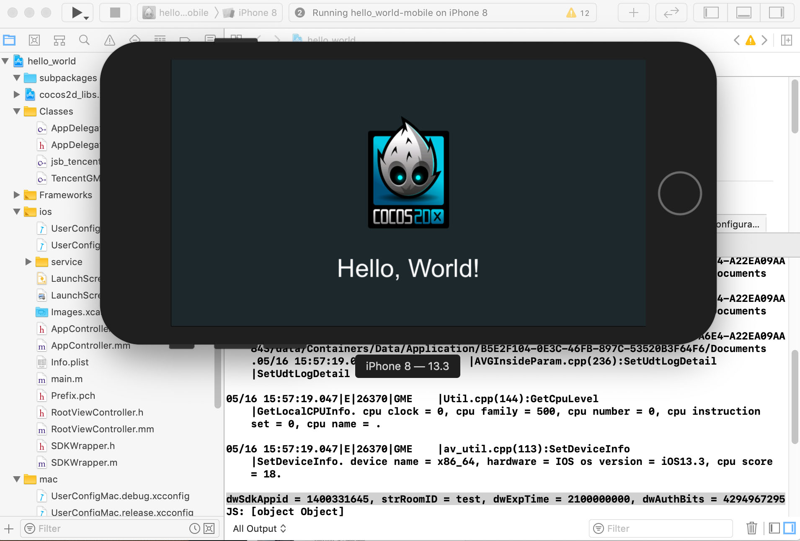
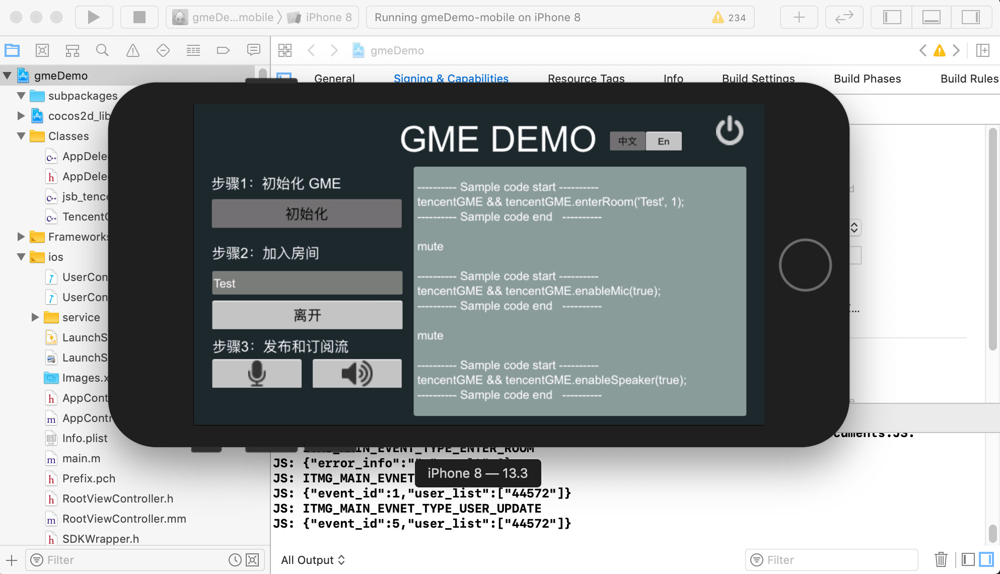

> **注意**：此版本文档已归档不再维护，请移步至 [最新版本](https://service.cocos.com/document/zh/gme.html)。

# 游戏多媒体引擎（腾讯云）快速入门

[**游戏多媒体引擎（Game Multimedia Engine，GME）**](https://cloud.tencent.com/product/gme) 提供一站式语音解决方案。针对不同场景进行深度优化，覆盖游戏、社交、娱乐等多种泛互联网行业应用场景。提供实时语音、语音消息及转文本、语音分析服务，一次接入即可满足多样化的语音需求。

### 特性

- **功能覆盖**：针对游戏、社交、娱乐、直播等应用场景，全面覆盖各类语音功能。提供实时语音、语音消息及转文本、语音分析服务，实现游戏语音开黑、语音聊天室、语音直播、线上 K 歌等主流语音需求；独有的 3D 语音技术应用于大逃杀、VR 游戏等场景下打造沉浸式听觉体验；趣味变声、人声美化等功能提升应用趣味性。
- **极致性能**：实时语音结合应用场景的深度优化，普通音质语音时延低至 200ms，在 50% 以上丢包、1000ms 网络抖动情况下，仍能顺畅沟通；高清音质，利用回声消除、环境音消除、噪声抑制、啸叫抑制专利算法还原清晰听感。语音消息及转文本支持 120 种语言的即说即转，助力应用出海。语音分析可以智能识别音频流/文件中的呻吟、涉政、低俗等不良信息，净化业务环境。
- **兼容适配**：提供主机端 SDK，支持 PS4、Xbox、Switch 游戏集成，与 Wwise 音频引擎深度融合，独创性地解决了开语音时游戏背景音效丢失的问题。针对 Cocos Creator 深度优化，跨平台支持 Mac、Windows、iOS、Android 系统。依托 QQ 亿级用户，适配全部 iOS 设备和 2000+ Android 终端设备，保证用户体验一致，节省开发时间。
- **全球服务**：六大洲全球服务可用，覆盖中东、南美、澳洲等地区。全国部署 1100+ 加速节点，海外布局 200+ 加速节点，覆盖全球 30+ 国家地区，实现玩家就近接入，提供低延时不卡顿的实时语音服务；语音消息及转文本服务支持 120 种语言的语音识别，实现全球用户无障碍沟通；用技术助力中国应用出海。
- **稳定可靠**：QQ 音视频技术对外开放，经历 QQ 亿级用户验证。服务全行业 400+ 音视频社交和游戏客户，日通话时长超 3.6 亿分钟。实时监控，异地容灾，智能调度，保证服务稳定可靠，语音房间人数无上限，crash 率低于万分之一。
- **低成本接入**：7*24 小时服务响应，SLA 服务质量保障，让语音需求的实现变得更简单；提供新手体验包、控制台功能试用，低门槛接入，扶持广大开发者。接口设计简单，实时语音四行代码完成接入。

### 应用场景

- **电子竞技**：在 MOBA、FPS、MMORPG 等竞技对抗类游戏中，争斗局势瞬息万变，相同阵营的玩家需要根据战局实时沟通商议对敌策略。游戏多媒体引擎实时语音提供超低时延、流畅优先的实时语音对讲，让玩家能够更好地沟通，体会对战游戏的乐趣。此外，游戏多媒体引擎独有的 3D 语音技术可以让声音表现出虚拟的三维方位感，应用在大逃杀类型游戏中时，可以打造出立体空间的沉浸式游戏体验，提升游戏乐趣。
- **国战指挥**：国战指挥、团队副本、大型直播间等玩法中，对语音的时延要求也较高。游戏多媒体引擎指挥模式，实现实时自动上下麦及超低时延语音通话，房间人数无上限，高度适配超多人在线的国战类游戏玩家语音通话需求。
- **休闲游戏**：K 歌、音乐等休闲类的游戏中，语音消息与语音对讲也是必不可少的需求。同时，部分休闲类游戏中，会有美女主播为玩家播放歌曲，或者通过歌曲伴奏进行 K 歌游戏。游戏多媒体引擎可实现好友实时聊天的同时能提供低延时耳返、数十种音效的趣味变声能力，保证最佳的休闲游戏体验。
- **棋牌游戏**：棋牌类游戏中，好友开房一起游戏是普遍需求。游戏多媒体引擎独有的 3D 语音技术可以实现虚拟玩家坐在牌桌不同的位置聊天的方向感，最大程度地模拟真实牌局，实现和线下棋牌一样的临场体验。
- **社交主播**：在语音交友、聊天室、狼人杀的应用场景中，游戏多媒体引擎可以支持多人主播、多人随机连麦，达到现场多人互动的效果，提升娱乐性。

### 版本更新说明

- 当前版本：0.6.2_2.7.1

    - 升级 SDK 版本到 2.7.1。
    - `pttPlayRecordedFile` 方法新增参数选项。

- v0.6.1_2.5.2

    - 集成腾讯云游戏多媒体引擎（GME）服务。

## 一键接入游戏多媒体引擎服务

### 开通服务

- 使用 Cocos Creator 打开需要接入游戏多媒体引擎服务的项目工程。

- 点击菜单栏的 **面板 -> 服务**，打开 **服务** 面板，选择 **游戏多媒体引擎**，进入服务详情页。然后点击右上方的 **启用** 按钮即可开通服务。详情可参考 [服务面板操作指南](./user-guide.md)。

	

	**计费**：游戏多媒体引擎服务使用 **预付费** 模式，当你的服务使用超过服务商的免费部分，且账户余额不足时，会停止服务。这时候你需要在 Cocos 开发者账户中心进行 **预充值**。具体内容可参考 [计费与充值](billing-and-charge.md)。

	若需购买资源包套餐，请参考 [腾讯云套餐购买方式](billing-and-charge.md#%E8%85%BE%E8%AE%AF%E4%BA%91%E5%A5%97%E9%A4%90%E8%B4%AD%E4%B9%B0%E6%96%B9%E5%BC%8F)。

	开通服务后，Cocos Service 将自动开通游戏多媒体引擎服务、联通腾讯云账号，并集成游戏多媒体引擎 SDK 到游戏工程中。
    
	若之前没有在 Cocos Service 服务面板开通过腾讯云服务，跳转登录腾讯云控制台子账号的账号名，是开发者的 Cocos 账号的邮箱，初始密码会发到该邮箱和 Cocos 后台站内信。建议登录后，将该子账号与微信绑定，之后便可使用微信扫码登录。

### 验证服务是否接入成功

游戏多媒体引擎服务接入完成后，我们可以通过在脚本中添加简单的代码，来验证接入是否成功。

-  点击游戏多媒体引擎服务面板中的 **前往控制台**，跳转到游戏多媒体引擎后台，获取接入参数 **AppID** 和 **权限密钥**：

  
    
-  在脚本中调用游戏多媒体引擎的初始化，填入之前从后台获取的 **AppID** 和 **权限密钥**：

	```js
	var appid = '从游戏多媒体引擎后台获取的 AppID';
	var key = '从游戏多媒体引擎后台获取的权限密钥';
	// 用户的帐号，由开发者定义，必须大于 10000，用于标识用户
	var openid = '' + parseInt(Math.random() * 100000); 
	// 加入的频道名
	var channelid = 'test';
	// 调用初始化方法 init
	tencentGME && tencentGME.init(appid, key, openid);
	// 调用加入房间方法，此时才有日志输出
	tencentGME && tencentGME.enterRoom(channelid, 1);
	```

- 脚本修改完成并保存后，回到编辑器，当前游戏多媒体引擎版本不支持 H5 调试，需要 [**打包发布**](../publish/publish-native.md) 到 **Android** 或者 **iOS** 平台。我们以 iOS 平台为例，若能在 Xcode 的控制台中看到游戏多媒体引擎进入房间相关日志，即为接入成功。

  
    
## Sample 工程

- 点击游戏多媒体引擎服务面板中的 **Sample 工程** 按钮，Clone 或下载，并在 Cocos Creator 中打开。

- 在 **服务** 面板中开通游戏多媒体引擎服务。

- 在 [游戏多媒体引擎后台](https://console.cloud.tencent.com/gamegme) 获取 **AppID** 和 **权限密钥**。

  

- 打开工程中的 `assest/Script/index.js`，修改 **appid** 和 **key** 的值。

- 脚本修改完成并保存后，回到编辑器，[打包发布](../publish/publish-native.md) 到 **Android** 或者 **iOS** 平台。

  
  
## 相关参考链接

- [腾讯云套餐购买方式](billing-and-charge.md#%E8%85%BE%E8%AE%AF%E4%BA%91%E5%A5%97%E9%A4%90%E8%B4%AD%E4%B9%B0%E6%96%B9%E5%BC%8F)
- [游戏多媒体引擎后台](https://console.cloud.tencent.com/gamegme)
- [游戏多媒体引擎概览](https://cloud.tencent.com/document/product/607)
- [游戏多媒体引擎产品概述](https://cloud.tencent.com/document/product/607/10835)
- [游戏多媒体引擎购买指南](https://cloud.tencent.com/document/product/607/38500)
- [游戏多媒体引擎常见问题](https://cloud.tencent.com/document/product/607/17447)
- [游戏多媒体引擎文档与资源](https://cloud.tencent.com/product/gme/developer)

更多文档可直接在 [腾讯云文档中心 - 游戏多媒体引擎](https://cloud.tencent.com/document/product/607) 中查阅。

## 接口文档

详细的功能接口和 API 说明，请参考 [游戏多媒体引擎（腾讯云）- 接口文档](./gme-api-docs.md)。
