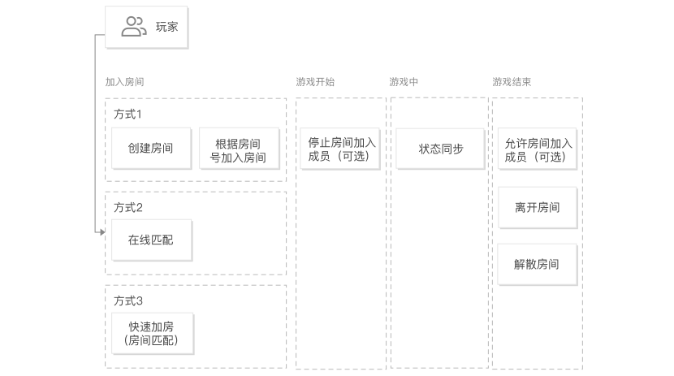
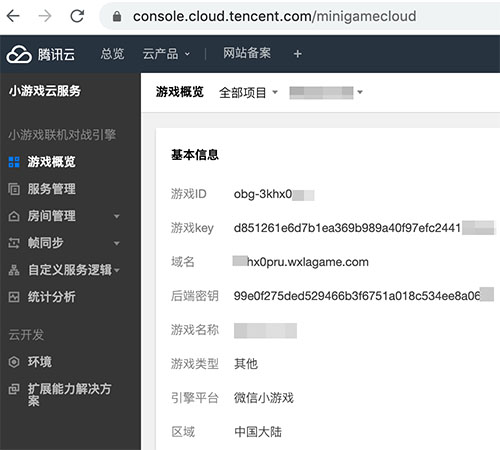
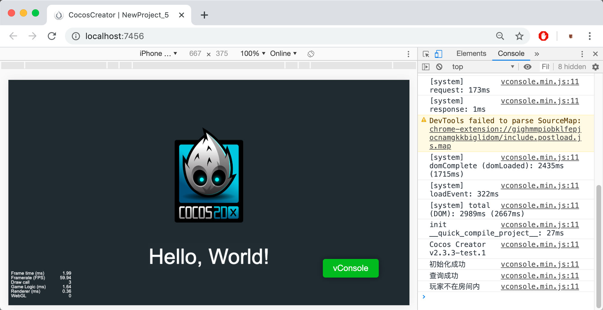
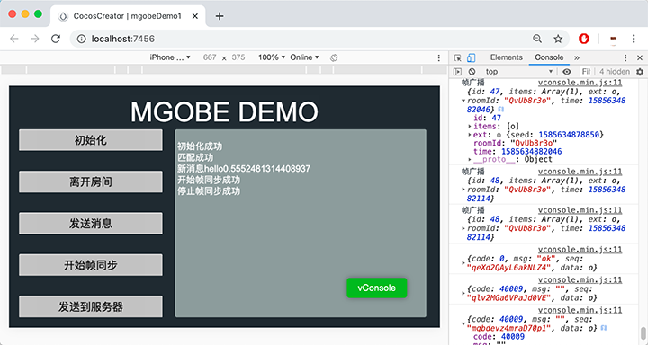
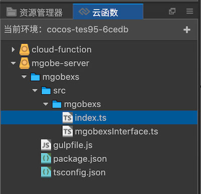
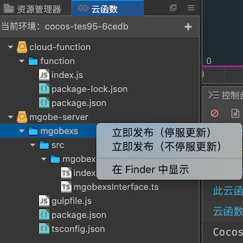

> **注意**：此版本文档已归档不再维护，请移步至 [最新版本](https://service.cocos.com/document/zh/mgobe.html)。

# 游戏联机对战引擎（腾讯云）快速入门

[**游戏联机对战引擎（Mobile Game Online Battle Engine，MGOBE）**](https://cloud.tencent.com/product/mgobe) 为游戏提供房间管理、在线匹配、帧同步、状态同步等网络通信服务，帮助开发者快速搭建多人交互游戏。开发者无需关注底层网络架构、网络通信、服务器扩缩容、运维等，即可获得就近接入、低延迟、实时扩容的高性能联机对战服务，让玩家在网络上互通、对战、自由畅玩。游戏联机对战引擎适用于回合制、策略类、实时会话（休闲对战、MOBA、FPS）等游戏。

### 特性

- **实时云**：依托腾讯云强大的网络和硬件资源，在国内多个地区部署云服务，使用多线 BGP 网络，并提供地域就近接入，确保更低延迟。
- **高可扩展性**：自动伸缩的云服务，承接业务爆发式增长，从几十并发用户到上百万并发用户，页面一键扩容，无需购买服务器，无需服务器运维。
- **匹配机制**：支持分数、模式、房间、地域多种匹配模式，还支持开发者自定义匹配机制，满足更多使用场景。
- **网络通信能力**：支持帧同步和状态同步，快速、稳定实现客户端与其他客户端的通信。
- **快速接入**：接口简单方便，只需要调用 JS 接口，即可快速实现房间管理、在线匹配、联网对战功能。
- **无忧定价**：支持按量计费（每日最高在线、流量收费）和按套餐付费两种。从免费计划开始，随时调整配额。
- **实时服务器**：房间管理会自动分配实时服务器，在实时服务器中运行实时对战和回合制游戏的逻辑，开发者无需购买服务器和运维，只需要填写游戏逻辑。
- **网络状态监控**：实时网络监控，快速实现玩家掉线通知、弱网络通知和断线重连等功能。帮助开发者告知玩家所有玩家的网络状态，并在网络出现异常的情况下，及时作出相应处理。

### 应用场景

#### 帧同步应用场景

- **适用场景**：实时会话游戏 10 人以内，棋牌、策略类回合制游戏。
- **优点**：开发效率高，客户端同步指令给其他客户端。业务逻辑由客户端计算处理。

  

#### 状态同步应用场景

- **适用场景**：实时会话游戏大于 10 人，棋牌、策略回合制游戏。
- **优点**：容易防外挂，当人数比较多，客户端渲染压力大时，可以由服务端来处理。

  

## 一键接入游戏联机对战引擎服务

### 开通服务

- 使用 Cocos Creator 打开需要接入游戏联机对战引擎服务的项目工程。

- 点击菜单栏的 **面板 -> 服务**，打开 **服务** 面板，选择 **游戏联机对战引擎**，进入服务详情页。然后点击右上方的 **启用** 按钮即可开通服务。详情可参考 [服务面板操作指南](./user-guide.md)。

    

    **计费**：游戏联机对战引擎服务使用 **预付费** 模式，当你的服务使用超过服务商的免费部分，且账户余额不足时，会停止服务。这时候你需要在 Cocos 开发者账户中心进行 **预充值**。具体内容可参考 [计费与充值](billing-and-charge.md)。

    若需购买资源包套餐，请参考 [腾讯云套餐购买方式](billing-and-charge.md#%E8%85%BE%E8%AE%AF%E4%BA%91%E5%A5%97%E9%A4%90%E8%B4%AD%E4%B9%B0%E6%96%B9%E5%BC%8F)。

    开通服务后，Cocos Service 将自动开通游戏联机对战引擎服务、联通腾讯云账号，并集成游戏联机对战引擎 SDK 到游戏工程中。
    
    若之前没有在 Cocos Service 服务面板开通过腾讯云服务，那么在跳转后登录的腾讯云控制台子账号的账号名，是开发者的 Cocos 账号邮箱，初始密码会发到该邮箱和 Cocos 后台站内信。建议登录后，将该子账号与微信绑定，之后便可使用微信扫码登录。
    
### 验证服务是否接入成功

游戏联机对战引擎服务接入完成后，我们可以通过在脚本中添加简单的代码，来验证接入是否成功。

- 点击游戏联机对战引擎服务设置面板中的 **前往控制台**，跳转到 [游戏联机对战引擎后台](https://console.cloud.tencent.com/mgobe)，获取接入参数 **游戏 ID**、**游戏 key** 和 **域名**：

  

- 在脚本中调用游戏联机对战引擎的初始化，填入之前从游戏联机对战引擎后台获取的 **游戏 ID**、**游戏 key** 和 **域名**：

    ```js
    const gameInfo = {
        gameId: '从游戏联机对战引擎后台获取的游戏 ID',
        secretKey: '从游戏联机对战引擎后台获取的游戏 key',
        openId: '玩家 ID，可自定义',
	};

    const config = {
        url: '从游戏联机对战引擎后台获取的域名',
        reconnectMaxTimes: 5,
        reconnectInterval: 1000,
        resendInterval: 1000,
        resendTimeout: 10000,
    };
    
    // 实例化 Room 对象
    const room = new MGOBE.Room();
    MGOBE.Listener.init(gameInfo, config, event => {
        if (event.code === 0) {
            console.log("初始化成功");
            // 初始化成功之后才能调用其他 API
            // 查询玩家自己的房间
            room.getRoomDetail(event => {
                if (event.code !== 0 && event.code !== 20011) {
                    return console.log(event);
                }
                console.log("查询成功");
                if (event.code === 20011) {
                    console.log("玩家不在房间内");
                } else {
                    // 玩家已在房间内
                    console.log("房间名", event.data.roomInfo.name);
                }
            });
        }
    });
    ```
    
- 脚本修改完成并保存后，回到编辑器。在编辑器上方选择 **浏览器**，然后点击  [预览](../getting-started/basics/preview-build.md) 按钮，若能在控制台中看到初始化和登录日志，即为接入成功。

  
    
## Sample 工程

- 点击游戏联机对战引擎服务面板中的 **Sample 工程** 按钮，Clone 或下载，并在 Cocos Creator 中打开。

- 在 **服务** 面板中开通游戏联机对战引擎服务。

- 脚本修改完成并保存后，回到编辑器。点击编辑器窗口正上方的  [预览](../getting-started/basics/preview-build.md) 按钮，即可在浏览器中调试该项目工程。

  

游戏联机对战引擎还提供了 TypeScript 版本的 Demo，展示了更多功能，具体请参考腾讯云官方文档 [Cocos 引擎案例](https://cloud.tencent.com/document/product/1038/40875)。

## 实时服务器面板使用说明

- 若需要使用实时服务器，创建服务后，请在游戏联机对战引擎服务面板下方，点击 **初始化框架** 按钮，选择 JavaScript 或者 TypeScript 语言版本，进行本地框架代码初始化操作。

  

- **游戏联机对战引擎** 与 **云开发** 共用 **云函数** 面板，若初始化框架后没有出现云函数面板，可以在 **菜单 -> 面板 -> 云函数** 中重新打开。

- 以 TS 版本为例，初始化后，在云函数面板中会出现 `mgobe-server`，该文件夹为游戏联机对战引擎的实时服务器框架。`src/mgobexs/index.ts` 为实时服务器主文件。

  

- 修改主文件后，可以在云函数任意层级点击右键，选择 **立即发布**，即可上传代码进行调试。

  
    
## 视频教程
   
<iframe src="https://player.bilibili.com/player.html?aid=328250967&bvid=BV1VA411q7Ms&cid=193808588&page=1" scrolling="no" border="0" frameborder="no" width="100%" height="480" framespacing="0" allowfullscreen="true"> </iframe>


https://www.bilibili.com/video/BV1VA411q7Ms

## 文档链接

- [腾讯云套餐购买方式](billing-and-charge.md#%E8%85%BE%E8%AE%AF%E4%BA%91%E5%A5%97%E9%A4%90%E8%B4%AD%E4%B9%B0%E6%96%B9%E5%BC%8F)
- [游戏联机对战引擎管理后台](https://console.cloud.tencent.com/mgobe)
- [游戏联机对战引擎简介](https://cloud.tencent.com/product/mgobe)
- [游戏联机对战引擎产品详细信息](https://cloud.tencent.com/product/mgobe/details)
- [游戏联机对战引擎计费概述](https://cloud.tencent.com/document/product/1038/33293)
- [游戏联机对战引擎常见问题](https://cloud.tencent.com/document/product/1038/42134)
- [游戏联机对战引擎文档与资源](https://cloud.tencent.com/product/mgobe/developer)

更多文档可直接在 [腾讯云文档中心 - 游戏联机对战引擎](https://cloud.tencent.com/document/product/1038) 中查阅。
