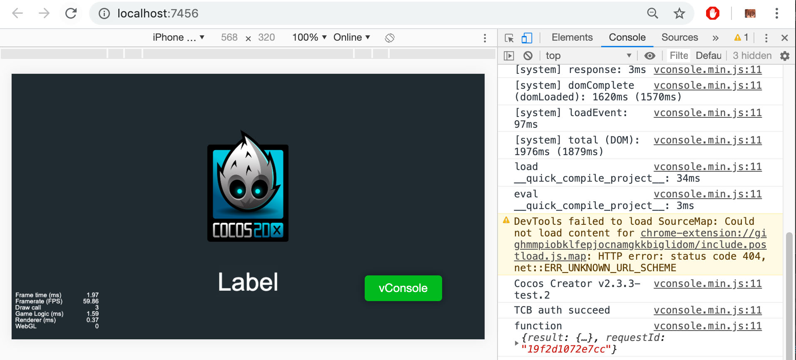

> **注意**：此版本文档已归档不再维护，请移步至 [最新版本](https://service.cocos.com/document/zh/tcb.html)。

## 云开发（腾讯云）快速入门

[**云开发（Tencent Cloud Base，TCB）**](https://cloud.tencent.com/product/tcb) 是腾讯云为移动开发者提供的一站式后端云服务，它帮助开发者统一构建和管理资源，免去了移动应用开发过程中繁琐的服务器搭建及运维、域名注册及备案、数据接口实现等繁琐流程，让开发者可以专注于业务逻辑的实现，而无需理解后端逻辑及服务器运维知识，开发门槛更低，效率更高。

-  **一站式后端云服务**：为移动开发者提供了数据库、存储等基础设施服务，开发者无需再为此搭建及运维服务器，可以专注于业务逻辑实现，轻松开始移动开发之旅。
-  **高效开发**：开发者只需进行核心代码的编码，不再需要关心服务架构的搭建，也不需要进行服务端代码的部署，提升了独立开发和迭代的速度。
-  **弹性可扩展**：计算资源可根据应用请求量自动横向扩缩；当存储容量不足时，开发者可以在控制台进行扩容操作，扩容过程不影响开发者的线上业务。
-  **管理简便**：提供了强大的管理后台，开发者可以在这里进行一站式的数据管理、文件管理，以及云函数管理，让开发者拥有随时调整数据结构以响应业务变化的能力。

### 特性

- [云数据库](https://cloud.tencent.com/document/product/876/19369)：提供高性能的数据库写入和查询服务。通过云开发的 SDK，可以直接在客户端对数据进行读写，也可以在云函数中读写数据，还可以通过控制台，数据进行可视化的增删查改等操作。
- [云存储](https://cloud.tencent.com/document/product/876/19376)：提供高扩展性、低成本、可靠和安全的文件存储服务。开发者可以快速的实现文件上传下载和对应的管理功能。存储支持灵活的鉴权策略，可以满足开发者不同场景下的文件访问管理。开发者可以在客户端和云函数端通过 API 直接使用存储。
- [云函数](https://cloud.tencent.com/document/product/876/41762)：云函数是在云端运行的函数，无需购买、搭建服务器，只需编写函数代码并部署到云端，即可在腾讯云基础设施上弹性、安全地运行代码。开发者可在客户端直接调用云函数，也可以在云函数之间实现相互调用。
- **静态加速**：提供了强大的 CDN 加速分发能力，极大缩短了应用响应时间，可实现复杂内容的快速加载，有效解决跨运营商、跨地域高延迟访问问题，显著提升用户访问体验。
- **身份认证**：提供了端到端身份验证解决方案，支持微信、QQ 等多种登录方式。只需要简单的配置及短短数行代码，即可轻松构建安全的身份验证系统。

## 一键接入云开发服务

### 开通服务

- 需要 Cocos Creator **v2.3.4** 及以上版本。

- 使用 Cocos Creator 打开需要接入云开发服务的项目工程。

- 点击菜单栏的 **面板 -> 服务**，打开 **服务** 面板，选择 **云开发**，进入服务详情页。然后点击右上方的 **启用** 按钮即可开通服务。详情可参考 [服务面板操作指南](./user-guide.md)。

    

	**计费**：云开发服务使用 **预付费** 模式，当你的服务使用超过服务商的免费部分，且账户余额不足时，会停止服务。这时候你需要在 Cocos 开发者账户中心进行 **预充值**。具体内容可参考 [计费与充值](billing-and-charge.md)。
	
	若需购买资源包套餐，请参考 [腾讯云套餐购买方式](billing-and-charge.md#%E8%85%BE%E8%AE%AF%E4%BA%91%E5%A5%97%E9%A4%90%E8%B4%AD%E4%B9%B0%E6%96%B9%E5%BC%8F)。

	开通服务后，Cocos Service 将自动开通云开发服务、联通腾讯云账号，并集成云开发 SDK 到游戏工程中。
    
	**注意**：若之前没有在 Cocos Service 服务面板开通过腾讯云服务，那么在跳转后登录的腾讯云控制台子账号的账号名，是开发者的 Cocos 账号邮箱，初始密码会发送到该邮箱和 Cocos 后台的站内信。建议登录后，将该子账号与微信绑定，之后便可使用微信扫码登录。

### 验证服务是否接入成功

#### 云函数环境的配置

现在我们创建和调用一个简单的云函数，来验证云开发接入是否成功。TCB 服务面板对云函数管理流程做了一些整合，大部分操作可以直接在 Cocos Creator 进行。

- 使用 Creator 打开已经开通云开发服务的项目，然后在菜单栏中选择 **面板 -> 云函数** 来打开 **云函数** 面板。

- 在 **云函数** 面板中，选择一个 **环境 ID**。若之前没有创建过环境，请点击 **新建环境** 按钮，填写一个自定义的 **环境名称**，然后点击确定。

    

    

- 返回 **云函数** 面板，若上方显示的当前环境 ID 正确，点击 ID 后面的 **+** 按钮，或者在 `cloud-function` 上点击右键，点击 **新建云函数 (Node.js)**。默认函数名为 `function`。若该环境已有云函数，可以点击 **同步云函数列表 -> 下载云函数**。

    

- 在 **云函数** 面板的方法名上（`function`）点击右键，选择 **上传云函数**，完成云函数配置。

    

#### 脚本调试

完成云开发服务接入和云函数创建上传步骤后，我们可以通过在脚本中添加简单的代码来验证云开发的接入是否成功。

- 在脚本中调用云开发的初始化。

	```js
	// 初始化方法，从配置中读取参数
	this.app = cc.cloud && cc.cloud.initialize();
	let auth = this.app.auth();
	auth.signInAnonymously().then(res => {
	   // 需要先做授权才能正常调用。使用匿名登陆方式访问云开发资源
	   // 请到腾讯云后台 -> 云开发 -> 选择当前环境 -> 环境设置/登录授权中，确认已经启用匿名登录
	   // 匿名登录有一定限制，后期请更换为自定义登录等其他方式。
	   console.log('TCB auth succeed');
	   this.app.callFunction({
	       // 云函数名称，要与上传的函数名一致
	       name: "function",
	       // 传给云函数的参数
	       data: {
	           a: 1
	       }
	   }).then(res => {
	       console.log('function', res);
	   }).catch(console.error);
	});
	```

- 脚本修改完成并保存后，回到编辑器。在编辑器上方选择 **浏览器**，然后点击  [预览](../getting-started/basics/preview-build.md) 按钮，若能在控制台中看到初始化和调用日志，即为接入成功。

    

## Sample 工程

- 点击云开发服务面板中的 **Sample 工程** 按钮，Clone 或下载 TCB Sample 工程，并在 Cocos Creator 中打开。

- 在 **服务** 面板中开通云开发服务。

- 然后在菜单栏中点击 **面板 -> 云函数** 来打开 **云函数** 面板。

- 在 **云函数** 面板中，选择一个环境 ID。若之前没有创建过环境，请点击 **新建环境** 按钮，填写一个自定义 **环境名称**，然后点击确定。

  

  

- 打开 Sample 工程目录下的 `serverless/cloud-function/` 目录，若还存在 **undefinedenv** 目录，手动将其改为当前的环境名。

- 打开该环境名目录下的 `function/index.js` 文件，修改环境名。

- 最后回到 **云函数** 面板，在 `function` 方法名上点击右键，选择 **上传云函数**，完成云函数配置。

  

- 请到 **腾讯云后台 -> 云开发 -> 选择当前环境 -> 环境设置/登录授权** 中确认该环境已经启用 **匿名登录**。

- 脚本修改完成并保存后，回到编辑器。点击编辑器窗口正上方的  [预览](../getting-started/basics/preview-build.md) 按钮，即可在浏览器中调试该项目工程。

  
  
## 视频教程


<iframe src="https://player.bilibili.com/player.html?aid=795849890&bvid=BV1CC4y1p7r7&cid=193808092&page=1" scrolling="no" border="0" frameborder="no" framespacing="0" width="100%" height="480" allowfullscreen="true"> </iframe>


https://www.bilibili.com/video/BV1CC4y1p7r7

## 文档链接

- [腾讯云套餐购买方式](billing-and-charge.md#%E8%85%BE%E8%AE%AF%E4%BA%91%E5%A5%97%E9%A4%90%E8%B4%AD%E4%B9%B0%E6%96%B9%E5%BC%8F)
- [云开发简介](https://cloud.tencent.com/document/product/876/18431)
- [云开发计费模式](https://cloud.tencent.com/document/product/876/18864)
- [云开发常见问题](https://cloud.tencent.com/product/tcb/faqs)

更多文档可在 [腾讯云文档中心 - 云开发](https://cloud.tencent.com/document/product/876) 中查阅。Cocos Service 对接的 SDK 为 **Web** 版本，与微信开发者工具提供的版本不相通。目前 Cocos Service 提供的云开发版本正在更新中，文档请以 [Web SDK API 参考](https://docs.cloudbase.net/api-reference/web/initialization.html) 这篇为准。
