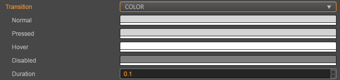

# Button（按钮）组件参考

Button 组件可以响应用户的点击操作，当用户点击 Button 时，Button 自身会有状态变化。另外，Button 还可以让用户在完成点击操作后响应一个自定义的行为。


点击 **属性检查器** 下面的 **添加组件** 按钮，然后从 **UI 组件** 中选择 **Button**，即可添加 Button 组件到节点上。

按钮的脚本接口请参考 [Button API](%__APIDOC__%/zh/classes/Button.html)。

## Button 属性

| 属性                 | 功能说明             |
| --------------       | -----------        |
| Target                  | Node 类型，当 Button 发生 Transition 的时候，会相应地修改 Target 节点的 SpriteFrame，颜色或者 Scale。           |
| interactable            | 布尔类型，设为 false 时，则 Button 组件进入禁用状态。                                                         |
| Enable Auto Gray Effect | 布尔类型，当设置为 true 的时候，如果 button 的 interactable 属性为 false，则 button 的 sprite Target 会变为灰度。|
| Transition              | 枚举类型，包括 NONE、COLOR、SPRITE 和 SCALE。每种类型对应不同的 Transition 设置。详情见下方的 **Button Transition** 部分。|
| Click Event             | 列表类型，默认为空，用户添加的每一个事件由节点引用、组件名称和一个响应函数组成。详情见下方的 **Button 事件** 部分。      |

> **注意**：当 Transition 为 SPRITE 且 disabledSprite 属性有关联一个 spriteFrame 的时候，此时将忽略 Enable Auto Gray Effect 属性

## Button Transition

Button 的 Transition 用来指定当用户点击 Button 时的状态表现。目前主要有 NONE、COLOR、SPRITE 和 SCALE 四种类型。


### Color Transition



| 属性            | 功能说明                         |
| -------------- | -----------                     |
| Normal         | Button 在 Normal 状态下的颜色。    |
| Pressed        | Button 在 Pressed 状态下的颜色。   |
| Hover          | Button 在 Hover 状态下的颜色。     |
| Disabled       | Button 在 Disabled 状态下的颜色。  |
| Duration       | Button 状态切换需要的时间间隔。      |

### Sprite Transition


| 属性            | 功能说明                                 |
| -------------- | -----------                             |
| Normal         | Button 在 Normal 状态下的 SpriteFrame。   |
| Pressed        | Button 在 Pressed 状态下的 SpriteFrame。  |
| Hover          | Button 在 Hover 状态下的 SpriteFrame。    |
| Disabled       | Button 在 Disabled 状态下的 SpriteFrame。 |

### Scale Transition


| 属性            | 功能                                                                                       |
| -------------- | -----------                                                                                |
| Duration       | Button 状态切换需要的时间间隔。                                                                |
| ZoomScale      | 当用户点击按钮后，按钮会缩放到一个值，这个值等于 Button 原始 scale * zoomScale，zoomScale 可以为负数  |

## Button 点击事件

Button 可以额外添加 Click 事件，用于响应玩家的点击操作。有以下两种方法。

### 通过属性检查器添加回调


|  序号 |  属性          | 功能说明      |
| ---- | ------------  | -----------                                       |
|  1   | Target        | 带有脚本组件的节点。                                  |
|  2   | Component     | 脚本组件名称。                                       |
|  3   | Handler       | 指定一个回调函数，当用户点击 Button 时会触发此函数。 |
|  4   | CustomEventData | 用户指定任意的字符串作为事件回调的最后一个参数传入。       |

### 通过脚本添加回调

通过脚本添加回调有以下两种方式：

1. 这种方法添加的事件回调和使用编辑器添加的事件回调是一样的，都是通过 Button 组件实现。首先需要构造一个 `cc.Component.EventHandler` 对象，然后设置好对应的 `target`、`component`、`handler` 和 `customEventData` 参数。

    ```js
    // here is your component file, file name = MyComponent.js 
    cc.Class({
        extends: cc.Component,
        properties: {},

        onLoad: function () {
            var clickEventHandler = new cc.Component.EventHandler();
            clickEventHandler.target = this.node; // 这个 node 节点是你的事件处理代码组件所属的节点
            clickEventHandler.component = "MyComponent";// 这个是代码文件名
            clickEventHandler.handler = "callback";
            clickEventHandler.customEventData = "foobar";

            var button = this.node.getComponent(cc.Button);
            button.clickEvents.push(clickEventHandler);
        },

        callback: function (event, customEventData) {
            // 这里 event 是一个 Event 对象，你可以通过 event.target 取到事件的发送节点
            var node = event.target;
            var button = node.getComponent(cc.Button);
            // 这里的 customEventData 参数就等于你之前设置的 "foobar"
        }
    });
    ```

2. 通过 `button.node.on('click', ...)` 的方式来添加，这是一种非常简便的方式，但是该方式有一定的局限性，在事件回调里面无法
获得当前点击按钮的屏幕坐标点。

    ```js
    // 假设我们在一个组件的 onLoad 方法里面添加事件处理回调，在 callback 函数中进行事件处理:

    cc.Class({
        extends: cc.Component,

        properties: {
            button: cc.Button
        },

        onLoad: function () {
            this.button.node.on('click', this.callback, this);
        },

        callback: function (button) {
            // do whatever you want with button
            // 另外，注意这种方式注册的事件，也无法传递 customEventData
        }
    });
    ```
