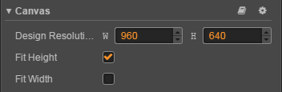

# Canvas（画布）组件参考

**Canvas（画布）** 组件能够随时获得设备屏幕的实际分辨率并对场景中所有渲染元素进行适当的缩放。场景中的 Canvas 同时只能有一个，建议所有 UI 和可渲染元素都设置为 Canvas 的子节点。

## 选项

选项                | 说明
--                  | --
Design Resolution   | 设计分辨率（内容生产者在制作场景时使用的分辨率蓝本）
Fit Height          | 适配高度（设计分辨率的高度自动撑满屏幕高度）
Fit Width           | 适配宽度（设计分辨率的宽度自动撑满屏幕宽度）

## 适配屏幕尺寸

Canvas 在做屏幕适配时，只会对整个游戏的画面进行缩放或拉伸，并不会修改所在节点的尺寸。节点尺寸将默认跟设计分辨率保持一致，因此不会跟屏幕实际大小完全贴合。所以为了让子节点能够正确适配屏幕实际大小，通常我们需要让 Canvas 所在节点的尺寸对齐到全屏幕。因此在编辑器中添加 Canvas 组件时，还会自动添加一个 Widget 组件，使 Canvas 所在节点能够自动撑满全屏（v2.3 新增）。

开发者如需固定 Canvas 节点的尺寸为设计分辨率，可以手动移除或禁用 Widget 组件。另外，当旧项目升级到 v2.3 时，编辑器会自动添加 Widget 组件，开发者无需手动添加。

Canvas 的脚本接口请参考 [Canvas API](../../../api/zh/classes/Canvas.html)。
