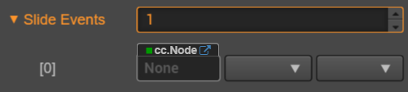

# Slider 组件参考

Slider 是一个滑动器组件。


点击 **属性检查器** 下面的 **添加组件** 按钮，然后从 **UI 组件** 中选择 **Slider**，即可添加 Slider 组件到节点上。

滑动器的脚本接口请参考 [Slider API](../../../api/zh/classes/Slider.html)。

## Slider 属性

| 属性           | 功能说明                                                 |
| -------------- | -----------                                            |
| handle         | 滑块按钮部件，可以通过该按钮进行滑动调节 Slider 数值大小       |
| direction      | 滑动器的方向，分为横向和竖向                                |
| progress       | 当前进度值，该数值的区间是 0-1 之间                         |
| slideEvents    | 滑动器组件事件回调函数                                     |

## Slider 事件



| 属性            | 功能说明                                                   |
| --------------  | -----------                                              |
| Target          | 带有脚本组件的节点。                                        |
| Component       | 脚本组件名称。                                             |
| Handler         | 指定一个回调函数，当 Slider 的事件发生的时候会调用此函数。       |
| CustomEventData | 用户指定任意的字符串作为事件回调的最后一个参数传入。              |

Slider 的事件回调有两个参数，第一个参数是 Slider 本身，第二个参数是 CustomEventData

## 详细说明

Slider 通常用于调节数值的 UI（例如音量调节），它主要的部件一个滑块按钮，该部件用于用户交互，通过该部件可进行调节 Slider 的数值大小。

通常一个 Slider 的节点树如下图：


## 通过脚本代码添加回调

### 方法一

这种方法添加的事件回调和使用编辑器添加的事件回调是一样的，都是通过代码添加。首先需要构造一个 `cc.Component.EventHandler` 对象，然后设置好对应的 `target`、`component`、`handler` 和 `customEventData` 参数。

```js
var sliderEventHandler = new cc.Component.EventHandler();
sliderEventHandler.target = this.node; // 这个 node 节点是你的事件处理代码组件所属的节点
sliderEventHandler.component = "cc.MyComponent"
sliderEventHandler.handler = "callback";
sliderEventHandler.customEventData = "foobar";

slider.slideEvents.push(sliderEventHandler);

// here is your component file
cc.Class({
    name: 'cc.MyComponent'
    extends: cc.Component,

    properties: {
    },

    callback: function(slider, customEventData) {
        // 这里 slider 是一个 cc.Slider 对象
        // 这里的 customEventData 参数就等于你之前设置的 "foobar"
    }
});
```

### 方法二

通过 `slider.node.on('slide', ...)` 的方式来添加

```js
// 假设我们在一个组件的 onLoad 方法里面添加事件处理回调，在 callback 函数中进行事件处理

cc.Class({
    extends: cc.Component,


    properties: {
       slider: cc.Slider
    },

    onLoad: function () {
       this.slider.node.on('slide', this.callback, this);
    },

    callback: function (slider) {
       // 回调的参数是 slider
       // do whatever you want with the slider
    }
});
```
