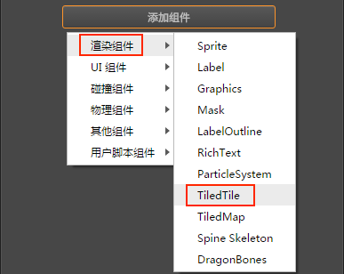

# TiledTile 组件参考

TiledTile 组件可以单独对某一个地图块进行操作。


## 创建方式

### 1、通过编辑器创建

在创建 [TiledMap 组件](tiledmap.md) 过程中 **自动生成** 的 Layer 节点下创建一个空节点。然后选中该空节点，点击 **属性检查器** 下方的 **添加组件 -> 渲染组件 -> TiledTile**，即可添加 TiledTile 组件到节点上。再通过设置 TiledTile 组件上的属性来操作地图块。



相关 TiledTile 脚本接口请参考 [TiledTile API](../../../api/zh/classes/TiledTile.html)

### 2、通过代码创建

在代码中设置地图块有两种方式。当你在某个 Layer 节点中设置了 TiledTile 之后，该 Layer 节点原先所在位置的 TiledTile 将会被取代。

#### 通过对一个节点添加 TiledTile 组件创建

```js
// 创建一个新节点
var node = new cc.Node();
// 然后把该节点的父节点设置为任意的 layer 节点
node.parent = this.layer.node;  
// 最后添加 TiledTile 组件到该节点上，并返回 TiledTile 对象，就可以对 TiledTile 对象进行一系列操作
var tiledTile = node.addComponent(cc.TiledTile);  
```

#### 通过 getTiledTileAt 获取 TiledTile

```js
// 获取 layer 上横向坐标为 0，纵向坐标为 0 的 TiledTile 对象，就可以对 TiledTile 对象进行一系列操作
var tiledTile = this.layer.getTiledTileAt(0, 0);
```

Layer 脚本接口相关请参考 [TiledLayer API](../../../api/zh/classes/TiledLayer.html)

## TiledTile 属性

| 属性 |   功能说明
| ------| ----------- |
| X     | 指定 TiledTile 的横向坐标，以地图块为单位
| Y     | 指定 TiledTile 的纵向坐标，以地图块为单位
| Gid   | 指定 TiledTile 的 gid 值，来切换 TiledTile 的样式
| Layer | 获取 TiledTile 属于哪一个 TiledLayer (从 v2.0.1 开始移除该属性 )

TiledTile 可以控制指定的地图块，以及将节点的位移、旋转和缩放等应用到地图块。用户可以通过更改 TiledTile 的 gid 属性来更换地图块样式。

**注意**: 只能使用地图中现有地图块的 gid 来切换地图块的样式，无法通过自定义 Sprite Frame 来切换地图块的样式。

## 可作用到 TiledTile 上的节点属性

| 属性 |   功能说明
| ------| ----------- |
| Position | 可对指定的 TiledTile 进行 **平移** 操作
| Rotation | 可对指定的 TiledTile 进行 **旋转** 操作
| Scale    | 可对指定的 TiledTile 进行 **缩放** 操作
| Color    | 可对指定的 TiledTile 进行更改 **颜色** 操作
| Opacity  | 可对指定的 TiledTile 调整 **不透明度**
| Skew     | 可对指定的 TiledTile 调整 **倾斜角度**
