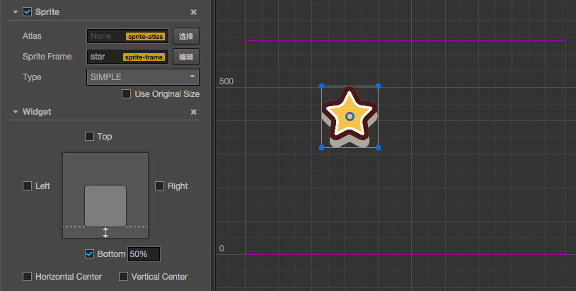
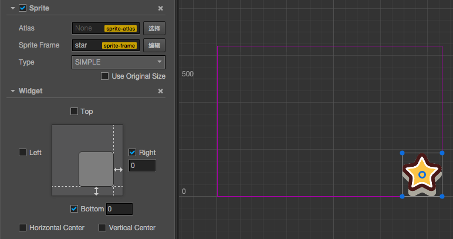

# Widget 组件参考

Widget (对齐挂件) 是一个很常用的 UI 布局组件。它能使当前节点自动对齐到父物体的任意位置，或者约束尺寸，让你的游戏可以方便地适配不同的分辨率。

对齐挂件的脚本接口请参考 [Widget API](%__APIDOC__%/zh/classes/Widget.html)。

## 选项

选项     | 说明      | 备注
--      | --        | --
Top     | 对齐上边界 | 选中后，将在旁边显示一个输入框，用于设定当前节点的上边界和父物体的上边界之间的距离。
Bottom  | 对齐下边界 | 选中后，将在旁边显示一个输入框，用于设定当前节点的下边界和父物体的下边界之间的距离。
Left    | 对齐左边界 | 选中后，将在旁边显示一个输入框，用于设定当前节点的左边界和父物体的左边界之间的距离。
Right   | 对齐右边界 | 选中后，将在旁边显示一个输入框，用于设定当前节点的右边界和父物体的右边界之间的距离。
HorizontalCenter   | 水平方向居中 |
VerticalCenter     | 竖直方向居中 |
Target  | 对齐目标   | 指定对齐参照的节点，当这里未指定目标时会使用直接父级节点作为对齐目标。 当父节点是整个场景时，则对齐到屏幕的可见区域（`visibleRect`），可用于将 UI 停靠在屏幕边缘。
Align Mode | 指定 widget 的对齐方式，用于决定运行时 widget 应何时更新 | 通常设置为 `ON_WINDOWS_RESIZE`，仅在初始化和每当窗口大小改变时重新对齐。 设置为 ONCE 时，仅在组件初始化时进行一次对齐。 设置为 ALWAYS 时，每帧都会对当前 Widget 组件执行对齐逻辑。

## 对齐边界

我们可以在 Canvas 下新建一个 Sprite，在 Sprite 节点上添加一个 Widget 组件，然后做如下一些测试：

### 左对齐，左边界距离 100 px：

### 下对齐，下边界距离 50%：

百分比将以父节点的宽或高作为基准

### 右下对齐，边界距离 0 px：

## 居中对齐

### 水平方向居中：

### 竖直方向居中，并且右边界距离 50%：

## 约束尺寸

如果左右同时对齐，或者上下同时对齐，那么在相应方向上的尺寸就会被拉伸。下面演示一下，在场景中放置两个矩形 Sprite，大的作为对话框背景，小的作为对话框上的按钮。按钮节点作为对话框的子节点，并且按钮设置成 Sliced 模式以便展示拉伸效果。

### 宽度拉伸，左右边距 10%：

### 高度拉伸，上下边距 0，同时水平居中：

### 水平和竖直同时拉伸，边距 50 px：

## 对节点位置、尺寸的限制

如果 `Align Mode` 属性设为 `ALWAYS` 时，会在运行时每帧都按照设置的对齐策略进行对齐，组件所在节点的位置（position）和尺寸（width，height）属性可能会被限制，不能通过 API 或动画系统自由修改。这是因为通过 Widget 对齐是在每帧的最后阶段进行处理的，因此对 Widget 组件中已经设置了对齐的相关属性进行设置，最后都会被 Widget 组件本身的更新所重置。

如果需要同时满足对齐策略和可以在运行时改变位置和尺寸的需要，可以通过以下两种方式实现：

1. 确保 **Widget** 组件的 `Align Mode` 属性设置为 `ONCE`，该属性只会负责在组件初始化（onEnable）时进行一次对齐，而不会每帧再进行一次对齐。可以在初始化时自动完成对齐，然后就可以通过 API 或动画系统对 UI 进行移动变换了。
2. 通过调用 **Widget** 组件的对齐边距 API，包括 `top`、`bottom`、`left`、`right`，直接修改 Widget 所在节点的位置或某一轴向的拉伸。这些属性也可以在动画编辑器中添加相应关键帧，保证对齐的同时实现各种丰富的 UI 动画。

## 注意

Widget 组件会自动调整当前节点的坐标和宽高，不过目前调整后的结果要到下一帧才能在脚本里获取到，除非你先手动调用 [updateAlignment](%__APIDOC__%/zh/classes/Widget.html#updatealignment)。
