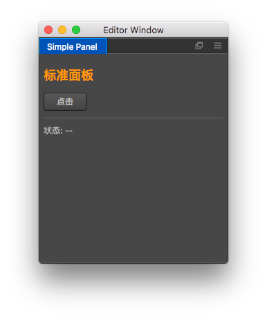

# 扩展编辑器面板

Cocos Creator 允许用户定义一份面板窗口做编辑器的 UI 交互。

## 定义方法

在插件的 package.json 文件中定义 `panel` 字段如下:

```json
{
  "name": "simple-package",
  "panel": {
    "main": "panel/index.js",
    "type": "dockable",
    "title": "Simple Panel",
    "width": 400,
    "height": 300
  }
}
```

目前编辑器扩展系统支持每个插件注册一个面板，面板的信息通过 `panel` 字段对应的对象来申明。其中 `main` 字段用来标记面板的入口程序，和整个扩展包的入口程序概念类似，`panel.main` 字段指定的文件路径相当于扩展包在渲染进程的入口。

另外值得注意的是 `type` 字段规定了面板的基本类型：

- `dockable`：可停靠面板，打开该面板后，可以通过拖拽面板标签到编辑器里，实现扩展面板嵌入到编辑器中。下面我们介绍的面板入口程序都是按照可停靠面板的要求声明的。
- `simple`：简单 Web 面板，不可停靠到编辑器主窗口，相当于一份通用的 HTML 前端页面。详细情况请见 [定义简单面板](define-simple-panel.md)。

其他面板定义的说明请参考 [面板字段参考](reference/panel-json-reference.md)。

## 定义入口程序

要定义一份面板的入口程序，我们需要通过 `Editor.Panel.extend()` 函数来注册面板。如以下代码：

```javascript
// panel/index.js
Editor.Panel.extend({
  style: `
    :host { margin: 5px; }
    h2 { color: #f90; }
  `,

  template: `
    <h2>标准面板</h2>
    <ui-button id="btn">点击</ui-button>
    <hr />
    <div>状态: <span id="label">--</span></div>
  `,

  $: {
    btn: '#btn',
    label: '#label',
  },

  ready () {
    this.$btn.addEventListener('confirm', () => {
      this.$label.innerText = '你好';
      setTimeout(() => {
        this.$label.innerText = '--';
      }, 500);
    });
  },
});
```

`Editor.Panel.extend()` 接口传入的参数是一个包括特定字段的对象，用来描述整个面板的外观和功能。

在这份对象代码中，我们定义了面板的样式（style）和模板（template），并通过定义选择器 `$` 获得面板元素，最后在 ready 初始化回调函数中对面板元素的事件进行注册和处理。

在完成了上述操作后，我们就可以通过在主进程（入口程序）调用 `Editor.Panel.open('simple-package')` 激活我们的面板窗口。关于 `Editor.Panel` 接口的用法请参考 [Panel API](api/editor-framework/main/panel.md)。

更多关于面板定义对象字段的说明，请阅读 [面板定义参考](reference/panel-reference.md)。

## 在主菜单中添加打开面板选项

为了方便打开窗口，通常我们会将打开窗口的方法注册到主菜单中，并通过发消息给插件主进程代码来完成。要做到这些事情，我们需要在 `package.json` 中注册主进程入口函数和主菜单选项：

```json
{
  "name": "simple-package",
  "main": "main.js",
  "main-menu": {
    "Panel/Simple Panel": {
      "message": "simple-package:open"
    }
  },
  "panel": {
    "main": "panel/index.js",
    "type": "dockable",
    "title": "Simple Panel",
    "width": 400,
    "height": 300
  }
}
```

在主进程函数中，我们做如下定义：

```javascript
// use strict;

module.exports = {
  load () {
  },

  unload () {
  },

  messages: {
    open() {
      Editor.Panel.open('simple-package');
    },
  },
};
```

一切顺利的话，你将可以通过主菜单，打开如下的面板：



更多关于在 `package.json` 文件中注册面板时的字段描述，请阅读 [面板字段参考](reference/panel-json-reference.md)。

## 窗口面板与主进程交互

通常我们需要在窗口面板中设置一些 UI，然后通过发送 IPC 消息将任务交给主进程处理。这里我们可以使用 `Editor.Ipc` 模块来完成，在上面定义的 `index.js` 的 `ready()` 函数中处理按钮消息来达成。

```javascript
this.$btn.addEventListener('confirm', () => {
    Editor.Ipc.sendToMain('simple-package:say-hello', 'Hello, this is simple panel');
});
```

当点击按钮时，它将会给插件主进程发送 'say-hello' 消息，并附带对应的参数。你可以用任何你能想得到的前端技术编辑你的窗口界面，还可以结合 Electron 的 内置 node 在窗口内 require 你希望的 node 模块，完成任何你希望做的操作。

更全面和详细的主进程和面板之间的 IPC 通讯交互方法，请继续阅读 [进程间通讯工作流程](ipc-workflow.md)。
