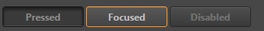
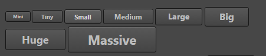

# ui-button 参考

## 基础用法

```html
<ui-button>buttton</ui-button>
```

## 属性
属性名  | 参数值类型 | 功能说明
------|--------------|-------------
[`pressed`](#`pressed,-focused,-disabled`-控制状态) | boolean | 控制按钮 `pressed` 状态  
[`focused`](#`pressed,-focused,-disabled`-控制状态)| boolean  | 控制按钮 `focused` 状态 
[`disabled`](#`pressed,-focused,-disabled`-控制状态)| boolean  | 控制按钮 `disabled` 状态，设置此属性后不再响应事件
`unnavigable`| boolean  | 控制按钮是否可导航，按钮默认可以通过 tab 键获取焦点，设置此属性后不再响应 tab，并且鼠标获取焦点后不会有 focus 样式

## 样式控制
种类  | 参数值类型 | 功能说明
------|-----------|-------------
[size](#控制按钮-size-样式) |`class` 样式名，string，支持值 "**mini, tiny, small, medium, large, big, huge, massive**" | 控制按钮大小  
[color](#控制按钮颜色) |`class` 样式名，string，支持值"**red, green, blue**" | 控制按钮颜色  
[`transparent`](#透明按钮) |`class` 样式名，string，支持值"`transparent`" | 控制按钮种类是否为透明类型

## event 事件
事件名称|是否冒泡|触发机制
-------|-------|--------
`click`|是|点击按钮触发
`confirm`|是|点击按钮触发

## 使用效果示例
### `pressed, focused, disabled` 控制状态

```html
<ui-button pressed>pressed</ui-button>
<ui-button focused>focused</ui-button>
<ui-button disabled>disabled</ui-button>
```
> 注意：布尔属性，只要赋值为真值即存在该属性，想要赋值 false 时，注意传递的值是否因转化为字符串而导致其他非正确结果           




### 控制按钮 size 样式

```html
<ui-button class="mini">Mini</ui-button>
<ui-button class="tiny">Tiny</ui-button>
<ui-button class="small">Small</ui-button>
<ui-button class="medium">Medium</ui-button>
<ui-button class="large">Large</ui-button>
<ui-button class="big">Big</ui-button>
<ui-button class="huge">Huge</ui-button>
<ui-button class="massive">Massive</ui-button>
```


### 控制按钮颜色

```html
<ui-button style="width: 100px;">Default</ui-button>
<ui-button style="width: 100px;" class="red">Red</ui-button>
<ui-button style="width: 100px;" class="green">Green</ui-button>
<ui-button style="width: 100px;" class="blue">Blue</ui-button>
```


### 透明按钮

```html
<ui-button class="transparent">Default</ui-button>
<ui-button class="red transparent">Red</ui-button>
<ui-button class="green transparent">Green</ui-button>
<ui-button class="blue transparent">Blue</ui-button>
```


### 综合样式效果
通过 `class` 结合可以实现多种效果

