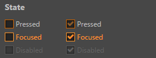

# ui-checkbox 参考

## 基础用法

```html
<ui-checkbox>checkbox</ui-checkbox>
```

## 属性
属性名  | 参数值类型 | 功能说明
------|--------------|-------------
`checked`| boolean  | 代表组件是否选中状态
[`pressed`](#`pressed,-focused,-disabled`-控制状态) | boolean | 控制组件 `pressed` 状态
[`focused`](#`pressed,-focused,-disabled`-控制状态)| boolean  | 控制组件 `focused` 状态
[`disabled`](#`pressed,-focused,-disabled`-控制状态)| boolean  | 控制组件 `disabled` 状态，设置此属性后不再响应事件
`readonly`| boolean  | 控制组件 `readonly` 状态
`unnavigable`| boolean  | 控制组件是否可导航，组件默认可以通过 tab 键获取焦点，设置此属性后不再响应 tab，并且鼠标获取焦点后不会有 focus 样式

## event 事件
事件名称|是否冒泡|触发机制
-------|-------|--------
`change`|是|点击组件触发
`confirm`|是|点击组件触发

## 使用效果示例
### `pressed，focused，disabled` 控制状态

```html
<ui-checkbox pressed>pressed</ui-checkbox>
<ui-checkbox focused>focused</ui-checkbox>
<ui-checkbox disabled>disabled</ui-checkbox>
```
> 注意：布尔属性，只要赋值为真值即存在该属性，想要赋值 false 时，注意传递的值是否因转化为字符串而导致其他非正确结果



### readonly
```html
<ui-checkbox readonly></ui-checkbox>
<ui-checkbox readonly ></ui-checkbox>
```