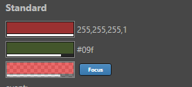
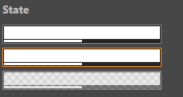

# ui-color 参考

## 基础用法

```html
<ui-color></ui-color>
<ui-color value="#09f"></ui-color>
<ui-color value="rgba(255,0,0,0.8)"></ui-color>
```



## 属性

属性  | 参数值类型 | 功能说明
------|--------------|-------------  
`value`| color，支持 16 进制颜色值，rgb 或 rgba 颜色值| 控制 color 的显示颜色，默认为白色，透明度 1
[`focused`](#`focused,-disabled`-控制状态)| boolean | 控制 `focused` 状态
[`disabled`](#`focused,-disabled`-控制状态)| boolean | 控制 `disabled` 状态，设置此属性后不再响应事件
`readonly` | boolean | 控制 `readonly` 状态，设置此属性后不再响应事件
`unnavigable`| boolean | 控制是否可导航，按钮默认可以通过 tab 键获取焦点，设置此属性后无法通过 tab 获取焦点，并且鼠标获取焦点后不会有 focus 样式

> 使用 `element.value` 获取到值为数组对象，例如：[154, 49, 49, 1]

## event 事件

事件名称|是否冒泡|触发机制
-------|-------|--------
`change` |是|颜色值发生改变
`confirm` |是|发生 `change` 改值后，失去焦点或键入 **enter**
`cancel` |是|发生 `change` 改值后，键入 **esc**（将恢复原值）

## 使用效果示例

### `focused, disabled` 控制状态

```html
<ui-color placeholder="Normal..."></ui-color>
<ui-color placeholder="Focused..." focused></ui-color>
<ui-color placeholder="Disabled..." disabled></ui-color>
```


