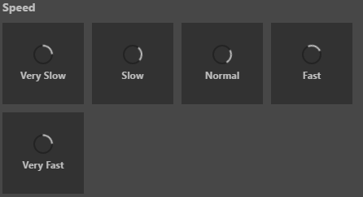

# ui-loader 参考

## 基础用法

```html
<ui-loader></ui-loader>
```

## 属性

属性名  | 参数值类型 | 功能说明
------|--------------|-------------  
[`color`](#`color`-控制遮罩颜色)| color，十六进制、rgba、rgb等常见颜色值 | 控制 `mask` 遮罩颜色
[`indeterminate`](#`indeterminate`)| boolean | 控制组件 `loader` 的旋转方向为逆时针，未指定默认为顺时针

## 样式控制

种类              | 参数值类型 | 功能说明
----------------|-----------|-------------
[size](#size-控制大小)      | `class` 样式名，string，支持值：**mini, tiny, small, medium, large, big, huge, massive** | 控制组件整体大小
[speed](#speed-控制动画速度)      | `class` 样式名，string，支持值：**very-slow, slow, fast, very-fast** | 控制组件 `loader` 动画速度，未设置为正常速度
[color](#color-控制组件颜色)      | `class` 样式名，string，支持值：**red, blue, green** | 控制组件颜色
[transparent](#transparent)      | `class` 样式名，string，支持值：**transparent** | 透明版组件

## 使用效果示例

### `color` 控制遮罩颜色

```html
<ui-loader color="rgba(128,0,0,0.3)">Color Mask</ui-loader>
```


### `indeterminate`

```html
<ui-loader indeterminate>Indeterminate</ui-loader>
```
<!--

-->

### transparent

```html
<ui-loader class="transparent">Transparent</ui-loader>
```


### `color` 控制 `loader` 颜色

```html
<ui-loader class="red">Red</ui-loader>
<ui-loader class="blue">Blue</ui-loader>
<ui-loader class="green">Green</ui-loader>
```


### size 控制大小

```html
<ui-loader class="mini">Mini</ui-loader>
<ui-loader class="tiny">Tny</ui-loader>
 ····
```


### speed 控制动画速度

```html
<ui-loader class="very-slow"></ui-loader>
<ui-loader class="slow"></ui-loader>
 ····
```


