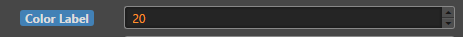
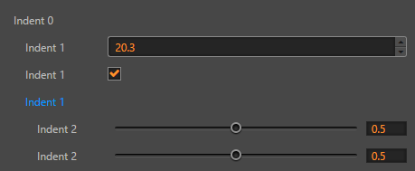
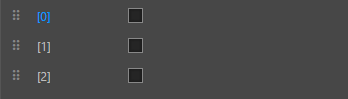
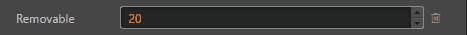
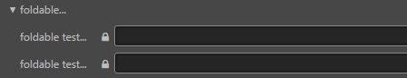
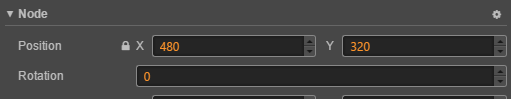

# ui-prop 参考

## 基础用法

```html
<ui-prop value="0.5"></ui-prop>
```
<!--

-->
## 属性

没有特殊说明，默认为可读写，可直接通过 `element` 调用取值。

属性名  | 参数值类型 | 功能说明
:------|:--------------|:-------------  
`selected`| boolean | 当前是否为选中状态
`focused`| boolean | 控制 `focused` 状态
`disabled`| boolean | 控制 `disabled` 状态, 设置此属性后不再响应事件
`readonly`| boolean | 只读状态
`name`| string | 指定内部生成的左边 label 名称
`labelWidth`|百分数或 0 ~ 100 的数字（内部转化为百分比）| 指定内部生成的左边 label 长度比例
[`indent`](#indent)| number | 缩进数
[`foldable`](#foldable)| boolean| 是否可折叠，设置该属性后，可实现子代组件的显示隐藏
[`movable`](#movable)| boolean| 是否可拖拽
[`removable`](#removable)| boolean |当前组件是否可移除
`auto-height`| boolean |当前组件是否高度为 auto，默认统一高度
[`tooltip`](#tooltip)| string | 设置提示信息内容，鼠标上移至 label 显示
`type`| string，支持 **boolean, number, string, color, vec2, vec3, enum, object**| 自动渲染组件类型
`value`| string | 组件需要渲染的子组件 `value` 数据，不同 `type` 传入不同数据，对象类需先转换为 JSON 字符串，不同 `type` 需要传递的对应值，[详情见 `type` 与 `value` 对应表](#`type`-与-`value`-对应表)
[`slidable`](#slidable)| boolean | `type` 为 number 时有效，控制能否通过在 label 上方拖动改值
[`max`](#slide)| number，默认为 infinite| `type` 为 number 时有效，控制子代组件最大值
[`min`](#slide)| number，默认为 -infinite| `type` 为 number 时有效，控制子代组件最小值
[`step`](#slide)| number，默认为 1| `type` 为 number 时有效，控制子代组件滑动步长
`input-type`| string | `type` 为 number 时有效，设置为限制数据类型为整型的 num-input
[`slide`](#slide)| boolean | `type` 为 number 时有效，设置生成的子组件为 ui-slider
[`multiline`](#multiline)| boolean | `type` 为 string 时有效，设置生成的子组件为 ui-text-area

> 带中划线的属性，使用键值对获取值时需改为驼峰式写法，例如 `element.autoHeight`

## event 事件

事件名称|是否冒泡|触发机制
:-------|:-------|:--------
`change` |是|内部生成子组件触发 `change` 事件
`confirm` |是|内部生成子组件触发 `confirm` 事件
`cancel` |是|内部生成子组件触发 `cancel` 事件

> 可以通过事件函数中的 event 对象，调用 `event.detail._path` 取到配置的 `path` 属性，调用 `event.detail._value` 获取当前触发事件组件的 `value` 值。

## `type` 与 `value` 对应表

type|value|示例
:-------|:-------|:--------
boolean|boolean，默认为 false|true / false，生成 ui-checkbox
number|number 或 number string（可转为数字的字符串），默认为 0 |1 或 "1"，生成 ui-num-input / ui-slider
string|string|任意字符串，生成 ui-input / ui-text-area
color|color，默认为黑色|任意颜色值，如“ #09f ”，生成 ui-color
vec2|数组的 JSON 字符串，默认值均为 0 |如“[10, 20]”，生成对应 `value` 的子组件为 ui-num-input 的 ui-prop
vec3|数组的 JSON 字符串，默认值均为 0 |如“[10, 20, 30]”，生成对应 `value` 的子组件为 ui-num-input 的 ui-prop
object|object 的 JSON 字符串|如“{"Name": "Foobar", "ID": 1000, "Enable": true}”，根据值类型生成一一对应的 ui 组件
enum|string，对应 option 的 `value` 值|如“0”，生成 ui-select（需要指定对应的 option，放置在直接嵌套样式名为 `user-content` 的元素内部），[详情见示例](#`type`-为-enum-示例)

## 样式控制

种类              | 参数值类型 | 功能说明
:----------------|:-----------|:-------------
[color](#color-控制-label-颜色)      | `class` 样式名，string，支持值 **red, blue, green** | 控制 label 颜色

```html
<ui-prop name="Color Label" class="blue" type="number" value="20"></ui-prop>
```



## 使用效果示例

### `focused, disabled` 控制状态

```html
<ui-prop name="Disabled..." disabled type="string"></ui-prop>
<ui-prop name="Readonly..." readonly type="string"></ui-prop>
```


### indent

控制缩进数。

```html
<ui-prop name="Indent 0" ></ui-prop>
<ui-prop name="Indent 1" indent="1">
    <ui-num-input value="20.3" ></ui-num-input>
</ui-prop>
<ui-prop name="Indent 1" indent="1" >
    <ui-checkbox checked></ui-checkbox>
</ui-prop>
<ui-prop name="Indent 1" indent="1" ></ui-prop>
<ui-prop name="Indent 2" indent="2" >
    <ui-slider value="0.5" ></ui-slider>
</ui-prop>
<ui-prop name="Indent 2" indent="2" >
    <ui-slider value="0.5" ></ui-slider>
</ui-prop>
```



### movable

```html
<ui-prop  name="[0]" indent="1" movable>
    <ui-checkbox  ></ui-checkbox>
</ui-prop>
<ui-prop  name="[1]" indent="1" movable>
    <ui-checkbox></ui-checkbox>
</ui-prop>
<ui-prop  name="[2]" indent="1" movable>
    <ui-checkbox></ui-checkbox>
</ui-prop>
```



### removable

当前组件是否有可移除功能。

```html
<ui-prop  name="Removable" removable>
    <ui-num-input value="20"></ui-num-input>
</ui-prop>
```



### foldable

是否可折叠。

```html
<ui-prop name="foldable..." foldable>
    <ui-input placeholder="Name" ></ui-input>
    <!--需要使用嵌套子组件的方式，将子组件放置在 class 样式为 child 的元素中-->
    <div class="child">
        <ui-prop name="foldable test..." readonly type="string"></ui-prop>
        <ui-prop name="foldable test..." readonly type="string"></ui-prop>
    </div>
</ui-prop>
```

> **注意**：嵌套子组件不能与 type 自动生成子组件共用，只能选择一种使用方式



### tooltip

鼠标上移至 label 区域，显示 ui-hint 提示所设置值。

```html
<ui-prop name="Rotation" type="number" value="0" slidable tooltip="相对父节点的旋转，以度为单位，输入正值时顺时针旋转">
    <ui-num-input></ui-num-input>
</ui-prop>
```



### multiline

`type` 为 string 时，生成 ui-text-area。

```html
<ui-prop name="Text (multiline)" type="string" value="Hello World This is Foobar!" multiline auto-height></ui-prop>
```


### slidable

`type` 为 number 时有效，设置是否可通过在 label 区域拖动，改变值。

```html
<ui-prop name="Number" type="number" value="20" slidable></ui-prop>
```


### slider

`type` 为 number 时，生成 ui-slider。

```html
<ui-prop name="Number (slide)" type="number" value="50" step="10" min="0" max="100" slide></ui-prop>
```


### `type` 为 enum 的示例

```html
<ui-prop name="Enum" type="enum" value="2" >
    <div class="user-content">
        <option value="0">Enum 001</option>
        <option value="1">Enum 002</option>
        <option value="2">Enum 003</option>
        <option value="3">Enum 004</option>
    </div>
</ui-prop>
```
