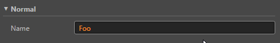
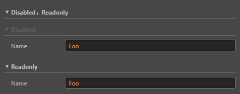

# ui-section 参考

## 基础用法

```html
<ui-section>
    <!-- ui-section 头部区域 -->
    <div class="header">Normal</div>
    <!-- ui-section 子代内容区域 -->
    <ui-prop name="Name" type="string" value="Foo">
        <ui-input class="flex-1"></ui-input>
    </ui-prop>
</ui-section>
```


## 属性

属性名  | 参数值类型 | 功能说明
------|--------------|-------------  
`folded`| boolean | 是否折叠
[`disabled`](#`disabled`、`readonly`)| boolean | 控制 `disabled` 状态
[`readonly`](#`disabled`、`readonly`)| boolean | 控制 `readonly` 状态

## 使用效果示例

### `disabled`、`readonly`
```html
<ui-section>
    <div class="header">Disabled，Readonly</div>
    <ui-section disabled>
        <div class="header">Disabled</div>
        <ui-prop name="Name" type="string" value="Foo">
            <ui-input class="flex-1"></ui-input>
        </ui-prop>
    </ui-section>
    <ui-section readonly>
        <div class="header">Readonly</div>
        <ui-prop name="Name" type="string" value="Foo">
            <ui-input class="flex-1"></ui-input>
        </ui-prop>
    </ui-section>
</ui-section>
```
