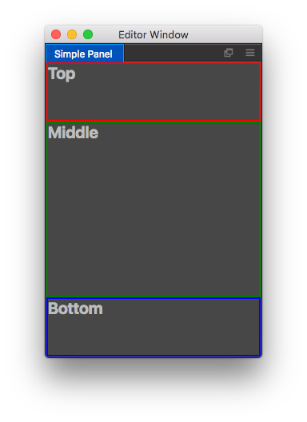

# 编写面板界面

Cocos Creator 的面板界面使用 HTML5 标准编写。你可以为界面指定 HTML 模板和 CSS 样式，然后对界面元素绑定消息编写逻辑和交互代码。如果你之前有过前端页面编程经验，那么这些内容对你来说再熟悉不过。而没有前端编程经验的开发者也不必太担心，通过本节的学习，将可以让你在短时间内掌握 Creator 面板界面的编写技巧。

## 定制你的模板

通常在开始编写界面之前，我们总是希望能够在界面中看见点什么。我们可以通过面板定义函数的 `template` 和 `style` 选项来稍微在面板界面上绘制点东西。

一般我们会选择绘制一些区块用于规划界面布局，我们可以写以下代码：

```javascript
Editor.Panel.extend({
  style: `
    .wrapper {
      box-sizing: border-box;
      border: 2px solid white;
      font-size: 20px;
      font-weight: bold;
    }

    .top {
      height: 20%;
      border-color: red;
    }

    .middle {
      height: 60%;
      border-color: green;
    }

    .bottom {
      height: 20%;
      border-color: blue;
    }
  `,

  template: `
    <div class="wrapper top">
      Top
    </div>

    <div class="wrapper middle">
      Middle
    </div>

    <div class="wrapper bottom">
      Bottom
    </div>
  `,
});
```

通过以上代码，我们获得了一个如下的界面效果：



## 界面排版

界面排版是通过在 `style` 中书写 CSS 来完成的。在上面的例子中，我们已经对界面做了简单的排版。如果对 CSS 不熟悉，推荐大家可以阅读 [W3 School 的 CSS 教程](http://www.w3school.com.cn/css/) 来加强。

在界面排版过程中，有时候我们希望更好的表达元素之间的布局关系，比如我们喜欢 Top 和 Bottom 元素的高度固定为 30px，而 Middle 元素的高度则撑满剩余空间。这个时候我们就可以使用 [CSS Flex](https://css-tricks.com/snippets/css/a-guide-to-flexbox/) 布局来制作。

我们可以这么修改 `style` 部分：

```javascript
Editor.Panel.extend({
  style: `
    :host {
      display: flex;
      flex-direction: column;
    }

    .wrapper {
      box-sizing: border-box;
      border: 2px solid white;
      font-size: 20px;
      font-weight: bold;
    }

    .top {
      height: 30px;
      border-color: red;
    }

    .middle {
      flex: 1;
      border-color: green;
    }

    .bottom {
      height: 30px;
      border-color: blue;
    }
  `
});
```

由于 CSS Flex 布局语法有些复杂，为了方便大家使用，Cocos Creator 对这部分进行了重新包装，关于这部分的详细介绍，请阅读 [界面排版](layout-ui-element.md)。

## 添加 UI 元素

规划好布局后，我们就可以考虑加入界面元素来完成界面功能。通常，熟悉前端编程的开发人员会想到一些常用的界面元素，如 `<button>`，`<input>` 等等。这些元素当然是可以直接被使用，但是我们强烈推荐大家使用 Cocos Creator 的内置 UI Kit 元素。这些内置元素都是以 `ui-` 开头，例如 `<ui-button>`，`<ui-input>`。

Cocos Creator 提供了非常丰富的内置元素，开发人员可以通过 [掌握 UI Kit](using-ui-kit.md) 章节获得更详细
的了解。内置元素不但在样式上经过细致的调整，同时也统一了消息发送规则并且能够更好的处理 focus 等系统事件。

让我们稍微丰富一下我们上面的面板：

```javascript
Editor.Panel.extend({
  style: `
    :host {
      display: flex;
      flex-direction: column;
      margin: 5px;
    }

    .top {
      height: 30px;
    }

    .middle {
      flex: 1;
      overflow: auto;
    }

    .bottom {
      height: 30px;
    }
  `,

  template: `
    <div class="top">
      Mark Down 预览工具
    </div>

    <div class="middle layout vertical">
      <ui-text-area resize-v value="请编写你的 Markdown 文档"></ui-text-area>
      <ui-markdown class="flex-1"></ui-markdown>
    </div>

    <div class="bottom layout horizontal end-justified">
      <ui-button class="green">预览</ui-button>
    </div>
  `,
});
```

如果一切正常，你将会看到如下界面：


## 为 UI 元素添加逻辑交互

最后让我们通过标准的事件处理代码来完成面板的逻辑部分。假设我们需要在每次点击预览按钮后，都会将 text-area 中输入的 Markdown 文档，渲染并显示在下方。我们可以做如下代码操作：

```javascript
Editor.Panel.extend({
  // ...

  $: {
    txt: 'ui-text-area',
    mkd: 'ui-markdown',
    btn: 'ui-button',
  },

  ready () {
    this.$btn.addEventListener('confirm', () => {
      this.$mkd.value = this.$txt.value;
    });

    // init
    this.$mkd.value = this.$txt.value;
  },
});
```

这里我们通过 `$` 选择器，预先索引了我们需要的 ui 元素。再利用 HTML 标准 API `addEventListener` 为元素添加事件。对于内置 UI Kit 元素，每个 UI 元素都拥有一组标准事件，它们分别是：`cancel`、`change` 和 `confirm`。同时，多数 UI 元素都会携带 `value` 属性，记录元素内相关的值信息。

希望通过本节的代码示例，能够启发你进行面板界面开发的工作。当然，要灵活运用面板界面，还是需要深入学习和掌握 HTML5 标准。
