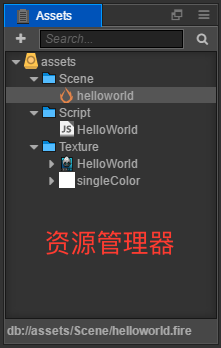
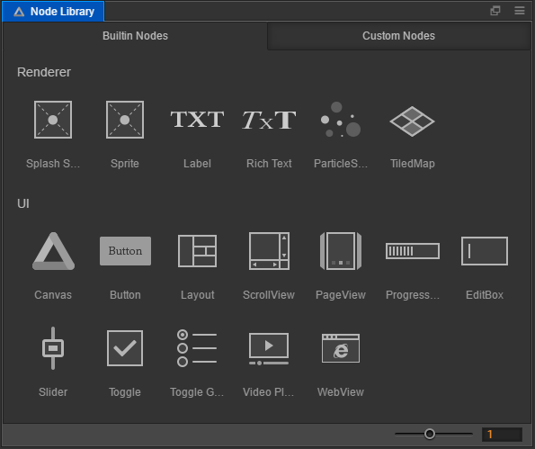
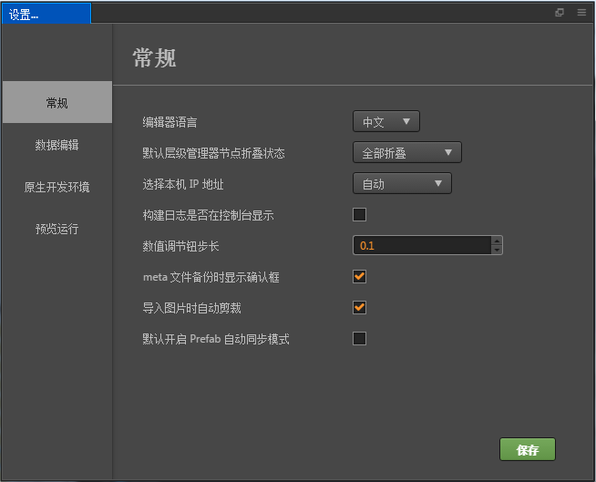

# 编辑器界面介绍

这一章将会介绍编辑器界面，熟悉组成编辑器的各个面板、菜单和功能按钮。Cocos Creator 编辑器由多个面板组成，面板可以自由移动、组合，以适应不同项目和开发者的需要。我们在这里将会以默认编辑器布局为例，快速浏览各个面板的名称和作用：

## 资源管理器

**资源管理器** 里显示了项目资源文件夹（`assets`）中的所有资源。这里会以树状结构显示文件夹并自动同步在操作系统中对项目资源文件夹内容的修改。您可以将文件从项目外面直接拖拽进来，或使用菜单导入资源。

详情请阅读 [资源管理器](editor-panels/assets.md) 一节。

## 场景编辑器

**场景编辑器** 是用来展示和编辑场景中可视内容的工作区域。所见即所得的场景搭建工作都依靠场景编辑器中的显示来完成。

详情请阅读 [场景编辑器](editor-panels/scene.md) 一节。

## 层级管理器

**层级管理器** 用树状列表的形式展示场景中的所有节点和它们的层级关系，所有在 **场景编辑器** 中看到的内容都可以在 **层级管理器** 中找到对应的节点条目，在编辑场景时这两个面板的内容会同步显示，一般我们也会同时使用这两个面板来搭建场景。

详情请阅读 [层级管理器](editor-panels/node-tree.md) 一节。

## 属性检查器

**属性检查器** 是我们查看并编辑当前选中节点和组件属性的工作区域，这个面板会以最适合的形式展示和编辑来自脚本定义的属性数据。

详情请阅读 [属性检查器](editor-panels/properties.md) 一节。

## 控件库

**控件库** 预设控件的仓库，可以通过拖拽方式添加到场景中，并且可以将用户自己的预制资源（prefab）添加到控件库里方便再次使用。

详情请阅读 [控件库](editor-panels/node-library.md) 一节。

## 工具栏

**工具栏** 上包括了场景编辑工具、预览游戏时的操作按钮、远程测试和调试时使用访问地址、连接中的设备数，以及最右边可访问项目文件夹和打开程序安装路径。

详情请阅读 [工具栏](toolbar.md) 一节。

## 设置

**设置** 里提供各种编辑器个性化的全局设置，包括原生开发环境、游戏预览、脚本编辑工具等。

详情请阅读 [设置](editor-panels/preferences.md) 一节。

## 项目设置

**项目设置** 里提供各种项目特定的个性化设置，包括分组管理、模块设置、项目预览、自定义引擎等。

详情请阅读 [项目设置](editor-panels/project-settings.md) 一节。

## 其他功能

其他重要的编辑器基础功能包括：

- [主菜单](main-menu.md)
- [工具栏](toolbar.md)
- [编辑器布局](layout.md)
- [构建预览](preview-build.md)