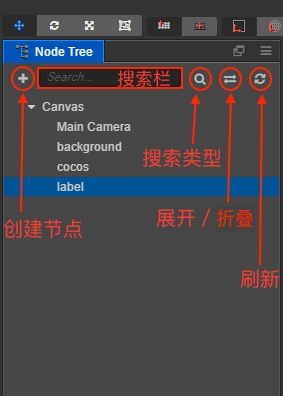

# Node Tree 层级管理器

**层级管理器** 中包括当前打开场景中的所有节点，不管节点是否包括可见的图像。你可以在这里选择、创建和删除节点，也可以通过拖拽一个节点到另一个上面来建立节点父子关系。

点击来选中节点，被选中的节点会以蓝底色高亮显示。当前选中的节点会在 **场景编辑器** 中显示蓝色边框，并更新 **属性检查器** 中的内容。

- 左上角的  按钮是创建按钮，用来创建节点。
-  搜索按钮用来过滤搜索的类型，分为 **节点**、**组件** 和 **引用 UUID 的节点** 三种类型。
- 上方的搜索栏可以根据搜索类型来搜索所需的节点或者组件等：
  - 当在搜索按钮中选择 **节点** 类型时，可在搜索栏中输入需要查找的节点名称搜索。
  - 当在搜索按钮中选择 **组件** 类型时，搜索栏中会出现 `t:` 的符号，在后面输入需要查找的组件名称即可（例如 `t:cc.Camera`）。
  - 当在搜索按钮中选择 **引用 UUID 的节点** 类型时，搜索栏中会出现 `used:` 的符号，在后面输入需要查找的 UUID，即可搜索出有使用到该 UUID 的节点。
-  按钮可以切换 **层级管理器** 节点的展开/折叠状态。
- 面板主体是节点列表，可以在这里用右键菜单或者拖拽操作对资源进行增删修改。
- 节点前面的小三角  用来切换节点树的展开/折叠状态。当用户按住 Alt/Option 的同时点击该按钮，除了执行这个节点自身的展开/折叠操作之外，还会同时展开/折叠该节点下的所有子节点。

## 创建节点

在层级管理器中有两种方法可以创建节点：

- 点击左上角的 **+** 按钮，或右键点击鼠标并进入右键菜单中的 **创建节点** 子菜单。在这个子菜单中，你可以选择不同的节点类型，包括精灵（Sprite）、文字（Label）、按钮（Button）等有不同功能和表现节点。
- 从 **资源管理器** 中拖拽图片、字体或粒子等资源到层级管理器中。就能够用选中的资源创建出相应的图像渲染节点。

## 删除节点

选中节点后，通过右键菜单里 `删除` 选项，或按下 <kbd>Delete</kbd>（Windows）或 <kbd>Cmd + Backspace</kbd>（Mac）热键即可删除选中的节点。如果选中节点包括子节点，子节点也会被一起删除。

## 建立和编辑节点层级关系

将节点 A 拖拽到节点 B 上，就使节点 A 成为节点 B 的子节点。和 [资源管理器](assets.md) 类似，层级管理器中也通过树状视图表示节点的层级关系。点击节点左边的三角图标，即可展开或收起子节点列表。

## 更改节点的显示顺序

除了将节点拖到另一个节点上，你还可以继续拖拽节点上下移动，来更改节点在列表中的排序。橙色的方框表示节点所属父节点的范围，绿色的线表示节点将会被插入的位置。

节点在列表中的排序决定了节点在场景中的显示次序。在层级管理器中显示在下方的节点的渲染顺序是在上方节点的后面，即下方的节点是在上方节点之后绘制的，因而最下方的节点在 **场景编辑器** 中显示在了最前。

## 其他操作

右键点击节点弹出的菜单里还包括下列操作：

- **拷贝/粘贴**：将节点复制到剪贴板上，然后可以粘贴到另外的位置，或打开另一个场景来粘贴刚才拷贝的节点。
- **复制节点**：生成和选中节点完全相同的节点副本，生成节点和选中节点在同一层级中。
- **重命名**：将节点改名。
- **显示节点 UUID 和路径**：在复杂场景中，我们有时候需要获取节点的完整层级路径，以便在脚本运行时访问该节点。点击这个选项，就可以在 **控制台** 中看到当前选中节点的路径以及节点的 UUID。
- **锁定节点**：鼠标移到节点上，左侧会有一个锁定按钮，节点锁定后无法在 **场景编辑器** 内选中该节点。
