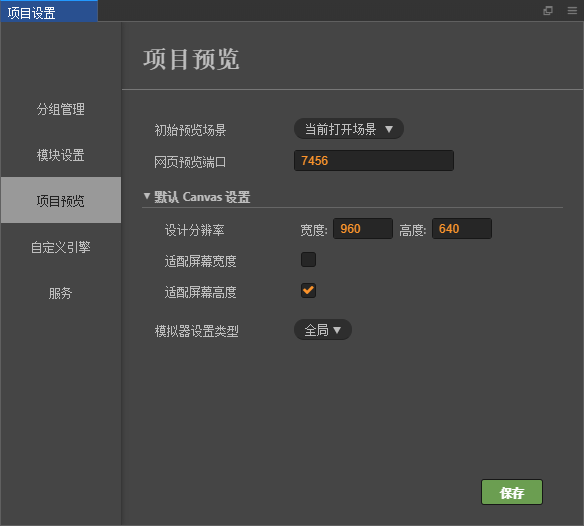

# 项目设置

**项目设置** 面板通过主菜单的 `项目->项目设置...` 菜单打开，这里包括所有特定项目相关的设置。这些设置会保存在项目的 `settings/project.json` 文件里。如果需要在不同开发者之间同步项目设置，请将 `settings` 目录加入到版本控制。

## 分组管理

目前项目设置中的分组管理主要为 [碰撞体系统](../../../physics/index.md) 提供分组支持，详情请参考 [碰撞分组管理](../../../physics/collision/collision-group.md)。

## 模块设置

这里的设置是针对发布 Web 版游戏时引擎中使用的模块进行裁剪，达到减小发布版引擎包体的效果。在列表中选中的模块在打包时将被引擎包括，未选中的模块会被裁剪掉。

在这里设置裁剪能够大幅度的减小引擎包体，建议打包后进行完整的测试，避免在场景和脚本中使用裁剪掉的模块。

## 项目预览

**项目预览** 分页提供的选项和 [设置面板](preferences.md) 里的 **预览运行** 分页类似，用于设置初始预览场景、网页预览端口、默认 Canvas 设置等等，但只对当前项目生效。

### 初始预览场景

指定按下 **预览运行** 按钮时，会打开项目中哪个场景。如果设置为 **当前打开场景**，就会运行当前正在编辑的场景，此外也可以设置成一个固定的场景（比如项目总是需要从登录场景开始游戏）。

### 默认 Canvas 设置 设计分辨率，适配屏幕宽度/高度

默认 Canvas 设置包括设计分辨率和适配屏幕宽度/高度，用于规定在新建场景或 **Canvas 组件** 时，Canvas 中默认的设计分辨率数值，以及 **Fit Height**、**Fit Width** 选项。

### 模拟器设置类型

用于设置模拟器预览分辨率和屏幕朝向，当这个选项设为 **全局** 时，会使用 **设置** 里的模拟器分辨率和屏幕朝向设置。当设为 **项目** 时，会显示以下模拟器设置：

- 模拟器横竖屏设置
- 模拟器分辨率设置
- 模拟器自定义分辨率

以上选项和 **设置** 面板中的设置方法一致。

## 服务

Facebook 服务包括 **Facebook Live Video** 和 **Facebook Audience Network**。详情请参考 [Facebook 直播和广告](../../../sdk/fb-an-and-live.md)。
