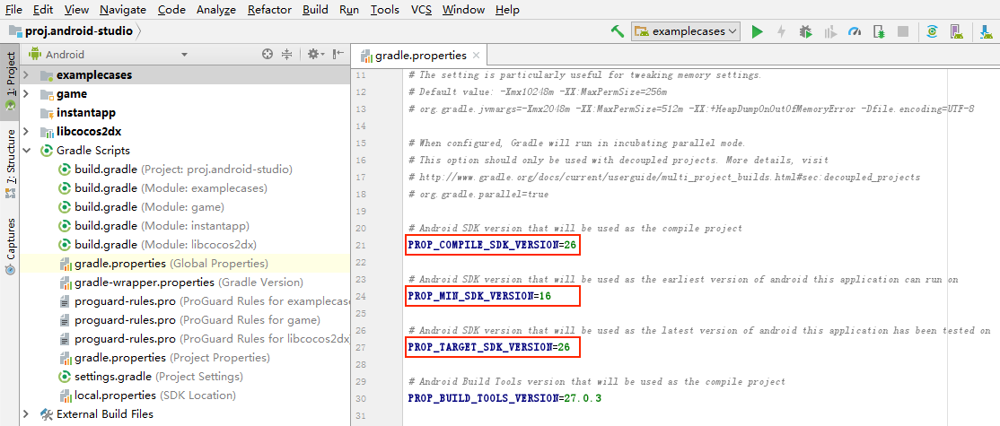

# 常见问题（FAQ）

### 在 Mac 平台安装 Creator 后，打开工程，窗口无法显示出来。

把 CocosCreator.app 从 dmg 中拖到应用程序里，再打开。

### 如何配置构建后生成的目录结构以及自动修改构建后的文件内容？

可以分别执行 `Editor.Builder.on(“build-finished”, callback)` 和 `Editor.Builder.on(“before-change-files”, callback)` 来监听并对文件做出修改。<br>
详见 [定制项目构建流程](../publish/custom-project-build-template.md)。

### 构建后，组件关联的对象找不到，或者警告找不到类型？

指定模块可能被剔除了，请检查一下 `菜单栏 -> 项目 -> 项目设置` 中的模块设置。

### 如何从 CDN 加载资源？

在 `main.js` 里修改 `libraryPath` 和 `rawAssetsBase` 参数为任意路径。

### 浏览器里如何截屏？

截屏方法：监听 `cc.Director.EVENT_AFTER_DRAW` 事件，在回调中调用 `cc._canvas.toDataURL()`，就可以获得 base64 格式的截屏。

具体内容可参考 **官方范例**（[GitHub](https://github.com/cocos/example-projects/tree/v2.4.3/assets/cases/07_capture_texture) | [Gitee](https://gitee.com/mirrors_cocos-creator/example-cases/tree/v2.4.3/assets/cases/07_capture_texture)）中 **07_capture_texture** 关于三种不同平台如何截屏并保存的范例。

### 在安卓第三方 App 自带的 WebView 上触摸时，引擎报错

找到 `main.js` 中调用 `cc.view.enableAutoFullScreen` 的地方，将传入参数改为 `false`。

### 帧动画每帧的图片大小不一样的话，播放动画时会发生偏移

请参考：[自带位置信息的序列帧动画](../asset-workflow/trim.md#%E8%87%AA%E5%B8%A6%E4%BD%8D%E7%BD%AE%E4%BF%A1%E6%81%AF%E7%9A%84%E5%BA%8F%E5%88%97%E5%B8%A7%E5%8A%A8%E7%94%BB)。

### 图片放大后，边缘白边/黑边问题

这是由于线性过滤时，颜色通道和背景色做了插值，比较简单的办法是使用预乘。预乘需要将 Sprite 组件的混合模式设置成 `SRC: ONE, DST: ONE_MINUS_SRC_ALPHA`，然后对原图做处理。

原图的处理一般可以通过在编辑器的图片资源上勾选 **预乘**；或者由美术在图片导出时，在颜色通道下面添加黑色背景，透明通道保持不变。

### 如何用插件控制 Prefab？

**创建 Prefab**：

```js
Editor.Ipc.sendToPanel('scene', 'scene:create-prefab', node.uuid, 'db://assets/xxx/xxx.prefab');
```

**进入 Prefab 编辑模式**：

```js
Editor.Ipc.sendToAll('scene:enter-prefab-edit-mode', assetUuid);
```

**保存 Prefab**：

```js
Editor.Ipc.sendToPanel('scene', 'scene:apply-prefab', node.uuid);
```

### 1.8.2 的版本可能出现 JSC 崩溃问题

请升级到 1.8.2 之后的版本。

### 微信开放数据加载头像时提示 wx.request 找不到

加载图片时 url 若缺失 .png 之类的后缀，`cc.assetManager.loadRemote` 需要额外提供 options 参数指定 `{ ext: '.png' }`。

具体内容可参考 **官方范例**（[GitHub](https://github.com/cocos/example-projects/tree/v2.4.3/assets/cases/dragonbones) | [Gitee](https://gitee.com/mirrors_cocos-creator/example-cases/tree/v2.4.3/assets/cases/dragonbones)）中的 **dragonBones/DragonMesh** 范例。

### 如何从服务器远程加载 DragonBones

#### 加载文本格式的 DragonBones 资源

```js
var animNode = new cc.Node();
animNode.parent = cc.find('Canvas');
var dragonDisplay = animNode.addComponent(dragonBones.ArmatureDisplay);

var image = 'http://localhost:7456/res/raw-assets/eee_tex-1529064342.png';
var ske = 'http://localhost:7456/res/raw-assets/eee_ske-1529065642.json';
var atlas = 'http://localhost:7456/res/raw-assets/eee_tex-1529065642.json';
cc.assetManager.loadAny([{ url: atlas, ext: '.txt' }, { url: ske, ext: '.txt' }], (error, assets) => {
    cc.assetManager.loadRemote(image, (error, texture) => {
        var atlas = new dragonBones.DragonBonesAtlasAsset();
        atlas.atlasJson = assets[0];
        atlas.texture = texture;

        var asset = new dragonBones.DragonBonesAsset();
        asset.dragonBonesJson = assets[1];

        dragonDisplay.dragonAtlasAsset = atlas;
        dragonDisplay.dragonAsset = asset;

        dragonDisplay.armatureName = 'box_anim';
        dragonDisplay.playAnimation('box_anim', 0);
    });
});
```

#### 加载二进制格式的 DragonBones 资源

```js
var animNode = new cc.Node();
animNode.parent = cc.find('Canvas');
var dragonDisplay = animNode.addComponent(dragonBones.ArmatureDisplay);

var image = 'http://localhost:7456/res/raw-assets/eee_tex-1529064342.png';
var ske = 'http://localhost:7456/res/raw-assets/eee_ske-1529065642.dbbin';
var atlas = 'http://localhost:7456/res/raw-assets/eee_tex-1529065642.json';
cc.assetManager.loadAny([{ url: atlas, ext: '.txt' }, { url: ske, ext: '.bin' }], (error, assets) => {
    cc.assetManager.loadRemote(image, (error, texture) => {
        var atlas = new dragonBones.DragonBonesAtlasAsset();
        atlas.atlasJson = assets[0];
        atlas.texture = texture;

        var asset = new dragonBones.DragonBonesAsset();
        asset._nativeAsset = assets[1];

        dragonDisplay.dragonAtlasAsset = atlas;
        dragonDisplay.dragonAsset = asset;

        dragonDisplay.armatureName = 'box_anim';
        dragonDisplay.playAnimation('box_anim', 0);
    });
});
```

### 如何从服务器远程加载 Spine

#### 加载文本格式的 Spine 资源

```js
var spineNode = new cc.Node();
var skeleton = spineNode.addComponent(sp.Skeleton);
this.node.addChild(spineNode);

var image = "http://localhost/download/spineres/1/1.png";
var ske = "http://localhost/download/spineres/1/1.json";
var atlas = "http://localhost/download/spineres/1/1.atlas";
cc.assetManager.loadAny([{ url: atlas, ext: '.txt' }, { url: ske, ext: '.txt' }], (error, assets) => {
    cc.assetManager.loadRemote(image, (error, texture) => {
        var asset = new sp.SkeletonData();
        asset.skeletonJson = assets[1];
        asset.atlasText = assets[0];
        asset.textures = [texture];
        asset.textureNames = ['1.png'];
        skeleton.skeletonData = asset;
    });
});
```

#### 加载二进制格式的 Spine 资源

```js
var spineNode = new cc.Node();
var skeleton = spineNode.addComponent(sp.Skeleton);
this.node.addChild(spineNode);

var image = "http://localhost/download/spineres/1/1.png";
var ske = "http://localhost/download/spineres/1/1.skel";
var atlas = "http://localhost/download/spineres/1/1.atlas";
cc.assetManager.loadAny([{ url: atlas, ext: '.txt' }, { url: ske, ext: '.bin' }], (error, assets) => {
    cc.assetManager.loadRemote(image, (error, texture) => {
        var asset = new sp.SkeletonData();
        asset._nativeAsset = assets[1];
        asset.atlasText = assets[0];
        asset.textures = [texture];
        asset.textureNames = ['1.png'];
        skeleton.skeletonData = asset;
    });
});
```

### 如何从服务器远程加载图集

可参考范例：[GitHub](https://github.com/cocos-creator/load-remote-plist) | [Gitee](https://gitee.com/mirrors_cocos-creator/load-remote-plist)

### 如何自定义或者直接禁用编辑器自带的 uglify

自定义引擎完成后，打开 `engine/gulp/util/utils.js` 脚本，在最下面有一个 `uglify` 函数，可以根据需求自行修改其中的参数。如果想要完全跳过 `uglify` 操作，可以直接将 `uglify` 部分中的内容替换成：

```js
const Es = require('event-stream');
return Es.through();
```

### 如何在插件中创建 AssetDB 资源

在主进程中，使用 `Editor.assetdb.create(url, data, callback)`。第一个参数是 `db://assets/xxx.png`，第二个参数是 .png 文件读取出来的 buffer。

### 如何在插件中重新刷新 AssetDB 中的资源

`Editor.assetdb.refresh()` 提供了一个手动刷新资源库的方法。

### Creator 打包 APK 提交到 Google Play 失败，提示 API 等级最低 26？

Google Play 声明 2018 年 8 月开始，新提交的应用必须使用 api level 26 及以上版本编译。Android 构建时三个版本号的设置如下：

- compileSdkVersion 编译版本：编译 Java 代码时使用的 SDK 版本，和支持的最低版本无关。可以设置为 26/27/28。
- minSdkVersion：支持的最小版本，决定编译出的应用最小支持的 Android 版本。建议设置为 16（对应 Android 4.1）。
- targetSdkVersion：和运行时的行为有关，建议设置与 compileSdkVersion 一致，也可以设置为 22，避免 [运行时权限的问题](https://developer.android.google.cn/training/permissions/requesting?hl=zh-cn)。

  

### 物理刚体的最大速度似乎被限制住了

可以对引擎进行 [定制和重编译](../advanced-topics/engine-customization.md)，在引擎 `engine/external/box2d/box2d.js` 脚本中，`b2_maxTranslation` 参数表示刚体的最大线速度，默认值为 **2**，开发者可以按需修改。

### 加载场景时出现 `TypeError: children[i]._onBatchCreated is not a function` 的报错

这是由于场景文件中的某个 `_children` 的值错误地保存成了 `null`，有可能是在某次编辑器报错的情况下无意中保存了错误的场景数据导致的。可以用文本编辑工具打开场景对应的 `.fire` 文件，把它改为 `[]` 即可。

### VideoPlayer 在浏览器中播放视频时显示黑屏

HTML 只支持 H.264 编码格式的 MP4，建议使用视频格式转换工具输出 AVC(H264) 编码格式的 MP4 视频。

### 运行或预览时，Creator 默认的调试信息显示的颜色看不清楚

可以对引擎进行 [定制和重编译](../advanced-topics/engine-customization.md)，修改引擎调试信息所用的颜色。在 `engine/cocos2d/core/utils/profiler/CCProfiler.js` 脚本中找到 `generateNode` 方法，修改其中的 **LEFT-PANEL**、**RIGHT-PANEL** 节点颜色即可。

### Widget 组件改变的坐标值在当前帧不刷新

请注意需要在立即刷新节点坐标或尺寸前执行 `widget.updateAlignment();`。

### 监听多点触摸，假设有 A、B 两点，按住 B 点，重复点击 A 点之后，松开 B 点时不响应 `touchend` 事件

在项目的任意脚本最外层对 [cc.macro.TOUCH_TIMEOUT](../../../api/zh/classes/macro.html#touchtimeout) 重新赋予一个更大的值即可。注意赋值代码请写在项目脚本中的最外层，不要写在 `onLoad` / `start` 等类函数中。

### 动态修改材质的纹理

可以通过材质的 `setProperty` 来修改纹理：

```js
material.setProperty("diffuseTexture", texture);
```

具体内容可参考官方范例中的 **custom_material** 范例（[GitHub](https://github.com/cocos/example-projects/tree/v2.4.3/assets/cases/06_rendering/custom_material) | [Gitee](https://gitee.com/mirrors_cocos-creator/example-cases/tree/v2.4.3/assets/cases/06_rendering/custom_material)）。

### Scheduler 取消失败，仍然运行

`this.unschedule(callBack, target)` 接收的参数必须与 `this.schedule(callBack, target)` 传入的一致。其中 callBack 必须是同一函数对象，而 target 也必须是同一个对象。如果传入的参数不同就会导致无法正常停止 Scheduler。

### Mac 版本的 CocosCreator 在程序坞上变小

受 Electron 底层 bug 影响，Mac 系统上 Cocos Creator 程序坞图标概率性变小。可以在终端上输入命令行：`defaults write com.apple.dock contents-immutable -bool false; killall Dock`，回车之后即可重启程序坞。

### Web Audio 在 iOS 的浏览器上播放时，如果切换前后台，大概率会出现无法正常暂停和恢复播放的问题

这个问题是 Web Audio 的 `AudioScheduledSourceNode` 引起的。`WebAudioContext` 的 `suspend` 方法在 Web Desktop 平台只会暂停 **指定的** Audio，而在 Web Mobile 平台会暂停 **所有的** Audio。因此在引擎上修复该问题过于 Hack 且不够通用，便不做修复，开发者可以通过在项目脚本中加入以下代码修复：

```js
if (cc.sys.isBrowser && cc.sys.os === cc.sys.OS_IOS) {
    cc.game.on(cc.game.EVENT_GAME_INITED, () => {
        cc.game.on(cc.game.EVENT_SHOW, () => {
            cc.sys.__audioSupport.context.resume();
        });

        cc.game.on(cc.game.EVENT_HIDE, () => {
            cc.sys.__audioSupport.context.suspend();
        });
    })
}
```
