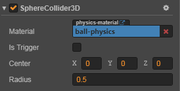

# 3D 物理碰撞组件

碰撞组件用于指明游戏对象的形状，不同形状具有不同属性及物理行为，可根据需求选择不同形状的碰撞组件。目前包括盒碰撞组件和球碰撞组件两种。

如果游戏对象要触发碰撞，那么需要同时添加碰撞组件和刚体组件。如果没有碰撞组件或者只有一个对象具有碰撞组件，则两个对象会相互穿过。

## 盒碰撞组件（BoxCollider3D）

点击 **属性检查器** 下方的 **添加组件 -> 物理组件 -> Collider -> Box 3D** 按钮，即可添加盒碰撞组件到节点上。

### 盒碰撞属性

| 属性        | 功能说明                  |
| ---------- | -----------              |
| Material   | 设置碰撞体的材质。具体可参考 [3D 物理材质](./physics-material.md)   |
| Is Trigger | 如果开启，碰撞组件会用作触发器。触发器相关可参考 [3D 物理事件](./physics-event.md) |
| Center     | 碰撞体在所在节点坐标中的位置  |
| Size       | 碰撞体的大小，即长、宽、高    |

盒碰撞组件的 API 接口请参考 [BoxCollider3D](%__APIDOC__%/zh/classes/BoxCollider3D.html)。

## 球碰撞组件（SphereCollider3D）

点击 **属性检查器** 下方的 **添加组件 -> 物理组件 -> Collider -> Sphere 3D** 按钮，即可添加球碰撞组件到节点上。

### 球碰撞属性

| 属性        | 功能说明                  |
| ---------- | -----------              |
| Material   | 设置碰撞体的材质。具体可参考 [3D 物理材质](./physics-material.md)   |
| Is Trigger | 是否可用作触发器。触发器相关可参考 [3D 物理事件](./physics-event.md) |
| Center     | 碰撞体在所在节点坐标中的位置  |
| Radius     | 碰撞体的半径               |

球碰撞组件的 API 接口请参考 [SphereCollider3D](%__APIDOC__%/zh/classes/SphereCollider3D.html)。
