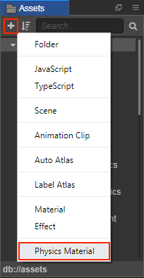

# 3D 物理材质

3D 物理材质指的是碰撞体表面的材质，用于调节碰撞体的摩擦力和弹力。

## 创建 3D 物理材质

直接点击 **资源管理器** 左上方的 **+** 号按钮，然后选择 **物理材质** 即可。

另外一种方式是在 **资源管理器** 中选中要存放物理材质的文件夹，然后点击右键，选择 **新建 -> 物理材质** 即可。

## 物理材质属性

| 属性         | 功能说明    |
| ----------- | ---------- |
| Friction    | 摩擦力      |
| Restitution | 弹力       |

## 使用 3D 物理材质

1. 创建物理材质后，在 **属性检查器** 中设置物理材质的属性，然后点击右上方的 **应用** 按钮。

2. 在 **层级管理器** 中选中碰撞组件所在的节点，再将物理材质拖拽至碰撞组件的 **Material** 属性框中即可。

    
