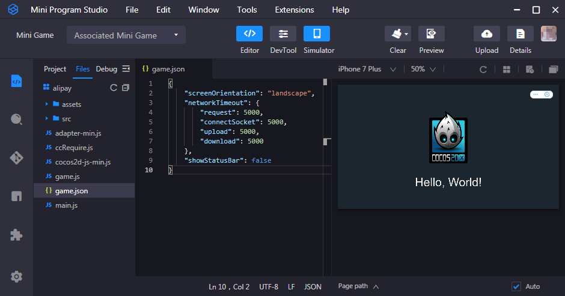

# 发布到支付宝小游戏

Cocos Creator 从 **v2.4.12** 版本开始正式支持将游戏发布到支付宝小游戏。

## 环境配置

- 桌面端下载 [支付宝小程序开发者工具](https://render.alipay.com/p/f/fd-jwq8nu2a/pages/home/index.html) 并安装。

- 下载 [支付宝](https://mobile.alipay.com/index.htm)，并安装到手机设备上。

- 支付宝客户端在 Android 上支持的最低版本为 10.3.70，在 iOS 为 10.3.70。

## 发布流程

使用 Cocos Creator 打开需要发布的项目工程，从 **菜单栏 -> 项目** 中打开 **构建发布** 面板，**发布平台** 选择 **Alipay Mini Game**，然后点击 **构建**。

### 参数项配置

相关参数配置具体的填写规则如下：

- **主包压缩类型**

  设置主包的压缩类型，具体内容可参考文档 [Asset Bundle — 压缩类型](../asset-manager/bundle.md#%E5%8E%8B%E7%BC%A9%E7%B1%BB%E5%9E%8B)。

- **配置主包为远程包**

  该项为可选项，需要与 **资源服务器地址** 选项配合使用。 
  勾选后，主包会配置为远程包，并且与其相关依赖资源一起被构建到发布包目录 remote 下的内置 Asset Bundle — [main](../asset-manager/bundle.md#%E5%86%85%E7%BD%AE-asset-bundle) 中。开发者需要将整个 remote 文件夹上传到远程服务器。

- **初始场景分包**

  该项为可选项。 
  勾选后，首场景及其相关的依赖资源会被构建到发布包目录 assets 下的内置 Asset Bundle — [start-scene](../asset-manager/bundle.md#%E5%86%85%E7%BD%AE-asset-bundle) 中，提高初始场景的资源加载速度。具体内容可参考文档 [初始场景的资源加载](publish-wechatgame.md#%E5%88%9D%E5%A7%8B%E5%9C%BA%E6%99%AF%E7%9A%84%E5%8A%A0%E8%BD%BD%E9%80%9F%E5%BA%A6)。

- **资源服务器地址**

  该项为选填项，用于填写资源存放在远程服务器上的地址。开发者需要在构建后手动将发布包目录下的 remote 文件夹上传到所填写的资源服务器地址上。具体的资源管理细节，请参考文档下方的资源管理部分。

### 运行预览

- 构建完成后点击 **发布路径** 后的 **打开** 按钮，可以看到在发布包 **build** 目录下生成了支付宝小游戏工程文件夹 **alipay**，其中已经包含了支付宝小游戏环境的配置文件 `game.json`。

  

- 使用 **支付宝开发者工具** 打开构建生成的 **alipay** 文件夹，即可打开支付宝小游戏项目以及预览调试游戏内容。

  

## 支付宝小游戏环境的资源管理

支付宝小游戏与微信小游戏类似，都存在着包体限制，超过 **4MB** 的额外资源，必须通过网络请求下载。

Cocos Creator 已经帮开发者做好了远程资源的下载、缓存和版本管理。具体的实现逻辑和操作步骤都与微信小游戏类似，请参考 [微信小游戏资源管理](./publish-wechatgame.md#%E5%BE%AE%E4%BF%A1%E5%B0%8F%E6%B8%B8%E6%88%8F%E7%9A%84%E8%B5%84%E6%BA%90%E7%AE%A1%E7%90%86)。

> **注意**：目前支付宝小游戏在真机上只支持通过 **HTTPS** 从远程服务器加载资源，所以必须将资源文件放在 **HTTPS** 服务器上，否则会出现资源加载失败的情况。

## 支付宝小游戏的限制

目前仍不支持以下模块：

- WebView
- VideoPlayer

## 文档相关

由于支付宝小游戏相关的文档目前只对内开放，开发者如果有需要的话可直接联系支付宝对接群的人员。

