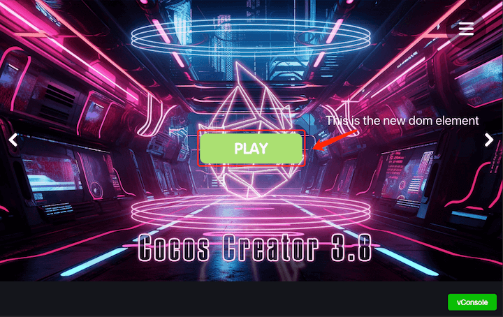

# 发布游戏到 Facebook Instant Games

Facebook Instant Games 跟微信小游戏相比，本质上的区别在于 Facebook Instant Games 运行于纯 HTML5 环境。因此它不仅可以在手机上，还可以在桌面浏览器上运行，开发和调试更加便捷。

**目前 Cocos Creator 为用户完成的工作包括：**

- 集成了 Facebook Instant Games SDK，并且自动进行了初始化，用户能直接调用相关的 API
- 在 Cocos Creator 构建面板中提供一键式打包流程，可直接打包为符合 Facebook Instant Games 技术规范的游戏

**用户需要完成的工作：**

- 调用 Facebook Instant Games SDK，访问平台相关功能
- 将 Cocos Creator 打包好的版本上传到 Facebook

## 发布流程

- 使用 Cocos Creator 构建游戏
- 上传到 Facebook 后台
- 测试游戏
- 在 Facebook 中分享你的游戏

### 一、使用 Cocos Creator 构建游戏

- 使用 Creator 打开需要发布的项目工程，从 **菜单栏 -> 项目** 中打开 **构建发布** 面板，在构建发布面板的 **发布平台** 中选择 **Facebook Instant Games**，然后点击 **构建**。

  

  相关参数配置具体的填写规则如下：

  **主包压缩类型**：设置主包的压缩类型，具体内容可参考文档 [Asset Bundle — 压缩类型](../asset-manager/bundle.md#%E5%8E%8B%E7%BC%A9%E7%B1%BB%E5%9E%8B)。

- 构建完成后会在发布包目录 `build` 下生成一个 `fb-instant-games` 文件夹：

  

### 二、上传到 Facebook

在 Facebook 后台创建一款新应用，在 **添加商品** 中添加 **小游戏**，设置游戏类别，保存更改。（详情可参考 [设置应用](https://developers.facebook.com/docs/games/instant-games/getting-started/quickstart?locale=zh_CN#app-setup)）

点击应用面板左侧的 **小游戏 -> 网页托管** 选项卡，单击 **上传版本**，将 `fb-instant-games` 目录下的 `.zip` 文件上传到 Facebook 托管服务中。


当版本状态更改为 “待命” 时，单击 “★” 按钮将构建版本推送到 “生产” 环境。


### 三、测试游戏

#### 在本地启用支持 https 的 Web 服务器

- 首先打开命令行窗口，进入构建好的 `fb-instant-games` 目录，通过 npm 安装 http-server 包：

  ```bash
  $ cd fb-instant-games
  $ npm install -g http-server
  ```

- 接着通过 openssl 创建私钥和证书：

  ```bash
  $ openssl genrsa 2048 > key.pem
  $ openssl req -x509 -days 1000 -new -key key.pem -out cert.pem
  ```

- 当私钥和证书准备就绪后，可通过 SSL 在本地启动 Web 服务：

  ```bash
  $ http-server --ssl -c-1 -p 8080 -a 127.0.0.1 
  ```

- 用浏览器打开 [https://localhost:8080](https://localhost:8080)，跳过浏览器显示的安全警告，这一步仅仅是为了让浏览器把上面的私钥和证书加入白名单。如果后续重新生成了私钥和证书，则需要再次打开确认一次。目前还不能在这一步直接预览游戏，因为预览游戏需要初始化 Facebook Instant Games 的 SDK，需要通过下面的方式。

#### 在 Facebook 域名下预览游戏

如果要使用 Facebook Instant Games SDK 的所有功能，需要用浏览器打开 [https://www.facebook.com/embed/instantgames/YOUR_GAME_ID/player?game_url=https://localhost:8080](https://www.facebook.com/embed/instantgames/YOUR_GAME_ID/player?game_url=https://localhost:8080)，注意要将链接中的 `YOUR_GAME_ID` 换成你在 Facebook 后台创建的应用编号。

然后可以看到游戏成功运行：


### 四、在 Facebook 中分享你的游戏

点击应用面板中的 **小游戏** 选项卡，选择 **详情**，在 **详情** 页面中拉到最下方可看到如下图所示部分，选择 **分享游戏**，即可将小游戏直接分享到 Facebook 动态消息中。


详细的内容，可参考 [测试、发布和分享小游戏](https://developers.facebook.com/docs/games/instant-games/test-publish-share?locale=zh_CN)。

> **注意**：Facebook 托管存在多项限制，其中最重要的是：
>
> 1. 不支持服务器端逻辑（例如：php）
> 2. 每次应用程序上传的文件数量不超过 500 个

## 自定义 Instant Games

开发者可以根据自身需求在 Creator 项目文件夹下创建 [build-templates/fb-instant-games](custom-project-build-template.md) 目录，然后将发布后的这几个文件复制到该目录中，即可对它们进行定制：


- `fbapp-config.json`：这是整个包的配置，可前往 [官方介绍](https://developers.facebook.com/docs/games/instant-games/bundle-config)
- `index.html`：这里可以修改引入的 Facebook Instant Games SDK 版本
- `main.js`：这里可以修改 SDK 初始化与进度条

## 在游戏中创建 Dom element
请参考示例代码在 facebook instant game 中创建 Dom elements，并显示在游戏画面中
```javascript
var buttonDiv = document.createElement("div");
var button = document.createElement("button");

const frameSize = cc.view.getFrameSize();
const imageWidth = 195, imageHeight = 57;

button.style.position = "absolute";
button.style.left = `${frameSize.width / 2 - imageWidth / 2}px`;
button.style.top = `${frameSize.height / 2 - imageHeight / 2}px`;

//load image from resources bundle
cc.resources.load("btn_play", cc.Texture2D, (error, res)=>{
  if (!error) {
    button.style.backgroundImage = `url(${res.nativeUrl})`;
    button.style.backgroundRepeat = "no-repeat";
    button.style.backgroundPosition = "center";
    button.style.width = res.width + "px";
    button.style.height = res.height + "px";
    button.style.backgroundColor = "transparent";
    button.style.borderColor = "transparent";
    button.onclick = (()=>{
          //DO SOMETHING
    });
    buttonDiv.appendChild(button);
    var body = document.body;
    body.insertBefore(buttonDiv, body.lastChild);
  }
});
```

运行效果：



## SDK 说明

Creator 已集成 Facebook 提供的 Instant Games SDK，并且在游戏加载时自动进行了初始化（`initializeAsync` 及 `startGameAsync`）。用户可直接通过 `FBInstant` 模块访问，使用说明详见 [Instant Games SDK](https://developers.facebook.com/docs/games/instant-games/sdk)。
此外，Facebook 还提供了 Facebook SDK for JavaScript，用于访问 Facebook 的社交功能，可通过 `FB` 模块访问。不过该 SDK Creator 并没有集成，需要用户手动引入，详见 [官方文档](https://developers.facebook.com/docs/javascript)。

## 参考链接

- Cocos Creator 提供的 **Instant Games 工程模板**（[GitHub](https://github.com/cocos-creator/demo-instant-games) | [Gitee](https://gitee.com/mirrors_cocos-creator/demo-instant-games)），包含了 Instant Games SDK 使用示例。
- [Facebook 后台](https://developers.facebook.com/)
- [Facebook Instant Games 文档](https://developers.facebook.com/docs/games/instant-games?locale=zh_CN)
