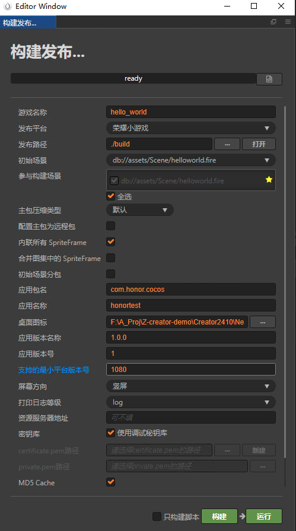
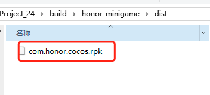
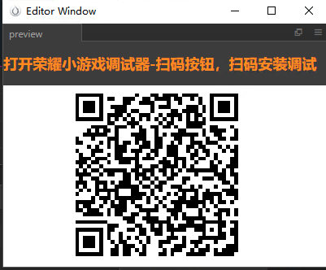
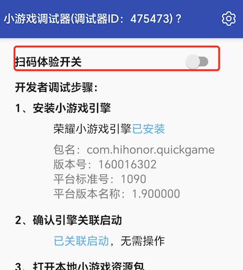

# 发布到荣耀小游戏

Cocos Creator 从 v2.4.15 开始支持将游戏发布到 **荣耀小游戏**。

## 准备工作

- 参考 [荣耀小游戏接入指南](https://developer.honor.com/cn/docs/game_center/guides/miniGame/miniGameGuidelines)，在荣耀开放平台完成开发者入驻流程和应用创建。

- 下载 [荣耀小游戏调试器](https://developer.honor.com/cn/docs/game_center/guides/miniGame/miniGameGuidelines#开发+调试指引)，可安装到荣耀手机设备进行小游戏调试。

## 发布流程

使用 Cocos Creator 打开需要发布的项目工程，从 **菜单栏 -> 项目** 中打开 **构建发布** 面板，**发布平台** 选择 **荣耀小游戏**。



### 参数项配置

相关参数配置具体的填写规则如下：

- **主包压缩类型**

  设置主包的压缩类型，具体内容可参考文档 [Asset Bundle — 压缩类型](../asset-manager/bundle.md#%E5%8E%8B%E7%BC%A9%E7%B1%BB%E5%9E%8B)。

- **配置主包为远程包**

  该项为可选项，需要与 **资源服务器地址** 选项配合使用。<br>
  勾选后，主包会配置为远程包，并且与其相关依赖资源一起被构建到发布包目录 remote 下的内置 Asset Bundle — [main](../asset-manager/bundle.md#%E5%86%85%E7%BD%AE-asset-bundle) 中。开发者需要将整个 remote 文件夹上传到远程服务器。

- **初始场景分包**

  该项为可选项。<br>
  勾选后，首场景及其相关的依赖资源会被构建到发布包目录 assets 下的内置 Asset Bundle — [start-scene](../asset-manager/bundle.md#%E5%86%85%E7%BD%AE-asset-bundle) 中，提高初始场景的资源加载速度。具体内容可参考文档 [初始场景的资源加载](publish-wechatgame.md#%E5%88%9D%E5%A7%8B%E5%9C%BA%E6%99%AF%E7%9A%84%E5%8A%A0%E8%BD%BD%E9%80%9F%E5%BA%A6)。

- **应用包名**

  该项为必填项，根据用户的需求进行填写。

- **应用名称**

  该项为必填项。是 荣耀小游戏的名称。

- **桌面图标**

  **桌面图标** 为必填项。点击输入框后面的 **...** 按钮选择所需的图标。构建时，图标将会被构建到**荣耀小游戏**的工程中。**桌面图标** 建议使用 **.png** 图片。

- **应用版本名称**

  该项为必填项。**应用版本名称** 是真实的版本，如：1.0.0

- **应用版本号**

  该项为必填项。**应用版本号** 与 **应用版本名称** 不同，**应用版本号** 主要用于区别版本更新。每次提交审核时应用版本号都要比上次提交审核的值至少 +1，一定不能等于或者小于上次提交审核的值，建议每次提交审核时应用版本号递归 +1。**注意**：**应用版本号** 必须为正整数。

- **支持的最小平台版本号**

  该项为必填项。用于兼容性检查，避免上线后在低版本平台运行导致不兼容。

- **资源服务器地址**

  该项为选填项，用于填写资源存放在服务器上的地址。

  - 若 **不填写** 该项，则发布包目录下的 `build/honor-minigame/remote` 文件夹将会被打包到构建出来的 rpk 包中。

  - 若 **填写** 该项，则 remote 文件夹不会被打包到 rpk 包中。开发者需要在构建后手动将 remote 文件夹上传到所填写的资源服务器地址上。

  具体的资源管理细节，请参考文档下方的资源管理部分。

- **密钥库**

  勾选 **密钥库** 时，表示默认用的是 Creator 自带的证书构建 rpk 包，仅用于 **测试和调试** 时使用。<br>
  如果不勾选 **密钥库**，则需要配置签名文件 **certificate.pem 路径** 和 **private.pem 路径**，此时构建出的是可以 **直接发布** 的 rpk 包。用户可通过输入框右边的 **...** 按钮来配置两个签名文件。**注意**：这两个签名文件建议不要放在发布包 **build/qgame** 目录下，否则每次构建时都会清空该目录，导致文件丢失。

  有以下两种方式可以生成签名文件：

  - 通过 **构建发布** 面板 **certificate.pem 路径** 后的 **新建** 按钮生成。

  - 通过命令行生成 release 签名

    用户需要通过 openssl 命令等工具生成签名文件 `private.pem`、`certificate.pem`。其中在 `build/qgame/sign/debug` 目录下的证书仅供调试使用。

    ```bash
    # 通过 openssl 命令工具生成签名文件
    openssl req -newkey rsa:2048 -nodes -keyout private.pem -x509 -days 3650 -out certificate.pem
    ```

    **注意**：openssl 工具在 linux 或 Mac 环境下可在终端直接打开，而在 Windows 环境下则需要安装 openssl 工具并且配置系统环境变量。

### 构建

**构建发布** 面板的相关参数设置完成后，点击 **构建**。构建完成后点击 **发布路径** 后面的 **打开** 按钮来打开构建发布包，可以看到在默认发布路径 build 目录下生成了 **honor-minigame** 目录，该目录就是导出的荣耀小游戏工程目录，rpk 包则在 `honor-minigame/dist` 目录下。



### 将打包出来的 rpk 运行到手机上

有以下两种方式可将 rpk 运行到手机上：

- **方法一**

    在 **构建发布** 面板点击 **运行** 按钮，等待二维码界面生成

    

    然后在 Android 设备上打开之前已经安装完成的 **荣耀小游戏调试器**，点击 **扫码安装** 按钮直接扫描二维码即可打开 rpk。

    

- **方法二**

    将构建生成的小游戏 rpk 文件（位于小游戏工程 honor-minigame 目录下的 dist 目录中）拷贝到手机内部存储目录下。

    在 Android 设备上打开之前已经安装完成的 **荣耀小游戏调试器**，点击 **本地安装**，然后从手机内部存储目录中找到 rpk 文件，选择打开即可。

    

## 荣耀小游戏环境的资源管理

荣耀小游戏与微信小游戏类似，都存在着包体限制，不过荣耀的主包包体限制是 **5MB**，超过的部分必须通过网络请求下载。

Cocos Creator 已经帮开发者做好了远程资源的下载、缓存和版本管理。具体的实现逻辑和操作步骤都与微信小游戏类似，请参考 [微信小游戏资源的管理](./publish-wechatgame.md#%E5%BE%AE%E4%BF%A1%E5%B0%8F%E6%B8%B8%E6%88%8F%E7%9A%84%E8%B5%84%E6%BA%90%E7%AE%A1%E7%90%86)。

## 参考链接

- [荣耀小游戏开发文档](https://developer.honor.com/cn/docs/game_center/guides/miniGame/miniGameGuidelines)
- [荣耀小游戏调试器下载](https://developer.honor.com/cn/docs/game_center/guides/miniGame/miniGameGuidelines#开发+调试指引)
