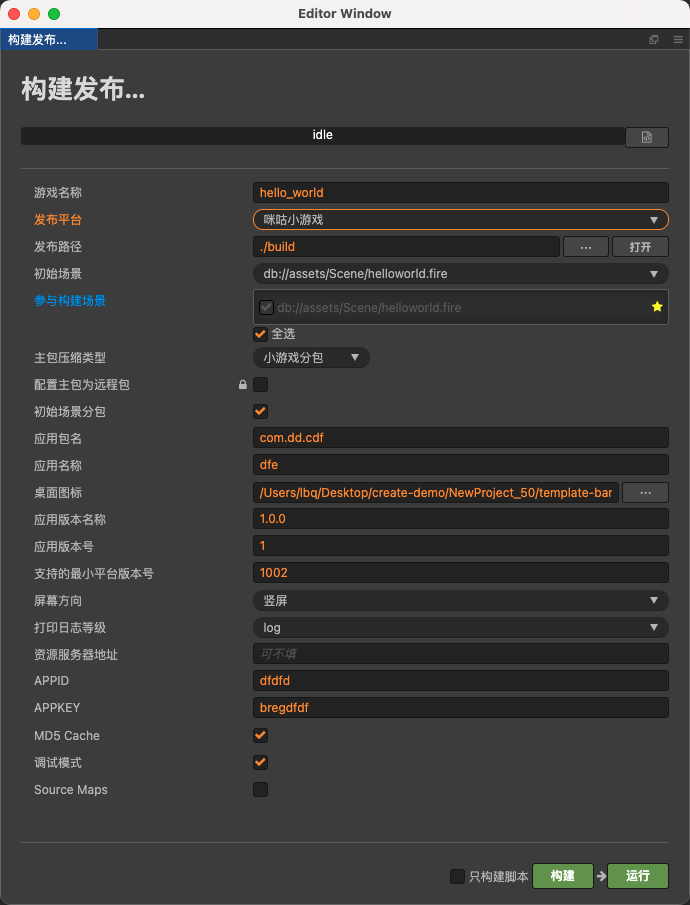
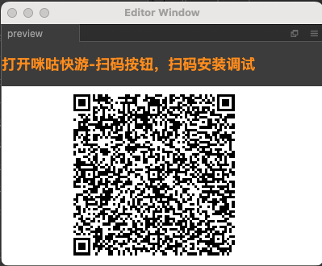

# 发布到咪咕小游戏

Cocos Creator 从 v2.4.14 开始支持将游戏发布到 **咪咕小游戏**。

## 准备工作

- 参考 [咪咕小游戏接入指南](https://open.migufun.com/document/detail?id=640)，在咪咕开放平台完成开发者入驻流程和应用创建。

- 下载 [咪咕快游](https://g.migufun.com/cocosdebugtool)，并安装到手机设备上。

- 咪咕快游最低版本为 Android 5.0。

## 发布流程

使用 Cocos Creator 打开需要发布的项目工程，从 **菜单栏 -> 项目** 中打开 **构建发布** 面板，**发布平台** 选择 **咪咕小游戏**。

### 参数项配置

相关参数配置具体的填写规则如下：

- **主包压缩类型**

  设置主包的压缩类型，具体内容可参考文档 [Asset Bundle — 压缩类型](../asset-manager/bundle.md#%E5%8E%8B%E7%BC%A9%E7%B1%BB%E5%9E%8B)。

- **配置主包为远程包**

  该项为可选项，需要与 **资源服务器地址** 选项配合使用。 
  勾选后，主包会配置为远程包，并且与其相关依赖资源一起被构建到发布包目录 remote 下的内置 Asset Bundle — [main](../asset-manager/bundle.md#%E5%86%85%E7%BD%AE-asset-bundle) 中。开发者需要将整个 remote 文件夹上传到远程服务器。

- **初始场景分包**

  该项为可选项。 
  勾选后，首场景及其相关的依赖资源会被构建到发布包目录 assets 下的内置 Asset Bundle — [start-scene](../asset-manager/bundle.md#%E5%86%85%E7%BD%AE-asset-bundle) 中，提高初始场景的资源加载速度。具体内容可参考文档 [初始场景的资源加载](publish-wechatgame.md#%E5%88%9D%E5%A7%8B%E5%9C%BA%E6%99%AF%E7%9A%84%E5%8A%A0%E8%BD%BD%E9%80%9F%E5%BA%A6)。

- **应用包名**

  该项为必填项，根据用户的需求进行填写。

- **应用名称**

  该项为必填项。是 咪咕小游戏的名称。

- **桌面图标**

  **桌面图标** 为必填项。点击输入框后面的 **...** 按钮选择所需的图标。构建时，图标将会被构建到**咪咕小游戏**的工程中。**桌面图标** 建议使用 **.png** 图片。

- **应用版本名称**

  该项为必填项。**应用版本名称** 是真实的版本，如：1.0.0

- **APPID**

  该项为必填项。**APPID** 是咪咕开放合作平台上为内容分配的 ID

- **APPKEY**

  该项为必填项。**APPKEY** 是咪咕开放合作平台上为内容分配的 KEY

- **应用版本号**

  该项为必填项。**应用版本号** 与 **应用版本名称** 不同，**应用版本号** 主要用于区别版本更新。每次提交审核时应用版本号都要比上次提交审核的值至少 +1，一定不能等于或者小于上次提交审核的值，建议每次提交审核时应用版本号递归 +1。**注意**：**应用版本号** 必须为正整数。

- **支持的最小平台版本号**

  该项为必填项。具体填写的值可通过点击 [更新记录](https://open.migufun.com/document/detail?id=640) 来查看最新的咪咕引擎版本号。

- **资源服务器地址**

  该项为选填项，用于填写资源存放在服务器上的地址。

  - 若 **不填写** 该项，则发布包目录下的 `build/migu-runtime/remote` 文件夹将会被打包到构建出来的 rpk 包中。

  - 若 **填写** 该项，则 remote 文件夹不会被打包到 rpk 包中。开发者需要在构建后手动将 remote 文件夹上传到所填写的资源服务器地址上。

  具体的资源管理细节，请参考文档下方的资源管理部分。

### 构建

**构建发布** 面板的相关参数设置完成后，点击 **构建**。构建完成后点击 **发布路径** 后面的 **打开** 按钮来打开构建发布包，可以看到在默认发布路径 build 目录下生成了 **migu-runtime** 目录，该目录就是导出的咪咕小游戏工程目录，rpk 包则在 `migu-runtime/dist` 目录下。

### 将打包出来的 rpk 运行到手机上

在 **构建发布** 面板点击 **运行** 按钮，等待二维码界面生成

然后在 Android 设备上打开之前已经安装完成的 **咪咕快游**，在**我的**页面右上角点击**扫码**按钮，直接扫描二维码即可打开 rpk。

## 咪咕小游戏环境的资源管理

咪咕小游戏与微信小游戏类似，都存在着包体限制，不过咪咕的主包包体限制是 **5MB**，超过的部分必须通过网络请求下载。

Cocos Creator 已经帮开发者做好了远程资源的下载、缓存和版本管理。具体的实现逻辑和操作步骤都与微信小游戏类似，请参考 [微信小游戏资源的管理](./publish-wechatgame.md#%E5%BE%AE%E4%BF%A1%E5%B0%8F%E6%B8%B8%E6%88%8F%E7%9A%84%E8%B5%84%E6%BA%90%E7%AE%A1%E7%90%86)。

## 参考链接

- [咪咕小游戏开发文档](https://open.migufun.com/document/detail?id=640)
- [咪咕快游下载](https://g.migufun.com/cocosdebugtool)
