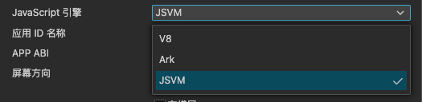
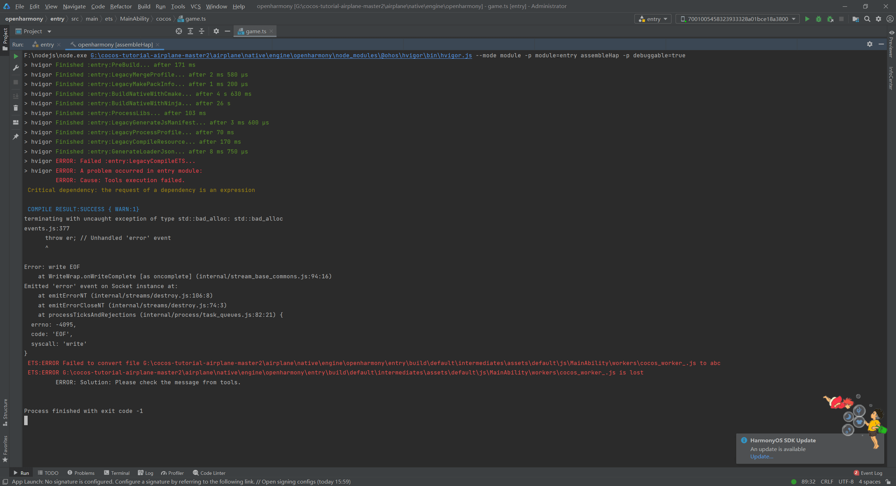
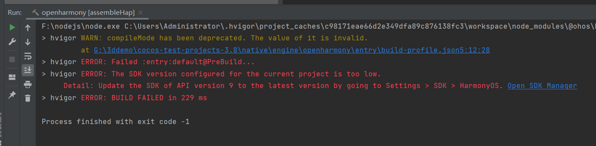

# 发布到 HarmonyOS Next 应用

自 Cocos Creator v2.4.14 起，支持发布到 **HarmonyOS Next** 平台。

## 安装 DevEco Studio

1. 下载最新的 IDE（版本>=5.x）：[DevEco Studio](https://developer.huawei.com/consumer/cn/deveco-studio/)

     <br>

2. 解压目录，双击进行安装，点击 Next，如下步骤：

     <br>
     <br>
     <br>
     <br>
     <br>
     <br>

3. 启动 DevEco Studio，如下图：

     <br>

4. 首次会提示设置源，默认应该就可以，如下图：

     <br>

5. 首次安装需要安装 Node.js，如果之前安装有 Node.js，选择本地的 Node.js 即可，但是有版本要求，Node.js 的版本必须大于 v14.19.1 和小于 v15.0.0。npm 的版本要求大于 6.14.16 和小于 7.0.0。如下图：

     <br>

6. 这里选择下载新的 Node.js 为例，如下图：

     <br>
     <br>

7. 接下来会提示安装 SDK，点击下一步，如下图：

     <br>
     <br>

8. 选择 Accept 之后，选择 Next，等待下载完成，之后点击 Finish 即可，如下图：

     <br>
     <br>


## 发布流程

1. 在 **构建发布** 面板的 **发布平台** 中选择 **HarmonyOS Next**，

     <br>

2. 选择 JavaScript 引擎，目前支持V8、Ark、JSVM，如下图：

     <br>

    > **注意**：在当前平台使用 V8 作为 JavaScript 引擎暂时无法使用 JIT 优化，建议选择使用 JSVM 获得最优的游戏性能。

3. 点击 **构建** 按钮构建项目。

4. 使用 DevEcoStudio，打开工程，如下图：

     <br>

     <br>

5. 配置签名，如下图：

     <br>

6. 插入设备，点击运行，如下图：

     <br>

7. 执行成功之后，在设备上查看效果。

## HarmonyOS Next 系统接口与 Cocos 交互

[基于反射机制实现 JavaScript 与 HarmonyOS Next 系统原生通信](../advanced-topics/arkts-reflection.md)

目前 Cocos 与 Ark 是分两个线程的，一个是 UI 线程，跑的是 Ark 引擎，另一个是 worker 线程，可以跑 Ark/V8 引擎。

所以这里要分两种情况：

### Cocos 使用 Ark 引擎

这样 globalThis 与 Cocos 的 globalThis 是一致的，也就是说给 globalThis 赋值，在 Cocos 上可以直接使用 globalThis 获取。

参考实现(构建 HarmonyOS Next 工程，使用 DevEco 打开工程，查看：entry/src/main/ets/cocos/sys-ability-polyfill 文件的实现)：

```ts
globalThis.getSystemLanguage = function () {
  return i18n.getSystemLanguage();
}
```

在 Cocos 上，可以直接使用:

```ts
globalThis.getSystemLanguage();
```

但是并不是所有的接口都可以这样封装，由于部分 HarmonyOS Next 的系统接口是只能在 UI 线程上使用的，例如 tts 与 asr 等接口；还有些 UI 操作相关的接口，例如 Editbox、Video 等。

这样必须使用进程间的通信机制来完成

Cocos 封装了一个类，名为 ProxyPort 类，这个是个公共类，同时可以在 ui 线程与 worker 线程上使用。可以通过使用 ProxyPort 接口互相发送消息。例如，在 ui 线程上（即 ets 布局文件与 ability 等文件）使用：

```ts
// entry/src/main/ets/pages/index.ets 文件
// 监听从 worker 上发送的消息，即 Cocos 发送的消息；
this.workPort.on('createWebview', (param: number)=> {
    this.webViewArray.push(new WebViewInfo(0, 0, 0, 0, param));
    this.webViewIndexMap.set(param, this.webViewArray.length - 1);
});

// entry/src/main/ets/components/CocosVideoPlayer.ets文件
// 在UI线程上，把事件派发给worker线程（即cocos）。
this.workPort?.postMessage("onVideoEvent", {
    videoTag: this.videoInfo.viewTag as number,
    videoEvent: EventType.PLAYING as EventType
} as param);

// entry/src/main/ets/workers/cocos_worker.ts 文件
// 在worker线程（即cocos）上，接收来着ui线程发送的消息
// 这里相当于中转，对游戏来说是只关心回调。
uiPort.on("onVideoEvent", (param) => {
  // @ts-ignore
  if (globalThis.oh && typeof globalThis.oh.onVideoEvent === "function") {
    // @ts-ignore 
    // 回调至业务代码
    globalThis.oh.onVideoEvent(msg.param.videoTag, msg.param.videoEvent, msg.param.args);
  }
});
```

### Cocos使用 V8 引擎

使用 V8，则不能使用 globalThis 来进行互相调用，因为 globalThis 已经是两个不同的东西；
因此需要交互的话，需要通过 native 进行绑定。

绑定分为两个部分：

- Ark 通过 napi 接口与 native 进行绑定；
- V8 通过接口绑定到 native

这样就可以在 native 里进行互相调用，例如：

```ts
// entry/src/main/ets/cocos/sys-ability-polyfill文件的实现
globalThis.getSystemLanguage = function () {
  return i18n.getSystemLanguage();
}
```

在 native 里：

```c++
// getCurrentLanguageCode 是 js 上的 jsb.__getCurrentLanguageCode 的实现
std::string System::getCurrentLanguageCode() const {
    // 通过 napi 调用 ark 引擎上的 getSystemLanguage 接口
    auto ret = NapiHelper::napiCallFunction("getSystemLanguage");
    if (!ret.IsString()) {
        return {};
    }
    auto str = ret.As<Napi::String>().Utf8Value();
    std::string::size_type pos = str.find('-');
    if(pos != std::string::npos) {
        str = str.substr(0, pos);
    }
    return str;
}
```

## 几个注意事项

另外，因为 HarmonyOS Next 还在不断完善当中，因此有些已知问题。这些问题都会在后续的版本解决。

- ARK不支持Restart，JSVM与V8是支持的。
- 编译失败时，可能是内存不足导致，退出部分应用，重新 build 试试；
    >>
    >> 
- 更新IDE，编译报错,如下图：
   >> 
- Mac 版 IDE 编译报错，报错信息为:

    ```
    npm ERR! Your cache folder contains root-owned files, due to a bug in
    npm ERR! previous versions of npm which has since been addressed.
    ```

    解决方法:

        在设备终端中执行命令 `sudo chown -R 502:20 "/Users/修改为你的设备用户名/.npm"`，之后重新编译项目
