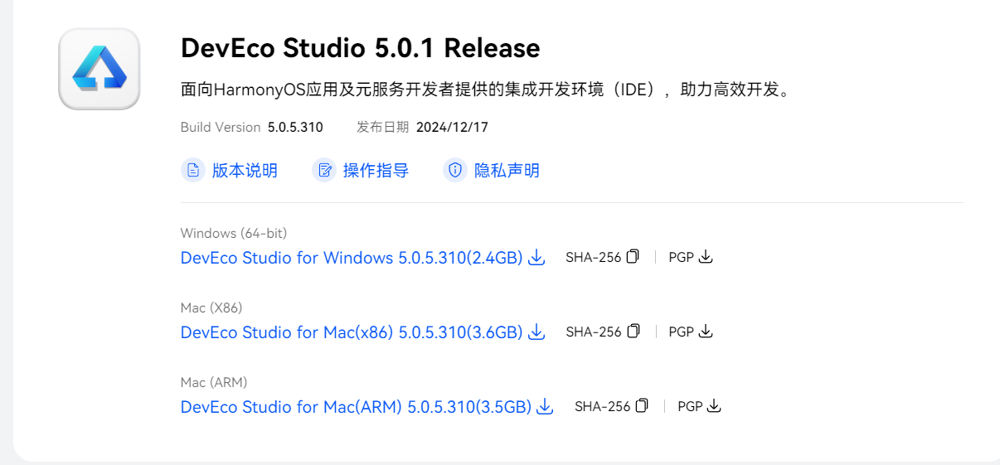
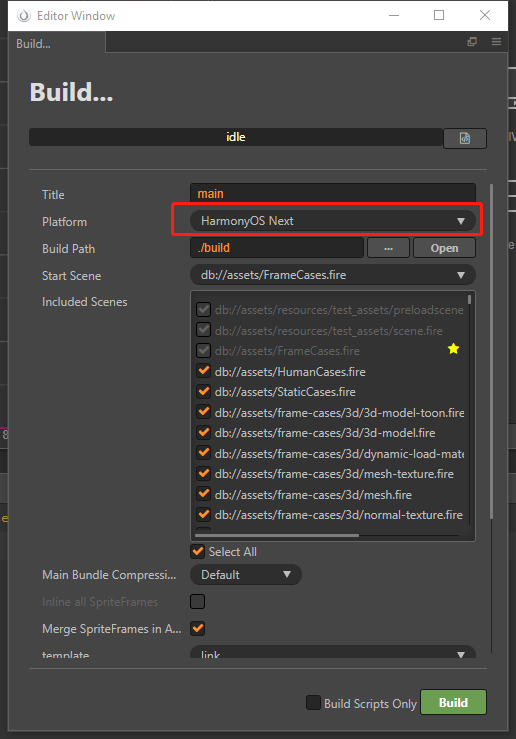
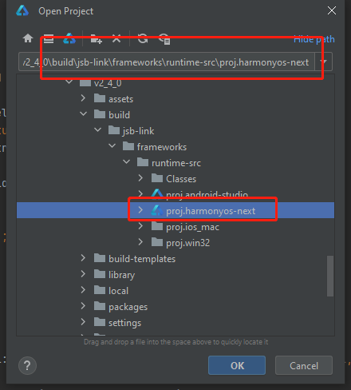
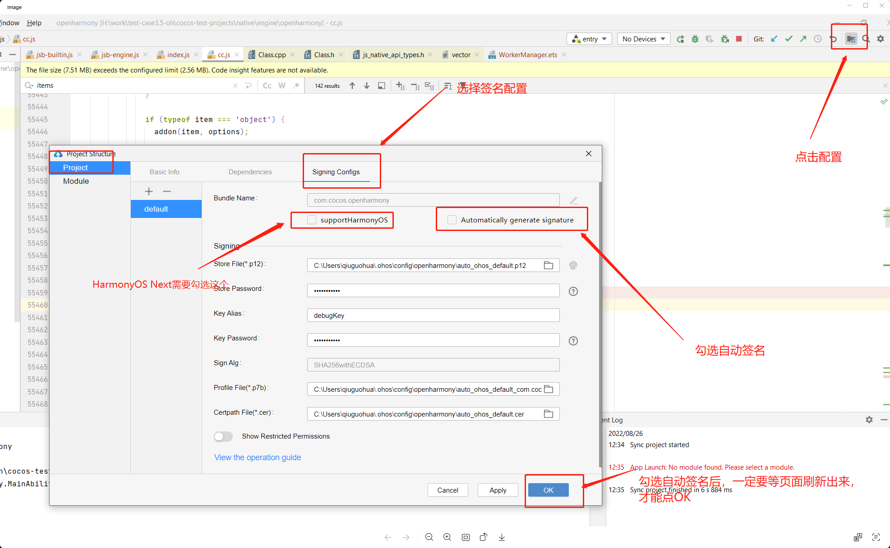

# 发布到 HarmonyOS Next 应用

自 Cocos Creator v2.4.12 起，支持发布到 **HarmonyOS Next** 平台。

## 安装 DevEco Studio

1. 下载最新的 IDE（版本>=5.x）：[DevEco Studio](https://developer.huawei.com/consumer/cn/deveco-studio/)

  

2. 解压目录，双击进行安装，点击 next，如下步骤：

  
  
  
  
  
  

3. 启动 DevEco Studio，如下图：

  

4. 首次会提示设置源，默认应该就可以，如下图：

  

5. 首次安装需要安装 Node.js，如果之前安装有 Node.js，选择本地的 Node.js 即可，但是有版本要求，Node.js 的版本必须大于 v14.19.1 和小于 v15.0.0。npm 的版本要求大于 6.14.16 和小于 7.0.0。如下图：

  

6. 这里选择下载新的 Node.js 为例，如下图：

  
  

7. 接下来会提示安装 SDK，点击下一步，注意是 OpenHarmonySDK，如下图：

  
  

8. 选择 Accept 之后，选择 Next，等待下载完成，之后点击 Finish 即可，如下图：

  
  

## 发布流程

1. 在 **构建发布** 面板的 **发布平台** 中选择 **HarmonyOS Next**，然后点击 **构建**。

  

2. 使用 DevEcoStudio，打开工程，如下图：

  

  

3. 配置签名，如下图：

  

4. 插入设备，点击运行，如下图：

  

5.执行成功之后，在设备上查看效果。
