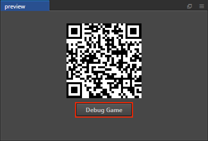
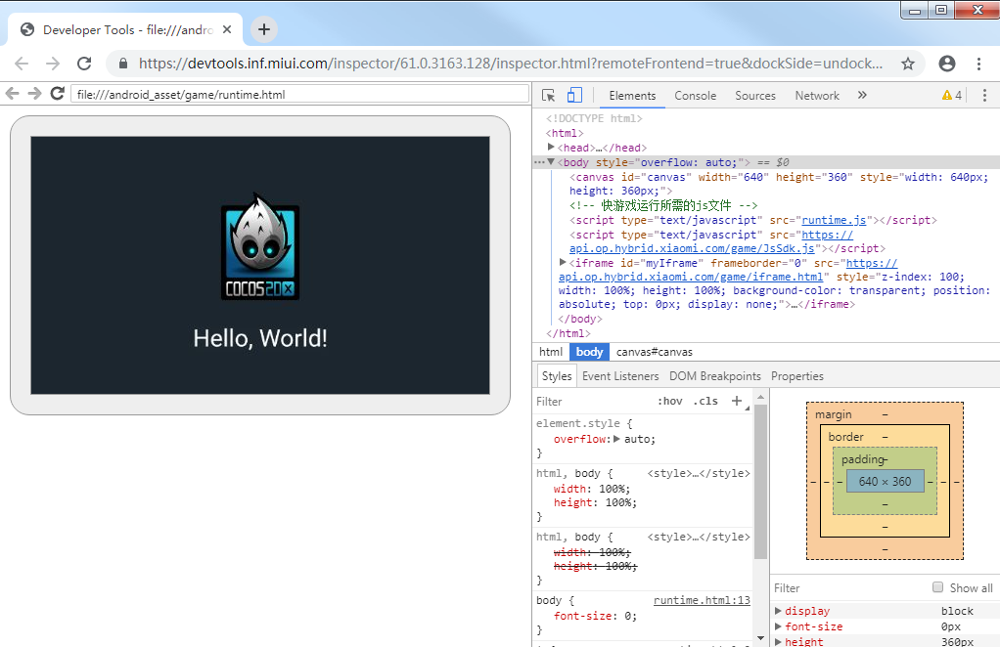

# 发布到小米快游戏

## 环境配置

- 下载 [小米快游戏调试器和小米快游戏运行环境](https://forum.cocos.org/t/topic/81887)，并安装到小米手机上（MIUI 8.5.0 或以上版本）。
- 桌面端全局安装 [Node.js](https://nodejs.org/zh-cn/download/) 8.1.4 或以上版本。
- 确保 Node.js 所带的 npm 版本最低是 **5.2.0**。升级 npm 命令如下：

  ```bash
  # 查看 npm 版本
  npm -v
  # 若 npm 版本在 5.2.0 以下，可使用以下升级命令升级 npm 
  npm install npm@latest -g
  ```

## 发布流程

使用 Cocos Creator 打开需要发布的项目工程，从 **菜单栏 -> 项目** 中打开 **构建发布** 面板，**发布平台** 选择 **小米快游戏**。


### 参数项配置

相关参数配置具体的填写规则如下：

- **主包压缩类型**

  设置主包的压缩类型，具体内容可参考文档 [Asset Bundle — 压缩类型](../asset-manager/bundle.md#%E5%8E%8B%E7%BC%A9%E7%B1%BB%E5%9E%8B)。

- **配置主包为远程包**

  该项为可选项，需要与 **资源服务器地址** 选项配合使用。<br>
  勾选后，主包会配置为远程包，并且与其相关依赖资源一起被构建到发布包目录 remote 下的内置 Asset Bundle — [main](../asset-manager/bundle.md#%E5%86%85%E7%BD%AE-asset-bundle) 中。开发者需要将整个 remote 文件夹上传到远程服务器。

- **初始场景分包**

  该项为可选项。<br>
  勾选后，首场景及其相关的依赖资源会被构建到发布包目录 assets 下的内置 Asset Bundle — [start-scene](../asset-manager/bundle.md#%E5%86%85%E7%BD%AE-asset-bundle) 中，提高初始场景的资源加载速度。具体内容可参考文档 [初始场景的资源加载](publish-wechatgame.md#%E5%88%9D%E5%A7%8B%E5%9C%BA%E6%99%AF%E7%9A%84%E5%8A%A0%E8%BD%BD%E9%80%9F%E5%BA%A6)。

- **应用包名**

  **应用包名** 的格式是：`com.yourcompany.projectname`。该项为必填项，根据用户的需求进行填写。

  **注意**：从平台版本号 **1062** 开始，小米快游戏需要使用正式申请的应用包名，否则在调试时会出现“数据加载异常，请点击重试”的报错。应用包名申请可参考 [文档](https://forum.cocos.org/t/topic/81887)。

- **应用名称**

  该项为必填项。是小米快游戏的名称。**构建发布** 面板最上方的 **游戏名称** 则不参与小米快游戏打包流程。

- **桌面图标**

  该项为必填项。构建时 **桌面图标** 将会构建到小米快游戏的工程中。点击输入框右边的 **...** 按钮即可选择图片。桌面图标建议使用 **png** 图片。

- **应用版本名称**

  该项为必填项。**应用版本名称** 是真实的版本，如：1.0.0

- **应用版本号**

  该项为必填项。**应用版本号** 与 **应用版本名称** 不同，**应用版本号** 主要用于区别版本更新。每次提交审核时应用版本号都要比上次提交审核的值至少 +1，一定不能等于或者小于上次提交审核的值，建议每次提交审核时应用版本号递归 +1。**注意**：**应用版本号** 必须为正整数。

- **支持的最小平台版本号**

  该项为必填项。根据小米快游戏的要求目前这个值必须大于或等于 **1050**。

- **资源服务器地址**

  该项为选填项，用于填写资源存放在服务器上的地址。

  - 若 **不填写** 该项，则发布包目录下的 `build/xiaomi/remote` 文件夹将会被打包到构建出来的 rpk 包中。

  - 若 **填写** 该项，则 remote 文件夹不会被打包到 rpk 包中。开发者需要在构建后手动将 remote 文件夹上传到所填写的资源服务器地址上。

  具体的资源管理细节，请参考文档下方的资源管理部分。

- **密钥库**

  勾选 **密钥库** 时，表示默认使用的是 Creator 自带的证书构建 rpk 包，仅用于 **调试** 时使用。**注意**：若 rpk 包要用于提交审核，则构建时不要勾选该项。<br>
  如果不勾选 **密钥库**，则需要配置签名文件 **certificate.pem 路径** 和 **private.pem 路径**，此时构建出的是可以 **直接发布** 的 rpk 包。开发者可点击输入框右边的 **...** 按钮来配置两个签名文件。**注意**：这两个签名文件建议不要放在发布包 `build/xiaomi` 目录下，否则每次构建时都会清空该目录，导致文件丢失。

  有以下两种方式可以生成签名文件：

  - 通过 **构建发布** 面板 **certificate.pem 路径** 后的 **新建** 按钮生成。点击 **新建** 按钮后，在弹出的 certificate 面板中填写相关信息，信息填写完成后点击保存，在控制台会输出日志 `Generate certificate is complete!`，表示生成签名文件完成。

    

  - 通过命令行生成 release 签名

    用户需要通过 openssl 命令等工具生成签名文件 private.pem、certificate.pem。

    ```bash
    # 通过 openssl 命令工具生成签名文件
    openssl req -newkey rsa:2048 -nodes -keyout private.pem -x509 -days 3650 -out certificate.pem
    ```

    > **注意**：openssl 工具在 linux 或 Mac 环境下可在终端直接打开。而在 Windows 环境下则需要安装 openssl 工具并且配置系统环境变量，配置完成后需重启 Creator。

### 构建

**构建发布** 面板的相关参数设置完成后，点击 **构建**。构建完成后点击 **发布路径** 后面的 **打开** 按钮来打开构建发布包，可以看到在默认发布路径 build 目录下生成了 **xiaomi** 目录，该目录就是导出的小米快游戏工程目录和 rpk，rpk 包在 `build/xiaomi/dist` 目录下。


### 将打包出来的 rpk 运行到手机上

启动游戏，有以下两种方式：

- **方法一**

  - 在 **构建发布** 面板点击右下角的 **运行** 按钮，等待二维码界面生成。

    

  - 然后在小米手机上打开之前已经安装完成的 **快应用调试器**，点击 **扫码安装** 按钮，直接扫描二维码即可打开 rpk。
  
    
  
- **方法二**

  - 首先在小米手机上打开 **设置-> 更多设置-> 开发者选项**，开启开发者选项以及 USB 调试。
  - 使用 USB 数据线将桌面端电脑与手机相连。
  - 将构建生成的快游戏 rpk 文件拷贝到小米手机内部存储目录中。
  - 在小米手机上打开之前已经安装完成的 **快应用调试器**，点击 **本地安装**，然后从手机内部存储目录中找到 rpk 文件，选择打开即可。

    

## 调试

调试必须基于真机进行调试，并且必须严格按照先运行游戏再启动调试功能的先后顺序。启动游戏后，让小米手机处于打开游戏运行的界面。然后使用 USB 数据线将桌面端电脑与小米手机相连，并且小米手机需要开启开发者选项以及 USB 调试。

开启调试有以下两种方式：

1. 直接点击二维码界面上的 **游戏调试** 按钮：

    

    即可在 Chrome 浏览器中自动启动调试界面：

    

2. 通过命令行来启动调试：

    - 指定到发布包目录 **build/xiaomi** 目录下，执行命令：`npm run debug`，就会在 Chrome 浏览器中 **自动** 启动调试界面。
    - 如果想要 **手动** 打开调试界面，那么执行命令：`npm run debug -- --print-only`，然后将运行后生成的 URL 地址拷贝到 Chrome 浏览器中打开即可启动调试界⾯。

    ```bash
    # 指定到发布包 build/xiaomi 目录下
    cd E:\NewProject\build\xiaomi
    # 自动在 Chrome 上打开调试界面
    npm run debug
    # 手动在 Chrome 上打开调试页面
    npm run debug -- --print-only
    ```

## 小米快游戏环境的资源管理

小米快游戏与微信小游戏类似，都存在着包体限制，不过小米的主包包体限制是 **5MB**, 超过的部分必须通过网络请求下载。

Cocos Creator 已经帮开发者做好了远程资源的下载、缓存和版本管理。具体的实现逻辑和操作步骤都与微信小游戏类似，请参考 [微信小游戏资源管理](./publish-wechatgame.md#%E5%BE%AE%E4%BF%A1%E5%B0%8F%E6%B8%B8%E6%88%8F%E7%9A%84%E8%B5%84%E6%BA%90%E7%AE%A1%E7%90%86)。

## 分包 rpk

分包 rpk 是根据用户的需求选择是否使用。分包加载，即把游戏内容按一定规则拆分在几个包里，在首次启动的时候只下载必要的包，这个必要的包称为 **主包**，开发者可以在主包内触发下载其他子包，这样可以有效降低首次启动的消耗时间。若要使用该功能需要在 Creator 中设置 [小游戏分包](subpackage.md)，设置完成后在构建时就会自动分包。构建完成后，会生成 **.rpk** 文件，生成目录在 `build/xiaomi/dist` 目录下。

分包或者主包的包体大小限制，具体可参考 [小米快游戏分包规则](https://forum.cocos.org/t/topic/81887)。
