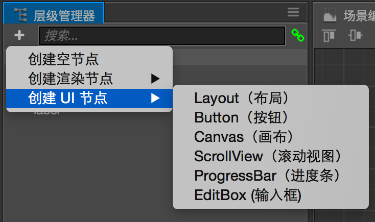

# 常用 UI 控件

本篇文档将介绍 UI 系统中常用的非核心控件，使用核心渲染组件和对齐策略，这些控件将构成我们游戏中 UI 的大部分交互部分。您将会了解以下 UI 控件的用法：

- ScrollView（滚动视图）、ScrollBar（滚动条）和 Mask（遮罩）
- Button（按钮）
- ProgressBar（进度条）
- EditBox（输入框）

以下介绍的 UI 控件都可以通过 **层级管理器** 左上角创建节点菜单中的 **创建 UI 节点** 子菜单来创建。

## ScrollView

ScrollView 是一个典型的组合型控件，通常由以下节点组成：

### ScrollView 根节点

这个节点上包含 ScrollView 组件，组件属性的详细说明可以查阅 [ScrollView 组件参考](../components/scrollview.md)

### content（内容）节点

content 节点用来承载将会在滚动视图中显示的内容，这个节点的约束框通常会远远大于 ScrollView 根节点的约束框，也只有在 content 节点比 ScrollView 节点大时，视图才能有效的滚动。

content 节点可以包括任意数量的子节点，配合 [Layout 组件](auto-layout.md)，可以确保 content 节点的约束框等于所有子节点约束框的总和。

### Mask（遮罩）节点

ScrollView 中的遮罩是可选的，但我们通常都希望能够隐藏 content 中超出 ScrollView 约束框范围的内容。

[Mask 组件](../components/mask.md) 能够隐藏自身约束框范围外的子节点内容，注意 **Mask** 属于渲染组件，因此不能和其他渲染组件（如 Sprite，Label 等）共存于同一个节点上，我们需要额外的一个节点专门用来放置 Mask，否则 ScrollView 将无法设置用于背景的 **Sprite** 组件。

### ScrollBar（滚动条）节点

滚动条也是可选的，在有鼠标的设备上，我们可以通过滚动条提供鼠标拖拽快速滚动的功能。而在移动设备上，滚动条通常只用于指示内容的总量和当前显示范围。

我们可以同时设置横向和纵向两个滚动条，每个滚动条节点都包含一个 **ScrollBar** 组件。滚动条节点也可以包括子节点，来同时显示滚动条的前景和背景。详细的属性设置请查阅 [ScrollBar 组件参考](../components/scrollbar.md)。

另外值得注意的是，ScrollBar 的 **handle** 部分的尺寸是可变的，推荐使用 **Sliced**（九宫格）模式的 Sprite 作为 ScrollBar 的 handle。

## Button（按钮）

通过 **层级管理器** 菜单创建的 **Button** 节点，由带有 **Button** 组件的父节点和一个带有 **Label** 组件的子节点组成。Button 父节点提供交互功能和按钮背景图显示，Label 子节点提供按钮上标签文字的渲染。

您可以根据美术风格和设计需要，将 Label 节点删除或者替换成需要的其他图标 Sprite。

关于 **Button** 组件的详细属性说明可以查阅 [Button 组件参考](../components/button.md)。

### Transition 说明

Button 的 `Transition` 属性用于设置当按钮处在普通（Normal）、按下（Pressed）、悬停（Hover）、禁用（Disabled）四种状态下 `Target` 属性引用的背景图节点的表现。可以从以下三种模式中选择：

- `NONE`（无 Transtion），这个模式下按钮不会自动响应交互事件来改变自身外观，但您可以在按钮上加入自定义的脚本来精确控制交互的表现行为。
- `COLOR`（颜色变化），选择这个模式后，能看到四种状态属性并可以为每一种状态设置一个颜色叠加，在按钮转换到对应状态时，设置的状态颜色会和按钮背景图的颜色进行相乘作为展示的颜色。这个模式还允许通过 `Duration` 属性设置颜色变化过程的时间长度，实现颜色渐变的效果。
- `SPRITE`（图片切换），选择这个模式后，可以为四种状态分别指定一个 `SpriteFrame` 图片资源，当对应的状态被激活后，按钮背景图就会被替换为对应的图片资源。要注意如果设置了 `Normal` 状态的图片资源，按钮背景的 Sprite 属性中的 `SpriteFrame` 会被覆盖。

### Click Events 点击事件

`Click Events` 属性是一个数组类型，将它的容量改为 `1` 或更多就可以为按钮按下（鼠标或触摸）事件添加一个或多个响应回调方法。新建 `Click Events` 后，就可以拖拽响应回调方法所在组件的节点到 `Click Event` 的 `Target` 属性上，然后选择节点上的一个组件，并从列表中选择组件里的某个方法作为回调方法。

Button 上的点击事件是为了方便设计师在制作 UI 界面时可以自行指定按钮功能而设置的，要让按钮按照自定义的方式响应更多样化的事件，可以参考 [系统内置事件](../scripting/internal-events.md)文档，手动在按钮节点上监听这些交互事件并做出处理。

## ProgressBar（进度条）

进度条是由 **ProgressBar** 组件驱动一个 **Sprite** 节点的属性来实现根据设置的数值显示不同长度或角度的进度。ProgressBar 有三种基本工作模式（由 `Mode` 属性设置）：

- HORIZONTAL 水平进度条
- VERTICAL 垂直进度条
- FILLED 填充进度条

其他的基本属性设置请查阅 [ProgressBar 组件参考](../components/progress.md)。

### 水平和垂直模式（HORIZONTAL & VERTICAL）

当模式选择 `HORIZONTAL` 或 `VERTICAL` 时，进度条可以通过修改 `Bar Sprite` 引用节点的尺寸（`width` 或 `height` 属性）来改变进度条显示的长度。在这两种模式下 `Bar Sprite` 推荐使用 `Sliced` 九宫格显示模式，这样在节点尺寸产生拉伸的情况下仍能保持高质量的图像渲染结果。

在这两种模式下，`Total Length` 属性的单位是像素，用来指定进度条在 100% 的状态下（`Progress` 属性值为 1）时 `Bar Sprite` 的长度。这个属性保证我们在编辑场景时可以自由设置 `Progress` 为小于 1 的值，而 `Bar Sprite` 总是能够记录我们希望的总长度。

### 填充模式（FILLED）

和上面两种模式不同，填充模式下的进度条会通过按照一定百分比剪裁 `Bar Sprite` 引用节点来显示不同进度，因此我们需要对 `Bar Sprite` 引用的 **Sprite** 组件进行特定的设置。首先将该 Sprite 的 `Type` 属性设置为 `FILLED`，然后选择一个填充方向（HORIZONTAL、VERTICAL、RADIAL），详情请查阅 [Sprite 填充模式](../components/sprite.md#--2) 参考文档。

要注意进度条在选择了填充模式后，`Total Length` 的单位变成了百分比小数，取值范围为 0 ~ 1。设置的 `Total Length` 数值会同步到 `Bar Sprite` 的 `Fill Range` 属性，使之保持一致。下图显示了填充模式进度条当 `Bar Sprite` 的 `Fill Type` 设置为 `RADIAL` 时，不同的 `Total Length` 对显示的影响。

## EditBox（输入框）

请参考 [EditBox 组件参考](../components/editbox.md) 文档里每个属性的说明进行设置。
