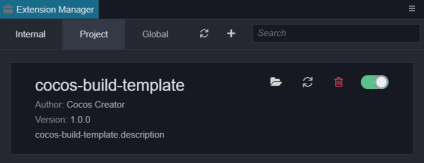
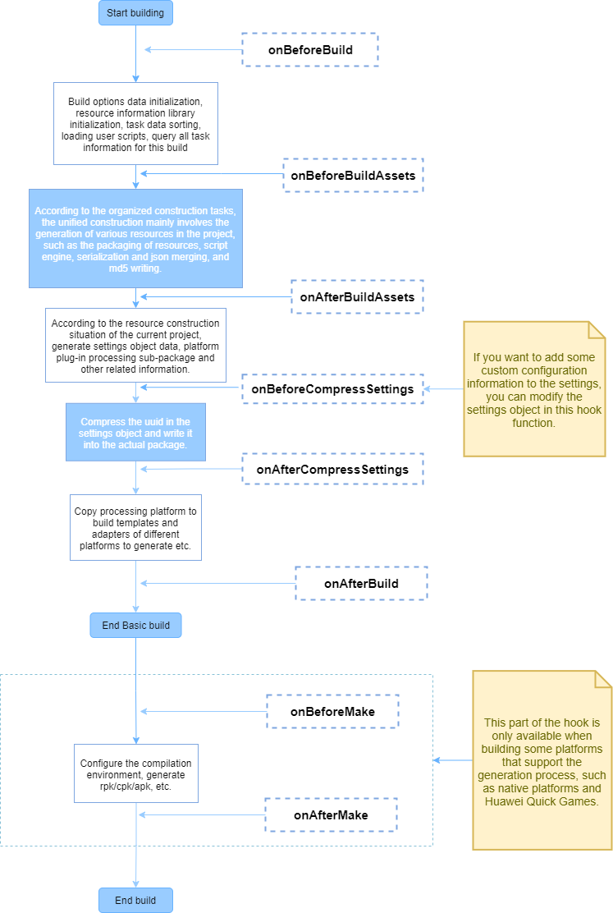

# Extending Build Process

To build a platform plug-in a common editor plug-in format is required. For the basic structure of the plug-in, please refer to the [First Extension](../extension/first.md) documentation . To extend the build function, it is necessary to understand the overall process of the build. Please read the [Introduction to the build process and FAQ guide](./build-guide.md) documentation.

## Quick start

1. Click **Project -> New Build Extension** in the menu bar of the editor, and select **Global**/**Project** to create a build extension package.

    - If selecting **Global**, the build extension will be applied to all Cocos Creator projects. The path of **Global** is:

        - **Windows**: `%USERPROFILE%\.CocosCreator\extensions`

        - **Mac**: `$HOME/.CocosCreator/extensions`

    - If selecting **Project**, this will apply the build extension to the specified Cocos Creator project. The path of **Project** is:

        - `$Your project address/extensions`

2. After the build extension is created, you will see the generation path of the plugin in the **Console**. Click on the path to open the build extension package in the file manager of the operating system.

3. Before enabling the build extension, execute `npm install` in the directory to install some dependent **@types** modules to compile normally. The interface definition that comes with the editor has been generated under the **@types** folder in the root directory. **Developer -> Export.d.ts** from the menu bar of the editor shows the latest interface definitions.

4. Click **Extension -> Extension Manager** in the menu bar of the editor to open the **Extension Manager** panel. Then select the **Project**/**Global** tab in the **Extension Manager**, and click the **Refresh Icon** button to see the build extension you just added. Then click the **Enable** button on the right to run the plug-in normally.

    

5. After the build extension is enabled, open the **Build** panel, notice the expansion bar of the build extension plugin. Click **Build** to join the build process.

    

6. If you need to modify the content of the build extension, directly modify the build extension package under the `extensions` directory, see the `readme.md` file in the build extension package directory for details. Then find the corresponding build extension in the **Extension Manager**, and click the **Reload** icon button. At this time, the extension in the editor will re-run with the latest code and files.

## Basic configuration process

To extend the build function of the plug-in, you need to add the `builder` field to the `contributions` in `package.json`, and the relative path configuration of the corresponding module can be passed to the specified platform in the field.

Example `package.json`:

```json
{
    "contributions": {
        "builder": "./dist/builder"
    }
}
```

The plugin entry configuration code example is shown below:

```ts
export const configs: IConfigs = {
    'web-mobile': {
        hooks: './hooks',
        options: {
            remoteAddress: {
                label: 'i18n:xxx',
                render: {
                    ui: 'ui-input',
                    attributes: {
                        placeholder: 'Enter remote address...',
                    },
                },
                // Validation rules, there are currently several commonly used validation rules built in, and the rules that need to be customized can be configured in the "verifyRuleMap" field
                verifyRules: ['require', 'http'],
            },
            enterCocos: {
                    label: 'i18n:cocos-build-template.options.enterCocos',
                    description: 'i18n:cocos-build-template.options.enterCocos',
                    default: '',
                    render: {
                        // Please click "Developer -> UI Components" in the menu bar of the editor to view a list of all supported UI components.
                        ui: 'ui-input',
                        attributes: {
                            placeholder: 'i18n:cocos-build-template.options.enterCocos',
                        },
                    },
                    verifyRules: ['ruleTest']
                }
            },
            verifyRuleMap: {
                ruleTest: {
                    message: 'i18n:cocos-build-template.ruleTest_msg',
                    func(val, option) {
                        if (val === 'cocos') {
                            return true;
                        }
                        return false;
                    }
                }
            }
        },
};
```

Please pay extra attention to the following points when writing entry scripts:

1. The environment variables in different processes will be different. The entry script will be loaded by the rendering process and the main process at the same time, do not use the editor interface that only exists in a single process in the entry script.

2. There are two ways to configure the key of `config`: one is for a single platform configuration, and the key is filled in as **platform plugin name** (available in the editor menu bar **Extensions -> Extension Manager -> Internal** to view the platform plug-in name); one is the configuration for all platforms, the key is filled in as `*`. These two configuration methods are mutually exclusive, please do not use them in the same build extension package.

The detailed interface definition is described as follows:

```ts
declare type IConfigs = Record<Platform | '*', IPlatformConfig>;
declare interface IBuildPlugin {
    hooks?: string; // Storage path of hook function
    options?: IDisplayOptions; // Platform parameter configuration that needs to be injected
    verifyRuleMap?: IVerificationRuleMap; // Register parameter verification rule function
}
declare type IDisplayOptions = Record<string, IConfigItem>;
declare interface IConfigItem {
    // The default value, the registered default value will be in the "options.[platform].xxx" field in the plugin configuration
    default?: any;

    render: ?{
        // The rules for rendering UI components are consistent with the unified rules at "ui-prop". Only configurations with UI properties specified will be displayed on the Build panel
        ui?: string;
        // The configuration parameters passed to the UI component
        attributes?: IUiOptions;
    };

    // Configure the displayed name, if you need to translate, then pass in "i18n:${key}"
    label?: string;

    // A brief description of the setting, which will be displayed on the title when the mouse hovers over the configuration name.
    description?: string;

    // Type of configuration
    type?: 'array' | 'object';

    // If type is an array, the data will be rendered according to the specified data type and "itemConfigs"
    itemConfigs?: Record<string, IConfigItem> | IConfigItem[];
}

declare interface IUiOptions extends IOptionsBase {
    //     // Validation rules array, build provides some basic rules, and you can also specify new validation rules through “verifyRuleMap”. Only when pass in “require” will be a valueless checksum, otherwise only when there is a value.
    verifyRules?: string[];
}

declare interface IUiOptions extends IOptionsBase {
    class?: string | string[]; // The name of the style that needs to be set on the current "ui-prop"
}
```

For the interface definition of `IOptionsBase` please refer to [ui-prop automatic rendering rule definition](../extension/ui.md).

## Custom build hook function code configuration

In the script module defined by the hooks field in the entry configuration, hook functions can be written that build the life cycle. In different hook functions, the data received will be different. All hook functions run in the build process, and the engine method can be used directly in the build process.

The relationship between the public hook function and the life cycle of the build can be seen in the following figure:



The rough interface definition of hook function is as follows:

```ts
declare interface IHook {
    throwError?: boolean; // The hook function injected by the plugin, whether to exit the build process directly and show the build failure when the execution fails.
    // ------------------ hook function --------------------------
    onBeforeBuild?: IBaseHooks;
    onBeforeCompressSettings?: IBaseHooks;
    onAfterCompressSettings?: IBaseHooks;
    onAfterBuild?: IBaseHooks;

    // Compile the generated hook function (only valid if the platform's build process has a "Make" step)
    onBeforeMake?: (root: string, options: IBuildTaskOptions) => void | Promise<void>;
    onAfterMake?: (root: string, options: IBuildTaskOptions) => void | Promise<void>;
}
type IBaseHooks = (options: IBuildTaskOptions, result?: IBuildResult) => void | Promise<void>;
```

> **Notes**:
> 1. the `result` parameter can be accessed only at the beginning of `onBeforeCompressSettings`, and the `options` passed to the hook function is a copy of the `options` used in the actual build process, and only used as a reference for information acquisition, so directly modifying it does not really affect the build process, although it can be modified successfully. To modify the build parameters, please set in the `options` field of the entry configuration code. Due to the numerous interface definitions, you can refer to the `@types/packages/builder` folder in the build extension package for detailed interface definitions.
> 2. The hook function is allowed to be an asynchronous function. the next process.

A simple example:

```ts
export function onBeforeBuild(options) {
    // Todo some thing...
}
export async function onBeforeCompressSettings(options, result) {
    // Todo some thing...
}
```

## Build plugin debugging

Click **Developer --> Open Build DevTools** in the menu to debug the plugin script normally.
