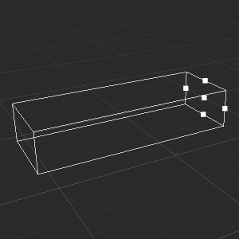

# Camera Gizmo

**Camera Gizmo** is used to show the clip area of a camera, you can read the [Camera Introduction](../components/camera-component.md) documentation for more information about camera.

## Perspective Camera Gizmo

**Perspective Camera Gizmo** shows the shape of frustum, which is calculate by the distance of the near clip plane, far clip plane and fov. You can edit them by dragging the control quad.

## Ortho Camera Gizmo

**Ortho Camera Gizmo** shows the shape of box, which is calculated by the distance of the near clip plane, far clip plane and the height of ortho camera. You can edit them by dragging the control quad.

