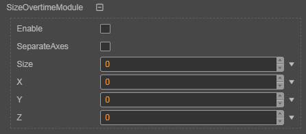

## Size Overtime Module

Property | Role
---|---
**separateAxes** | Whether the three axes are scaled separately.
**size** | The curve of the size change with time can be used in different calculation modes. It is valid when separateAxes is false.
**X Y Z** | The curve whose size changes with time, different zooms can be set on the three coordinate axes, and different calculation modes can be used. It is effective when separateAxes is true.

